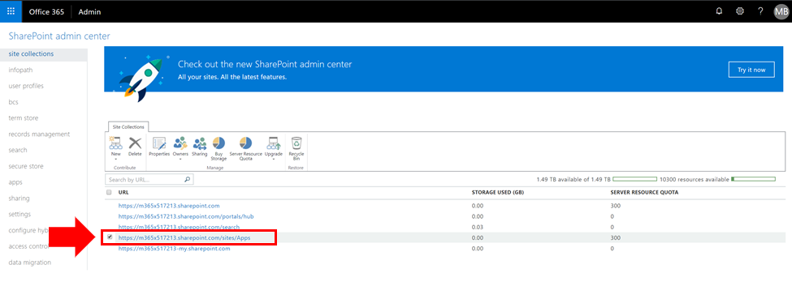

# オンライン アプリ カタログに管理者を表示SharePoint追加する

CLO365 を正常にインストールするには、ソリューションのプロビジョニングを行うユーザーをテナント アプリ カタログの管理者として一覧表示する必要があります。

1. [管理Office 365ポータルから、[オンライン管理センター] SharePointに移動します。
1. **アプリ** のサイト コレクションリスト URL から 
1. CLO365 インストーラーがアプリ カタログ管理者の 1 人として表示されます。
![[アプリ管理者] ダイアログ](media/appadmin_dialog.png)

ユーザー名が一覧表示されている場合は、ユーザー設定サイトのプロビジョニングにラーニングできます。  次の手順を完了しない場合。 

## 管理者の追加

1. [管理者センター SharePointアプリ カタログ URL の横にあるチェック ボックスをオンにして、[所有者] ドロップダウン ボックスを選択します。
![[サイト コレクション] タブで選択されている [所有者] オプション。](media/appadmin_owner.png)
1. [所有者] ドロップダウンのドロップダウン メニュー [詳細] ビューから [管理者 ![ の管理] を選択します。](media/appadmin_manage.png)
1. 正しい個人をサイト コレクション管理者として追加し、[OK] をクリックして変更を保存します。
