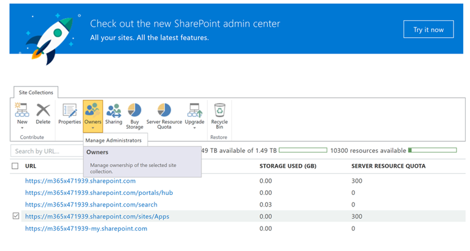
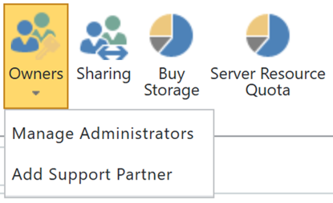

# 表示または SharePoint のオンライン アプリケーション カタログに管理者を追加します。View or Add an Administrator to your SharePoint Online App Catalog

CLO365 を正常にインストールするには、ソリューションの提供処理を実行するユーザーはテナント アプリケーション カタログの管理者として登録する必要があります。To successfully install CLO365, the person doing the provisioning of the solution needs to be listed as an administrator of the tenant app catalog.

1. Office 365 管理ポータルには、SharePoint のオンライン管理センターFrom the Office 365 Administration portal go to the SharePoint Online Admin Center
1. サイト コレクションの一覧からアプリケーション カタログの URL**を選択して** **Select** the App Catalog URL from the site collection list 
1. CLO365 インストーラーがアプリケーション カタログの管理者の 1 つとして表示されていることを確認します。Confirm that the CLO365 installer is listed as one of the app catalog administrators. 

自分のユーザー名が表示されている場合は、カスタムの学習サイトを準備するのには取得できます。 表示ない場合は、次の手順を完了します。If your user name is listed you can return to provisioning the Custom Learning site.  If not complete the next steps. 

## 管理者を追加します。Add an Administrator

1. SharePoint 管理センターからアプリケーション カタログの URL の横にチェック ボックスをオンし、[所有者] ドロップダウン ボックスを選択します。From the SharePoint Admin Center select the checkbox next to the app catalog URL and select the Owners drop-down box. 
1. ドロップ ダウン メニューから [管理者の管理を選択してSelect Manage Administrators from the drop down menu 
1. サイト コレクションの管理者として適切な個人を追加し、変更を保存するには、[ok] をクリックします。Add the correct individual as a Site Collection Administrator and click OK to save your changes.

### [サイトの準備](installsitepackage.md)の次のステップNext Steps - [Site Provisioning](installsitepackage.md)
