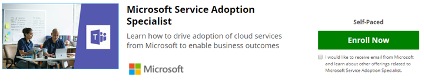

# スキルを検証する-サービス導入スペシャリストになる

サービス導入が役割の一部である場合、またはこのトピックに記載されている正式なトレーニングをさらに掘り下げたい場合は、パートナーサイトの EdX.org に Microsoft が提供するオンラインコースに登録できます。 

この[サービス導入スペシャリストのオンラインコース](https://aka.ms/AdoptionCert)は、**無料で監査**できます。  EdX 証明書を完成させたい場合は、$99.00 の料金が必要です。  このコースは、microsoft Teams エンジニアリングの[Karuana g・ mu](https://linkedin.com/in/karuanagatimu)により、複数の microsoft MVP および microsoft IT エキスパートからの入力によって作成されました。  内部に含まれているベストプラクティスは、業界全体としての、正式な組織変更管理教育に対する補完的なものです。  

このコースでは、この重要なビジネス機能で skils を検証できる、実践的なガイダンス、ツール、およびその他のコンテンツが含まれています。  

詳細については、このコースのドキュメントに関する[お知らせ](https://aka.ms/AdoptionCertAnnouncement)をご覧ください。 

オンラインコミュニティのビジネスユーザーおよび IT プロフェッショナルは、でhttps://aka.ms/DriveAdoptionの導入について学ぶことができます。 