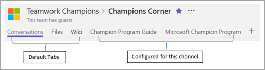

# エキスパートの検索Finding your Champions 

現時点では、正式なプログラムをまだ持っていない場合でも、皆さんが熟知しているユーザーを既に知っていると考えられます。It is likely you already know who your champions are, even if you do not currently have a formal program.  ユーザーは次のようになります。These are people who:

は、既存のテクノロジを使用している他のユーザーが教育を受けて、新しいテクノロジについて学ぶことができるようになることがよくあります。現在のソリューションの制限により、他の共同作業者の前であっても新しい事柄を試してみることができますAre often seen helping others with existing technology Enjoy teaching and learning about new technology May be vocal about the limitations of current solutions Are keen to try new things, even before other co-workers

> [!NOTE]
> エキスパートは、そのテクノロジだけで新しいソフトウェアをテストすることを楽しんでいる人とは異なります。Champions are different from people who enjoy testing new software for the technology alone. コンテキストに関係なく**他のユーザーを支援**します。Champions thrive on **helping others** regardless of context. 

## サイズの縮小と拡張を開始するStart small and grow

組織が現在の精鋭プログラムを持っていない場合、または自分の組織に reinvigorate する場合は、上記のプロファイルに合った既知の人物の小さなグループに招待状を送信してください。If your organization does not have a current Champion program or you would like to reinvigorate the one you have send an invitation to a small group of known people who fit the above profile.  次に、新しいプログラムの目的について説明し、フィードバックを得るために、一緒に収集します。Gather then together to discuss the goals of the new program and get their feedback. 真のチャンピオンは、音声を聞き、何かを作成する場合と同じように感じます。True Champions like to have their voice heard and feel as if they are a part of creating something.  

## 構造を指定するProvide structure

成功した精鋭プログラムには、現在の問題を満たすリーダーと定期的なスケジュールがあります。Successful champion programs have a leader and a regular schedule to meet and discuss current issues.  少なくとも月単位の会議は、コミュニティにおける正の文化の作成にとって重要な部分です。また、fostering の成長にもなります。Monthly meetings at a minimum are an important part of creating a positive culture in the community and fostering growth.  

Microsoft Teams を使用して、チームワークエキスパートのプログラム用のハブを作成することもできます。You can also use Microsoft Teams to create a hub for your Teamwork Champions' program.  [この記事](https://docs.microsoft.com/en-us/MicrosoftTeams/teams-adoption-your-first-teams)では、そのチーム構造の例を示します。An example for that team structure can be found in [this article](https://docs.microsoft.com/en-us/MicrosoftTeams/teams-adoption-your-first-teams).

