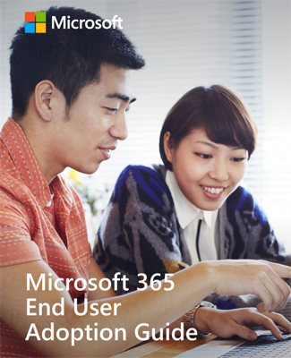

# Microsoft 365 エンド ユーザー導入ガイド

このテーマの詳細については [、Microsoft 365 エンド ユーザー導入ガイドを利用してください](https://aka.ms/adoptionguide)。 このガイドでは、エンド ユーザーの採用を促進するための手順を、次の主要な分野にわたって説明します。

- 利害関係者
- シナリオ
- 認識
- トレーニング 
- 変更の計画、実装、管理
- 
- 新しい情報を組み込むには、このガイドを頻繁に更新します。