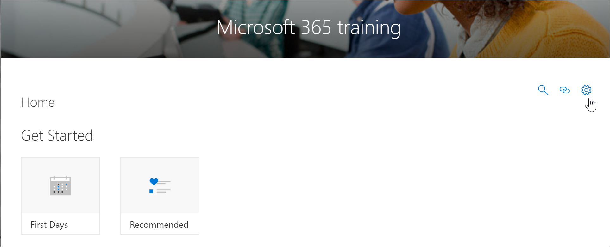
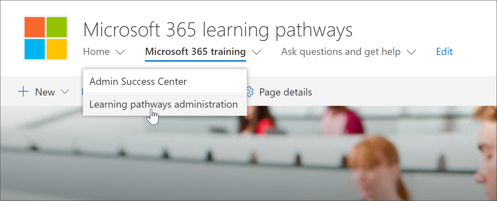

# [パスの管理ラーニング] ページにアクセスする

ラーニング管理は CustomLearningAdmin.aspx ページから管理されます。 この管理ページは、管理者SharePoint使用できます。 サイトにアクセスするメンバー特権を持つユーザーには、Web パーツ **の [管理** ] 歯車アイコンは表示されない。 さらに、管理者だけが[ホーム] メニューの [ラーニング パス管理]メニュー項目から管理ページを開SharePoint **できます**。 

> [!IMPORTANT]
> 製品サブカテゴリやプレイリストの非表示ラーニングカスタム 管理ページで行われた変更は、Web パーツのすべてのインスタンスに反映されます。 また、複数のユーザーが同時にページを使用している場合、カスタム ラーニング は競合検出を行うので、管理ページから変更を加える管理者は 1 人だけお勧めします。  

## パス Web パーツラーニングアクセス - 優先メソッド
Web パーツから [管理] ページを開くのが、新しいブラウザー タブでページを開くので、推奨される方法です。このメソッドを使用すると、タブ付きページ間を簡単に前後に切り替え、作業を確認または変更できます。  

1. [学習Microsoft 365ホーム] ページ **で**、[トレーニング] タイルOffice 365 **クリック** します。
2. 次の **例に示** すように、Web パーツの [管理] アイコンをクリックします。

## [ホーム] メニュー項目からのアクセス
管理者は、Web パーツを使用してページに移動するのではなく、[ホーム] メニュー項目の [管理] SharePoint **アクセス** できます。 

- [パスMicrosoft 365 ラーニングホーム] ページで、[ホーム] メニュー **をクリック** し、[Microsoft ラーニング管理 **] をクリックします**。

