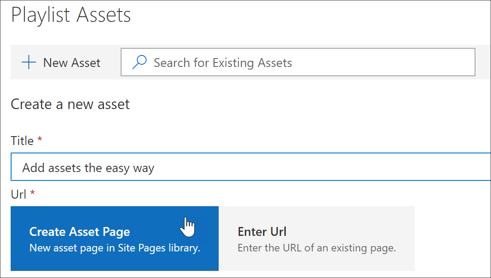
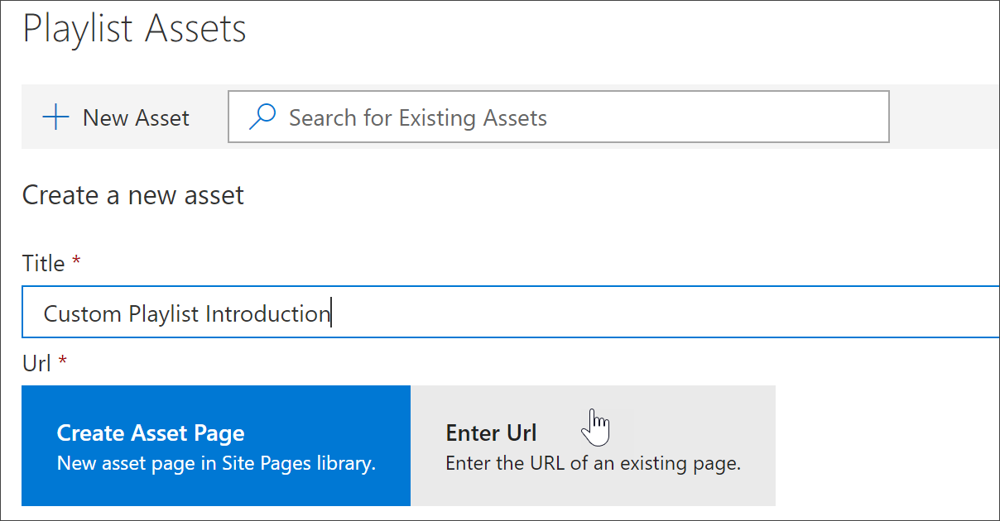
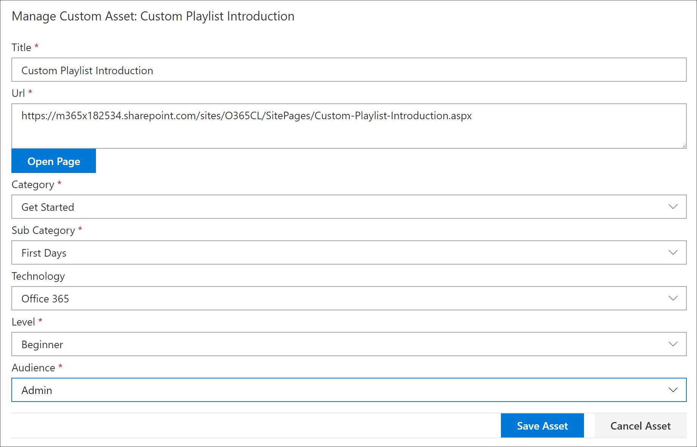
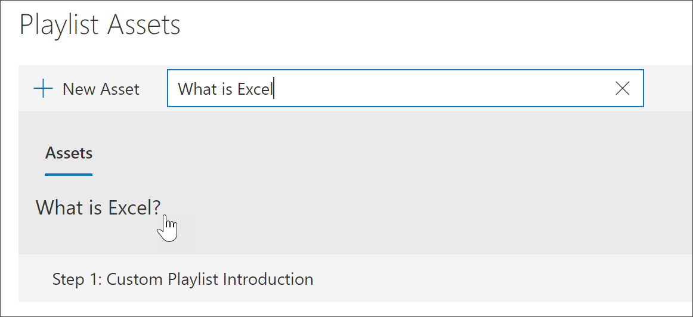
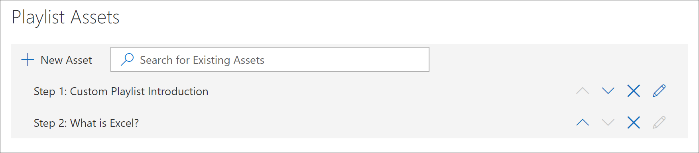
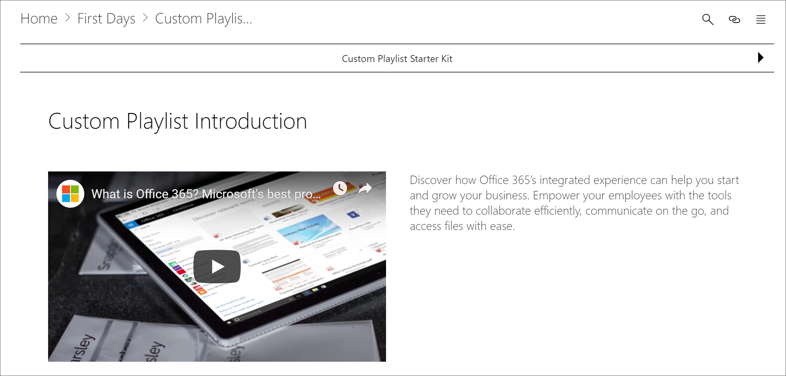

# カスタムプレイリストにアセットを追加する

カスタム学習を使用すると、次のアセットを再生リストに追加できます。

- **既存のカスタムラーニングアセット**-これらは、組織がカスタム学習に既に追加した、Microsoft online カタログまたはアセットの一部であるアセットです。
- **新しいアセット**-ユーザーが作成した sharepoint ページから、または組織内の sharepoint サイトで既に使用可能な sharepoint アセットから構築されたカスタム学習に追加するアセットです。 

> [!TIP]
> microsoft のプレイリストアセットがニーズに合わない場合は、新しい再生リストを作成し、そのプレイリストに microsoft アセットと新しく作成したアセットを追加して、必要な環境を構築します。 Microsoft が提供するカスタム学習再生リストを変更することはできませんが、カスタムの学習提供アセットをカスタムプレイリストに追加できます。   

## プレイリストの新しいアセットを作成する

新しいアセットを再生リストに追加するには、2つのオプションがあります。

- [**アセットの作成] ページ**-このオプションを使用すると、カスタム学習によって新しい空の SharePoint ページが生成され、プレイリストに追加されます。 その後、コンテンツをページに追加して保存することができます。  
- [ **url の入力**]-このオプションを使用して、ページを事前に作成するか、または既にページを使用できる状態にして、ページを再生リストに追加するための URL を指定します。

### アセットの作成ページ 
[**アセットの作成] ページ**オプションを使用して、アセットのタイトルを指定し、[アセットの作成] ページをクリックして新しい SharePoint ページを作成し、編集用に開きます。 

1.  編集用に再生リストがまだ開かれていない場合は、カスタムの [**学習管理**] ページで、編集する再生リストをクリックします。 
2. 新しいアセットを再生リストに追加するには、[**新しいアセット**] をクリックします。 
3. タイトルを入力します。 この例では、「再生リストにアセットを追加する」と入力してから、[**アセットの作成] ページ**をクリックします。

4. [**ページを開く**] をクリックします。
5. [**編集**] アイコンをクリックし、タイトル領域の [ **Web パーツの編集**] をクリックします。
6. [**レイアウト**] で、[**プレーン**] をクリックします。 
7. 新しい1列セクションを追加し、次の例のようにサンプルテキストをページに追加します。 

7. [ **発行**] をクリックします。
8. カスタムの [**ラーニングの管理**] ページに戻ります。 
9. アセットの残りのプロパティを入力し、[アセットの保存] をクリックし**ます。**

### URL の入力
[ **url の入力**] オプションを使用して、アセットのタイトルを指定し、[ **url の入力**] をクリックして、プレイリストに追加する SharePoint ページを指定します。 

1.  再生リストが編集用に開かれていない場合は、カスタムの [**学習の管理**] ページで、編集する再生リストをクリックします。 
2. 新しいアセットを再生リストに追加するには、[**新しいアセット**] をクリックします。 
3. タイトルを入力します。 この例では、「カスタム再生リストの紹介」と入力し、[ **URL の入力**] をクリックします。 

4. 前の「[カスタムプレイリストの sharepoint ページを作成](custom_createnewpage.md)する」セクションで作成した sharepoint ページの URL を入力し、次の図に示すように、残りのフィールドに入力します。

5. [**アセットの保存**] をクリックします。 

## 既存のアセットをプレイリストに追加する

既存のアセットは、Microsoft が提供するカスタム学習資産または資産から構成されており、組織によってカスタム学習に既に追加されています。 

- 検索ボックス**** に検索語句を入力し、検索結果からアセットを選択します。 この例では、「Excel とは」を入力します。 Excel の導入トピックを再生リストに追加します。

## アセットを編集、移動、および削除する
作成したカスタムアセットは編集できますが、Microsoft のアセットは編集できません。 ただし、プレイリストからすべてのアセットを削除して、注文アセットを変更することはできます。 

### アセットを編集する
- アセットの編集ボタンをクリックし、アセットを変更してから、[アセットの保存] をクリックします。 

### 再生リスト内のアセットを移動する
- アセットの右側にある上矢印または下矢印をクリックして、再生リスト内のアセットオーダーを移動します。

### 再生リストからアセットを削除する
- アセットの [再生リストから削除] X アイコンをクリックします。 

## 再生リストのアクションを表示する
これで、アセットが再生リストに追加されましたので、再生リストを閉じて、動作を確認してみましょう。 

1. [**再生リストを閉じる**] をクリックします。
2. **Office 365 トレーニング**ページのタブをクリックします。
3. ページを更新し、[**開始**] の下にある**最初の日**をクリックします。
4. [**カスタム学習スタートキット**] をクリックして、最初のプレイリストのアクションを表示します。 

