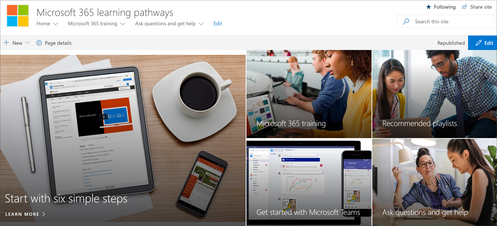
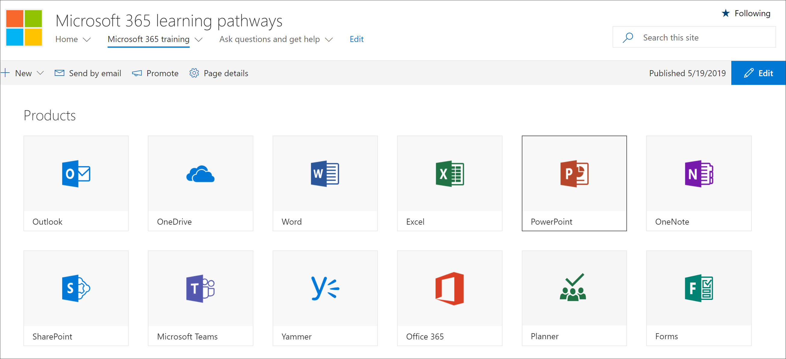

# [所有者の追加] カスタム ラーニング サイト

Office 365 サイトのカスタム ラーニング は Office 365 テナントでホストされますので、まだサインインしていない場合は、Office 365 にサインインしてサイトにアクセスする必要があります。 

## Office 365 にサインインする 

1.  Web ブラウザーを開き、office.com または組織のサインイン場所に移動します。 
2.  ユーザー名とパスワードでサインインします。
3.  サイトの場所に移動します。 使用できない場合は、PnP プロビジョニング サービスから受信したメールで確認できます。 [SharePoint] ページから [Office 365] を選択し、サイトの [カスタム] ラーニング **をOffice 365** します。 異なる名前を付けられた可能性があります。 
5. [トレーニング **Office 365]** タイルをクリックして、カスタム ラーニング で使用可能なトレーニング プレイリストの完全なスイートを表示し、カスタム ラーニングが正常に動作ラーニング確認します。 

## すべてのカスタム コンテンツをラーニングする
[Office 365] トレーニング ページは、カスタム ラーニングで使用可能なすべてのトレーニングを表示するように構成されたカスタム web パーツをホストラーニング。 

1. ページを下にスクロールすると、すべてのカテゴリとサブカテゴリが表示されます。
2. タイヤを少し蹴る。 いくつかのサブカテゴリをクリックし、いくつかのプレイリストをクリックして、カスタム コンテンツの整理方法ラーニングを取得します。 

## サイトに所有者を追加する
テナント管理者として、サイトをカスタマイズするユーザーになる可能性は低いので、少数の所有者をサイトに割り当てる必要があります。 所有者はサイトに対する管理者権限を持ち、サイト ページを変更したり、サイトのブランドを変更したりすることができます。 また、カスタム Web パーツを通じて配信されたコンテンツを非表示にし、表示ラーニングできます。 また、カスタム プレイリストを作成し、カスタム サブカテゴリに割り当てる機能も備えます。  

1. [アクセス許可 **SharePoint設定]** メニューの [**サイトのアクセス許可] をクリックします**。
2. [**高度なアクセス許可] 設定 をクリックします**。
3. [所有者 **Office 365 用カスタム ラーニング] をクリックします**。
4. [**新しい**  >  **ユーザーをこのグループに追加** する] をクリックし、所有者になるユーザーを追加し、[共有] を **クリックします**。

