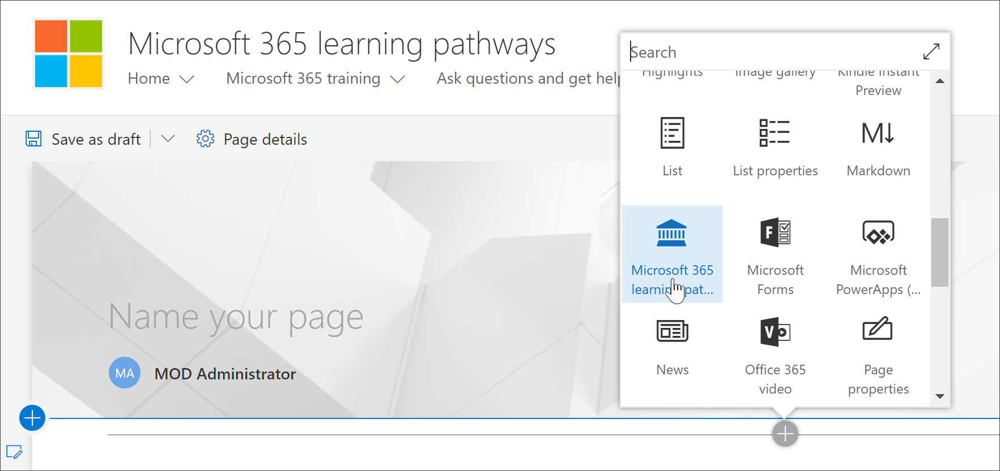
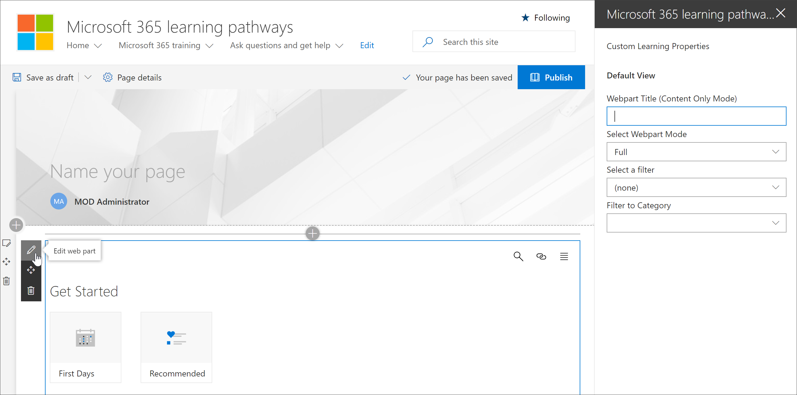
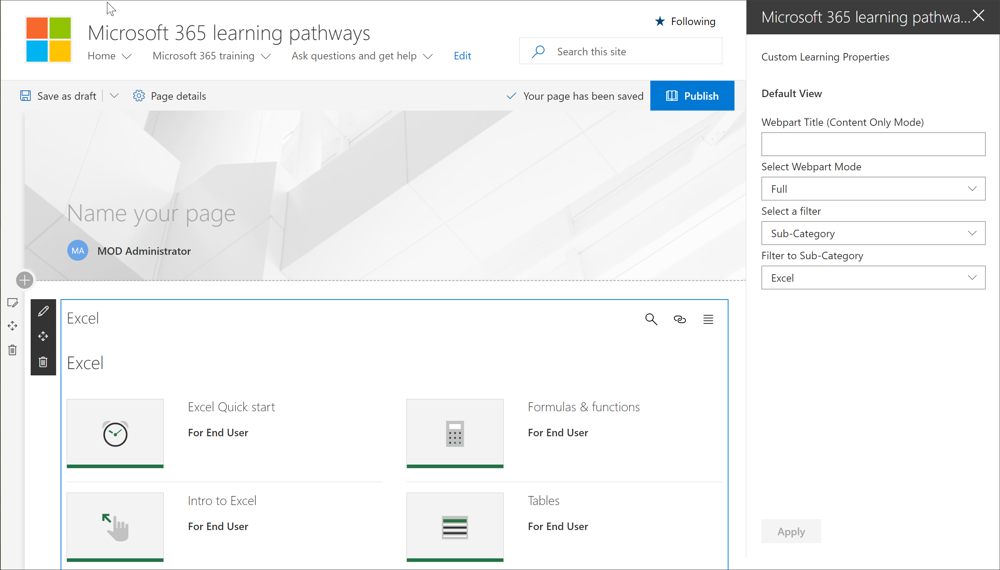

# Microsoft 365 learning の経路の web パーツを追加および編集する

Microsoft 365 のラーニング経路を使用すると、Microsoft 365 learning の経路の web パーツを SharePoint ページに追加し、Web パーツのコンテンツをフィルター処理してページの学習目標を満たすことができます。 たとえば、「OneDrive への切り替え」ページを作成し、Web パーツを追加して、組織に特に作成されたカスタムの OneDrive 移行プレイリストを表示するように構成することができます。

1.  SharePoint 歯車アイコンをクリックし、[**ページの追加**] をクリックします。
2.  ページの左側にある [**新しいセクション (+) の追加**] をクリックし、 **1 つの列**をクリックします。
3.  [ **+**] をクリックし、[ **Microsoft 365 learning の経路**の web パーツ] を選択します。 

## カスタム学習 web パーツを編集する
[Microsoft 365 learning の経路] web パーツを編集して、利用可能なカスタム学習コンテンツをすべて表示するか、特定のカテゴリ、サブカテゴリ、再生リスト、またはアセットを表示することができます。 

1.  **[Web パーツの編集]** をクリックします。

2. カスタムの [学習プロパティ] ウィンドウで、Web パーツを次のようにフィルタリングします。 

- Webpart モード: 完全
- フィルタ: サブカテゴリ
- サブカテゴリ: Excel

3. ページは次の画像のようになります。 

## タイトルを追加してページを発行する
1. ページのタイトル領域に「自分の環境を作成する」と入力します。
2. タイトル領域の [ **web パーツの編集**] アイコンをクリックし、 **[レイアウト**] で [**標準**] を選択して、[**プロパティ**] ウィンドウを閉じます。
3. **[発行]** をクリックします。
