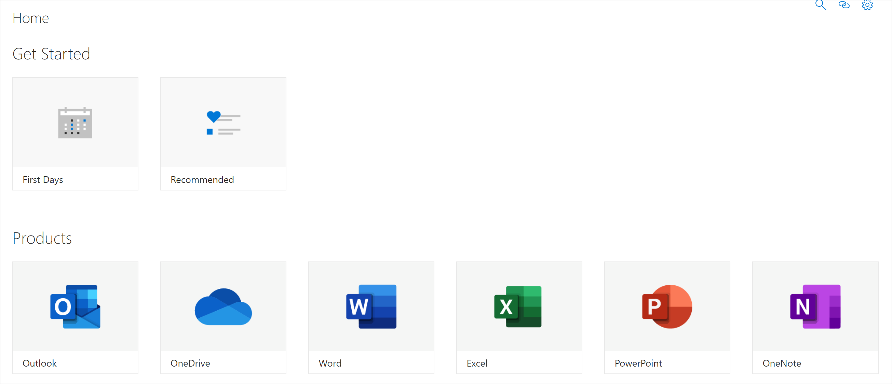

# SharePoint アプリケーション ページの概要

ラーニング パスには、管理者SharePoint知る必要がある 2 つのアプリケーション ページがあります。 これら 2 つのページは編集不可であり、削除する必要があります。 

- CustomLearningAdmin.aspx
- CustomLearningViewer.aspx

## CustomLearningAdmin.aspx

CustomLearningAdmin.aspx ページには、コンテンツの非表示と表示、サブカテゴリとプレイリストの作成と編集など、学習経路の管理機能が提供されています。 このページとその機能については、後のセクションで詳しく説明します。

### View CustomLearningAdmin.aspx

1. [サイト コンテンツ **SharePoint設定]** アイコンをクリックし、[サイト コンテンツ **サイト** ページ]  >  **をクリックします**。 
2. **[CustomLearningAdmin.aspx] をクリックします**。 

## CustomLearningViewer.aspx
CustomLearningViewer.aspx ページには、Web パーツに学習経路のコンテンツを表示するためのビューアーが表示されます。 たとえば、プレイリスト リンクをコピーして同僚と共有する場合、リンクをクリックすると、ユーザーはビューアー ページに移動し、リンクされたコンテンツを表示します。 

### View CustomLearningViewer.aspx

1. [サイト コンテンツ **SharePoint設定]** アイコンをクリックし、[サイト コンテンツ **サイト** ページ]  >  **をクリックします**。 
2. **[CustomLearningViewer.aspx] をクリックします**。 

