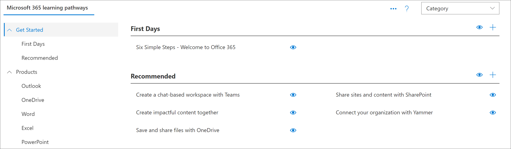

# SharePoint アプリケーションページを理解するGet to know the SharePoint Application pages

カスタム学習では、カスタム学習の管理者として知っておく必要がある2つの SharePoint アプリケーションページが提供されます。これら2つのページは編集できません。Custom Learning provides two SharePoint Application pages that you should know about as an administrator of Custom Learning. These two pages are non-editable. 

- CustomLearningAdminCustomLearningAdmin.aspx
- CustomLearningAdminCustomLearningAdmin.aspx

## CustomLearningAdminCustomLearningAdmin.aspx

CustomLearningAdmin ページには、コンテンツの非表示と表示、サブカテゴリおよびプレイリストの作成と編集など、カスタム学習のための管理機能が用意されています。このページとその機能については、後のセクションで詳細に説明します。The CustomLearningAdmin.aspx page provides Administrative features for Custom Learning, including hiding and showing content and creating and editing subcategories and playlists. We’ll cover this page and its functionality in more detail in later sections.

### CustomLearningAdmin の表示View CustomLearningAdmin.aspx

1. [SharePoint の**設定**] アイコンをクリックし、[**サイトコンテンツ**] をクリックします。Click the SharePoint **Settings** icon, and then click **Site Contents**. 
2. [ **CustomLearningAdmin**] をクリックします。Click **CustomLearningAdmin.aspx**. 

## CustomLearningViewerCustomLearningViewer.aspx
CustomLearningViewer ページには、web パーツにカスタム学習コンテンツを表示するためのビューアーが用意されています。たとえば、再生リストリンクをコピーして共同作業者と共有した場合、リンクをクリックすると、ユーザーは閲覧者のページに移動して、リンクされたコンテンツを表示することができます。このページとその機能については、後のトピックで詳しく説明します。The CustomLearningViewer.aspx page provides a viewer for displaying Custom Learning contents in the web part. For example, if you copy a Playlist link and share it with a co-worker, the link, when clicked, takes the user to the Viewer page and displays the linked content. We’ll cover this page and its functionality in more detail in later topics.

### CustomLearningViewer の表示View CustomLearningViewer.aspx

1. [SharePoint の**設定**] アイコンをクリックし、[**サイトコンテンツ**] をクリックします。Click the SharePoint **Settings** icon, and then click **Site Contents**. 
2. [ **CustomLearningViewer**] をクリックします。Click **CustomLearningViewer.aspx**. 

