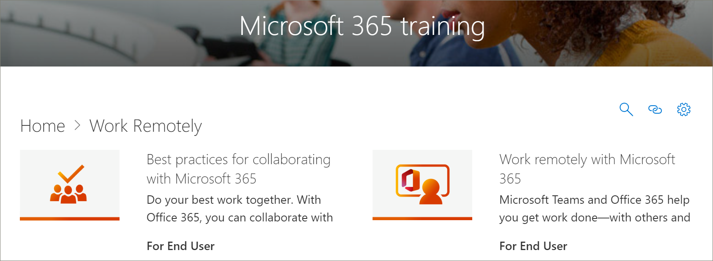

# Microsoft 365 Learning Pathways コンテンツ更新プログラム
学習経路は、四半期ごとにコンテンツ更新サイクルに従う努力をしています。 コンテンツ更新プログラムの適用方法とコンテンツ更新プログラムの管理方法の詳細については、「コンテンツ更新プログラムの管理 [」を参照してください](custom_contentupdatesmanage.md)。 

## 2021 年 3 月のコンテンツ更新プログラム
次に、2021 年 3 月のコンテンツ更新プログラムの一覧を示します。 

### ハイブリッドワークプレース
組織が、従業員が自宅やオフィスで働くハイブリッド職場への移行を支援するために、ユーザーが効果的な会議を実行し、包括的な会議環境を作成し、同年に共同作業を行い、ライブ イベントで大規模なユーザーにリーチするためのプレイリストを提供しました。 ハイブリッドワークプレースのサブカテゴリには、次のプレイリストとアセットが含まれます。

#### 効果的な会議を実行する
- 効果的な会議を実行する
- ハイブリッド会議
- ハイブリッド会議スペースに関する考慮事項
- ハイブリッド会議の前、中、後の操作
- 効果的な会議をスケジュールする
- 効果的な会議を計画し、導く
- ハイブリッド会議の前、中、後にユーザーを引き付け
- 会議のチェックリスト
- 会議の疲労を軽減する

#### 包括的な会議環境の作成
- 包括的な会議環境の作成
- 会議と関連コンテンツをすべてのユーザーにアクセス可能にする
- 会議の気晴らしを制限する
- タイム ゾーン間で共感を構築する

#### 非同期のコラボレーションと共同編集
- 会議の削減または非同期コラボレーションへの置き換え
- 共有コンテンツの共同作業と共同編集
- Microsoft 365 での共同作業のベスト プラクティス
- Microsoft 365 ファイルの共同作成者
- ドキュメントのグループ作業と共同編集
- SharePoint、Teams、OneDrive との共同作業
- Teams での共同作業
- SharePoint でドキュメント ライブラリを使用する
- 共同編集の一般的なエラーのトラブルシューティング

#### ライブ イベントで多数のユーザーにリーチする
- ライブ イベントを使用して多数のユーザーにリーチする
- ライブ イベントの Microsoft Teams の使用を開始する
- Teams でのライブ イベントの計画とスケジュール
- ライブを整理する

### Microsoft Teams
Microsoft Teams は、次のコンテンツで更新されました。

#### 会議のプレイリストを管理する
[会議の管理] プレイリストには、次の新しいアセットがあります。
- Teams 会議のヒント

#### 移動中のプレイリストのチーム
移動中の Teams プレイリストは、次の新しいアセットで更新されました。
- 移動中にチャネルを開始する
- 移動中にチャネルを作成する
- 移動中の通知を管理する

#### Shifts を使用してチーム スケジュールを管理する
[Shifts を使用してチーム スケジュールを管理する] プレイリストが、次のアセットで追加されました。
- Shifts とは
- 管理者のシフト
- シフト スケジュールの作成
- シフト スケジュールの管理
- Firstline ワーカーのシフト

#### Walkie Talkie、Tasks、および Praise
Walkie Talkie、Tasks、および Praise プレイリストが、次のアセットと一緒に追加されました。
- トランシーバー
- Teams でタスク アプリを使用する
- 管理者向けタスク
- Firstline ワーカーのタスク
- コミュニケーションと称賛

#### 承認の作成
[承認の作成] プレイリストが次のアセットと一緒に追加されました。
- 承認とは
- 承認の作成
- チャットから承認を作成する

### リスト
新しい Lists サブカテゴリとプレイリストが学習経路に追加されました。

#### リストの使用を開始する
[リストの開始] プレイリストには、次の新しいアセットがあります。
- リスト アプリからリストを作成する
- Teams チャネルでリストを作成する
- リスト アイテムの追加または編集
- リストのビューを作成または変更する
- リスト ビューの編集
- リストの検索と管理
- リストまたはリスト アイテムを共有する
- ビジネス情報の追跡

### フォーム
[フォームの作成と結果の表示] プレイリストが、次の新しいアセットで更新されました。

#### フォームを作成して結果を表示する
- 新しいフォームまたはクイズを作成する
- フォームを共有して応答を取得する
- フォームの結果を表示する
- フォームで分岐ロジックを使用する
- アンケートまたはアンケートにセクションを追加する

### Excel
学習経路の Excel が次のコンテンツで更新されました。

#### Excel のイントロ
Intro to Excel プレイリストには、次の新しいアセットがあります。
- ドロップダウン リストの作成

#### リンクされたデータ型
リンクされたデータ型の新しいプレイリストが、次のアセットを持つ学習経路に追加されました。 
- テキストを組織のデータ型に変換する
- データ セレクターを使用して組織のデータ型を指定する
- 組織のデータ型からデータを表示および挿入する

#### 数式と関数
数式と関数のプレイリストに 2 つの新しいアセットが追加されました。
- XLOOKUP 関数
- MATCH 関数

### SharePoint
すべての SharePoint プレイリストとアセットが更新されました。 更新されたプレイリストには、次のものが含まれます。
- SharePoint Online Quick Start
- SharePoint Online のイントロ
- サイト、投稿、リストを作成する
- SharePoint との共有と同期

## 2020 年 9 月のコンテンツ更新プログラム
次に、2020 年 9 月のコンテンツ更新プログラムの一覧を示します。 

### セキュリティ
新しいセキュリティ サブカテゴリがプレイリストとアセットで追加され、ユーザーがオフィスや自宅でより安全に作業できます。 

#### "5 つの簡単な手順" プレイリスト
- フィッシングから身を守る
- 技術サポート詐欺を回避する
- 自宅での作業を安全に行う
- PC を最新の状態に保つ
- Windows セキュリティで保護された環境を保つ

#### "自宅のセキュリティ" プレイリスト
- データを安全に保つヒント
- 自宅でコンピューターを安全に保つ
- Windows セキュリティを使用してオンラインで家族を保護する   

#### "仕事中のセキュリティ" プレイリスト
- 仕事でコンピューターを安全に保つ
- 多要素認証とは
- Windows セキュリティのファイアウォールとネットワーク保護
- タンパープロテクションによるセキュリティ設定の変更を防止する

### "Teams の使用を開始する" プレイリスト
新しい "Get Started with Teams" プレイリストが"Get Started/First Days" サブカテゴリに追加され、ユーザーが Teams を起動して実行するのに役立ちます。 プレイリストには次の内容が含まれます。
- Microsoft Teams にようこそ  
- チームを立ち上げ、実行する
- チャネルでの作業  
- ファイルのアップロードと共有 
- チャットの開始とピン留め  
- Teams 会議に参加する 
- 会議の管理 
 
### Microsoft 365 の基本
[製品] カテゴリで、"Office 365 Basics" サブカテゴリが "Microsoft 365 Basics" カテゴリに更新されました。 "Office 365 Basics" カテゴリの廃止されたアセットは、カスタムプレイリストに追加されている場合でも使用できます。

#### "Get started" プレイリスト
- Microsoft 365 とは
- サインイン
- Office.com

#### "作成して保存" プレイリスト
- デスクトップ アプリの使用
- アプリ Office.com 使用する
- ファイルをクラウドに保存する
- OneDrive を使用してオンデマンドでファイルを同期する

#### "共有と共同作業" プレイリスト
- Microsoft 365 でファイルを共有する
- 共同作成者
- 使用@mentions
- フォローアップ

#### "Microsoft Teams で作業する" プレイリスト
- Microsoft Teams にようこそ
- チームとチャネルの概要
- 投稿の作成と書式設定
- チャットの開始とピン留め
- 通話を行う
- Teams 会議に参加する
- より良い会議のヒント

#### "Windows を使い切る" プレイリスト
- 検索でドキュメント、アプリ、その他を検索する
- Microsoft Edge
- Bing での Microsoft Search

#### "どこからでも作業する" プレイリスト
- OneDrive モバイル アプリ
- Outlook モバイル アプリ

#### "クール Microsoft 365 の機能" プレイリスト
- PowerPoint デザイナー
- Excel のアイデア
- Word のエディター
- コンテンツにアクセス可能にする

### Access で "グラフを作成する" プレイリスト
"Products\Access" サブカテゴリに "グラフのプレイリストを作成する" が追加されました。  
- 列グラフの作成
- 棒グラフの作成
- 線グラフの作成
- 円グラフの作成
- コンボ グラフの作成

### Teams の更新
"Product\Microsoft Teams" サブカテゴリは、次のアセットで更新されました。 

#### "会議の管理" プレイリスト
- Teams 会議に参加する
#### "投稿とメッセージを処理する" プレイリスト
- 投稿の作成と書式設定

### Planner 
フォローアセットが "Products\Planner" の "Use Planner" プレイリストに追加されました。
#### Planner プレイリストを使用する
- To Do vs Planner
- [To Do] でプランナー タスクを確認する
- Teams でタスク アプリを使用する

### Word
次のアセットは、"Share and co-author with Word" プレイリストで更新されました。

#### "Share and co-author with Word" プレイリスト
- "リアルタイム共同編集を使用して Word ドキュメントを共同作業する" アセットが更新されました。 

### Web 用 Office
次のアセットは、"web Office Word for the web" プレイリストで更新されました。

#### "Office: Word for the web" プレイリスト
- 録音を書き起こしする

### PowerPoint (新規、更新)
次のアセットが更新または製品\PowerPoint プレイリストに追加されました。 

#### "PowerPoint &テーブルのテキスト" プレイリスト
- PowerPoint で手書きのインクを図形、テキスト、または数学に変更する (新しい)

#### スライド ショーのプレイリストを表示する
- プレゼンテーションを記録する (更新)

### Officeスタート ガイド (更新)
すべてのOfficeクイック スタート ガイドOffice更新されました。 

## 2020 年 4 月のコンテンツ更新プログラム
 現在のイベントに対応して、2020 年 4 月のコンテンツ更新プログラムには、組織内のリモート作業を有効にするように設計された学習プレイリストとリソースが提供されます。 新しい一連の作業のリモート再生リストが追加され、特に Teams 会議の Microsoft Teams コンテンツが更新されました。 また、Web プレイリスト用の新しいOffice追加し、新しい Microsoft Forms アセットを追加しました。 管理者向けリモート ワーク リソースの一覧も提供しました。  
 
 コンテンツ更新プログラムの適用方法とコンテンツ更新プログラムの管理方法の詳細については、「コンテンツ更新プログラムの管理 [」を参照してください](custom_contentupdatesmanage.md)。 次に、2020 年 4 月の Microsoft 365 ラーニング パスのコンテンツ更新プログラムの一覧を示します。 

### Office 365 が Microsoft 365 にブランド変更されました
Office 365 が Microsoft 365 にブランド変更されました。 名前の変更は、Microsoft 365 ラーニング パスのコンテンツ全体に反映されます。 

### 新しいプレイリストまたは更新されたプレイリスト
次のプレイリストが追加または更新されました。  

#### リモートで作業する (2 つの新しいプレイリスト/11 の新しいアセット)
次のプレイリストとアセットを備えた学習パスに、新しい Work リモートサブカテゴリが追加されました。 

##### リモートで作業する (5 つの新しいアセット)
- リモートで 365 Office作業する
- Office.com で使用を開始する
- コミュニケーションまたは会う
- 作業ファイルを保存する
- 高度な代替手段
##### 365 と共同作業するためのベスト Office (6 つの新しいアセット)
- 作業の開始
- 共有
- 共同作成者
- ファイル内のチャット
- Meet
- モバイル

### Teams (9 つの新しいアセット/6 つの更新されたアセット)
Teams コンテンツに対してさまざまな更新が行われた。 
#### チームとチャネルでの共同作業 (1 つの新しい/1 つの更新されたアセット)
- プライベート チャネルの作成と使用 (新しい)
- チャネルの表示と非表示 (更新)
#### チャットと通話の開始 (2 つの新しい/1 が更新されました)
- チャットの開始とピン留め (新しい)
- チャットを非表示にする、メッセージを削除する (新しい)
- 通話を行う (更新)
#### アプリとツールの検索 (新しい 1 つ)
- アプリを使用する (新しい)
#### 投稿とメッセージの処理
- 複数のチャネルにメッセージを投稿する (新しい)
#### 会議の管理 (3 つの新しい/4 つの更新されたアセット)
- Teams 会議に参加する (新しい)
- [今すぐ会議] を使用してインスタント 会議を作成する (更新)
- チャネルで会う (新しい)
- 会議の管理 (新規)
- 会議中に画面を表示する (更新)
- PowerPoint スライドの表示 (更新)
- Teams 会議中に移動する (更新)
#### 投稿とメッセージの処理 (新しい 1 つ)
- 複数のチャネルにメッセージを投稿する (新しい)

### Web 用 Office
Officeには、ユーザーが Web 上のユーザーと作成、共有、および共同作業を行うシナリオ用の一連のOffice提供されます。 この一連のコンテンツは、Google G Suite から Microsoft 365 に切り替える組織にも有用です。
#### 開始する (5 つの新しいアセット)
- 作業の開始
- 検索で検索する
- 新しいドキュメントの作成
- 仕事に戻る
- 推奨ファイル
#### Outlook for the web
- Outlook for the Web を知る
- メールへの返信を作成する
- 受信トレイを整理する
- 署名と自動返信を作成する
- 予定または会議をスケジュールする
- 連絡先の編集を作成する
- メール、連絡先、イベントの検索
#### Web 用 Word
- Word for the Web を知る
- ドキュメント レイアウトの変更
- テーブルと画像を挿入する
- オンラインでの共同作業
- Word for the Web でのクールな機能
#### Web 用 Excel
- Excel for the Web を知る
- 数式の作成
- ピボットテーブルの挿入
- アイデアに関する洞察を得る
- 共同作業
- フラッシュフィルで時間を節約する
- 条件付き書式を使用して図をペイントする
#### Web 用 PowerPoint
- PowerPoint for the Web を知る
- 図、図形などの挿入
- アニメーションと切り替え
- 他のユーザーとプレゼンテーションを作成する
- 提示する準備ができたら
- スライドの設計
#### ドキュメントを共有する
- ドキュメントを共有する
- 共有可能なリンクを作成する
- 特定のユーザーにのみドキュメントをセキュリティで保護する
- 組織外のユーザーと共有する 

### Microsoft Forms 
要求に応じて、いくつかの新しい Forms アセットも用意されています。 
#### フォーム (4 つの新しいアセット) 
- フォームの作成 
- フォームを共有する 
- フォームの結果を表示する 
- Microsoft フォームに関するよく寄せられる質問 

### リモート ワークをサポートするためのリソース
ラーニング パスを使用して、リモート ワーカーをサポートするためのラーニング パス サイトにランディング ページを作成できます。 または、ラーニング パス Web パーツをラーニング パス サイトの既存のサポート ページに追加し、Web パーツをフィルター処理して[リモートで作業] プレイリストを表示することもできます。 組織内のリモート作業をサポートするための Microsoft のトップ リソースの一覧を次に示します。 
- [Microsoft Teams の展開方法](/microsoftteams/how-to-roll-out-teams)
- [Microsoft Teams でのミーティングと会議](/microsoftteams/deploy-meetings-microsoft-teams-landing-page)
- [Microsoft Teams を使用したリモート ワーカーのサポート](/microsoftteams/support-remote-work-with-teams)
- [よくあるご質問 (FAQ): リモートの従業員をサポートする](/microsoftteams/faq-support-remote-workforce)
- [Microsoft IT が従業員のリモート作業を有効にする上位 9 つの方法](https://www.microsoft.com/microsoft-365/blog/2020/03/12/top-9-ways-microsoft-it-enabling-remote-work-employees/)
- [Microsoft Teams トレーニング](/microsoftteams/training-microsoft-teams-landing-page)
- [Education: Microsoft Education Center](https://education.microsoft.com) 
- [教育: リモート学習の開始](https://education.microsoft.com/resource/4c0c02c0)

ラーニング パスをカスタマイズする方法の詳細については、「学習パスを [カスタマイズする」を参照してください](custom_overview.md)。 

## 2019 年 11 月のコンテンツ更新プログラム
Microsoft 365 ラーニング パスのコンテンツ更新プログラムへようこそ。 2019 年 11 月の更新プログラムから、四半期ごとに学習経路カタログの更新されたインベントリを提供します。 2019 年 11 月の更新プログラムでは、次の新しいコンテンツ サブカテゴリと再生リストがラーニング パスカタログに追加されました。 コンテンツ更新プログラムの適用方法とコンテンツ更新プログラムの管理方法の詳細については、「コンテンツ更新プログラムの管理 [」を参照してください](custom_contentupdatesmanage.md)。    

### Teams
Teams サブカテゴリにいくつかの新しいプレイリストが追加されました。
- 投稿とメッセージの処理 (4 つのアセット)
- ファイルのアップロードと検索 (2 つのアセット)
- ライブ イベントの設定と参加 (4 つのアセット)
- アクティビティ フィードの管理 (2 つのアセット)
- 移動中のチーム (2 つのアセット)

### Microsoft 365 サクセス センター
Microsoft 365 ラーニング パスサクセス センター サブカテゴリをラーニング パスエクスペリエンスに追加しました。 サクセス センターには、次のプレイリストがあります。
- 新機能、変更点 (3 つのアセット)
- 学習コンテンツを計画する (2 つのアセット)
- 学習経路をカスタマイズする (8 つのアセット?
- 学習経路の導入を促進する (1 つのアセット)
- 学習経路の影響を測定する (1 つのアセット)

### Outlook
Outlook サブカテゴリに次のプレイリストが追加されました。 
- Outlook モバイル: 受信トレイを管理する (8 つのアセット)
- Outlook モバイル: ユーザーと接続 (5 つのアセット)
- Outlook mobile: 検索と共有 (4 つのアセット)

### OneDrive
OneDrive 用に次のビデオ アセットが追加されました。 
- iPhone または iPad のセットアップが OneDrive プレイリストのイントロに追加されました
- OneDrive のバックアップを有効にするが、OneDrive プレイリストでファイルを管理するに追加されました

### Planner
次のプレイリストとアセットがカタログに追加されました。  
- Planner クイック スタート (6 つのアセット)
- Use Planner (8 つのアセット)

### アクセシビリティ
コンテンツのアクセシビリティ サブカテゴリが、次のプレイリストと一緒に追加されました。 
- Microsoft 365 アクセシビリティの概要とリソース (3 つのアセット)
- Outlook でアクセスしやすい電子メール メッセージを作成する (3 つのアセット)
- よりアクセスしやすい Word ドキュメントを作成する (8 つのアセット)
- よりアクセスしやすい Excel ブックを作成する (3 つのアセット)
- PowerPoint でアクセスしやすいスライドを作成する (5 つのアセット)

### Sway
コンテンツの Sway サブカテゴリが、次のプレイリストと一緒に追加されました。 
- Sway クイック スタート (4 つのアセット)
- Sway の共有とアクセス (5 つのアセット)
- Sway にコンテンツを追加する (11 アセット)
- Sway のカスタマイズ (5 つのアセット)

### Access
- Access Quick Start (4 つのアセット)
- Access のイントロ (3 つのアセット)
- Access データベースの作成 (2 つのアセット)
- テーブルの追加 (2 つのアセット)
- リレーションシップの使用 (5 つのアセット)
- データの追加と編集 (2 つのアセット)
- クエリを使用してデータを管理する (5 つのアセット)
- フォームの作成 (1 つのアセット)
- レポートの作成 (2 つのアセット)
- データベースの保護 (1 つのアセット)