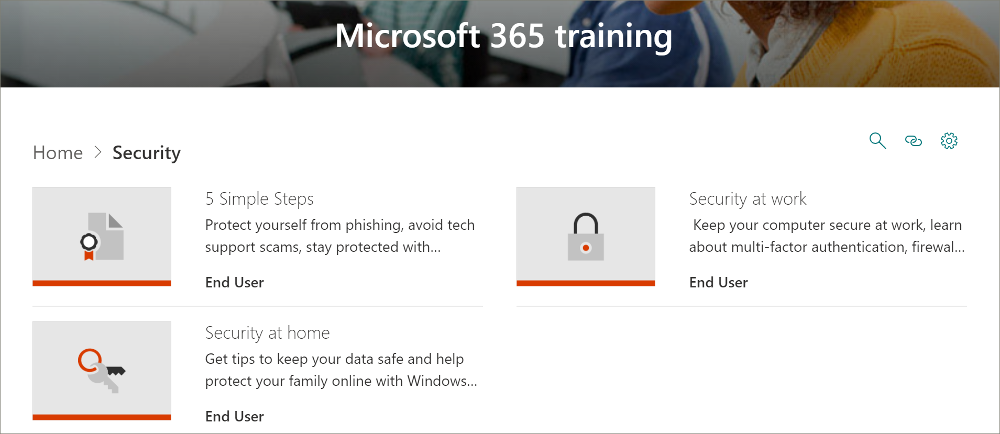

# Microsoft 365 学習経路のコンテンツの更新Microsoft 365 Learning Pathways Content Updates
学習経路は、四半期ごとのコンテンツ更新サイクルを遵守することに努力しています。Learning pathways strives to adhere to a quarterly content update cycle. 以下に、2020年9月のコンテンツ更新プログラムの一覧を示します。The following list the content updates for September 2020.

## 2020年9月のコンテンツ更新プログラムSeptember 2020 Content Updates
学習経路は、四半期ごとのコンテンツ更新サイクルを遵守することに努力しています。Learning pathways strives to adhere to a quarterly content update cycle. コンテンツの更新の適用方法、およびコンテンツの更新を管理する方法の詳細については、「 [コンテンツの更新を管理](custom_contentupdatesmanage.md)する」を参照してください。To learn more about how content updates are applied, and how to manage content updates, see [Manage Content Updates](custom_contentupdatesmanage.md). 

### セキュリティSecurity
新しいセキュリティサブカテゴリが、ユーザーが office および自宅でより安全に作業できるように、再生リストとアセットと共に追加されました。A new security subcategory has been added with playlists and assets to help users work more securely in the office and at home. 

#### "5 つの簡単な手順" プレイリスト"Five simple steps" playlist
- フィッシングから保護するProtect yourself from phishing
- テクニカルサポートによる詐欺を回避するAvoid tech support scams
- 自宅からより安全に作業を行うWork from home more securely
- PC を最新の状態に保つKeep your PC up-to-date
- Windows セキュリティで保護された状態を維持するStay protected with Windows security

#### "ホームのセキュリティ" 再生リスト"Security at home" playlist
- データを安全に保つためのヒントTips to keep your data safe
- 自宅でコンピューターを安全に保つKeep your computer safe at home
- Windows セキュリティを使用して家族を保護するには、ここで偶然になります。Help protect your family online with Windows Security – is this in here by accident?

#### "職場でのセキュリティ" 再生リスト"Security at work" playlist
- 作業時にコンピューターのセキュリティを確保するKeep your computer secure at work
- 多要素認証とはWhat is Multi-factor Authentication?
- Windows セキュリティでのファイアウォールとネットワーク保護Firewall and network protection in Windows security
- 改ざん防止が行われたセキュリティ設定の変更を禁止するPrevent changes in security settings with Tamper Protection

### "Teams の使用を開始する" プレイリスト"Get started with Teams" playlist
新しい "Teams の使用を開始する" プレイリストは、ユーザーが Teams を起動して実行するのに役立つ、"Teams の使用を開始する" という新しいサブカテゴリに追加されました。A new "Get Started with Teams" playlist has been added to the "Get Started/First Days" subcategory to help users get up and running with Teams. 再生リストの内容は次のとおりです。The playlist includes:
- Microsoft Teams にようこそWelcome to Microsoft Teams  
- チームを稼働させるGet your team up and running
- チャネルで作業するWork in channels  
- ファイルをアップロードして共有するUpload and share files 
- チャットの開始と固定Start and pin chats  
- Teams 会議に参加するJoin a Teams meeting 
- 会議の管理Manage meetings 
 
### Microsoft 365 の基本Microsoft 365 Basics
[製品] カテゴリでは、"Office 365 の基本" サブカテゴリが "Microsoft 365 の基本" カテゴリに更新されています。In the Products category, the "Office 365 Basics" subcategory has been updated to the "Microsoft 365 Basics" category. 「Office 365 の基本」カテゴリの廃止されたアセットは、カスタムプレイリストに追加されている場合でも使用できます。Retired assets in the "Office 365 Basics" category are still available if they've been added to a custom playlist.

#### "はじめに" プレイリスト"Get started" playlist
- Microsoft 365 とはWhat is Microsoft 365?
- サインインSign in
- Office.comOffice.com

#### 再生リストを作成して保存する"Create and save" playlist
- デスクトップアプリの使用Using the desktop apps
- Office.com アプリの使用Using Office.com apps
- クラウドにファイルを保存するSave files to the cloud
- OneDrive を使用して必要に応じてファイルを同期するSync Files on Demand with OneDrive

#### "共有と共同作業" プレイリスト"Share and collaborate" playlist
- Microsoft 365 でファイルを共有するShare files in Microsoft 365
- 共同作成者Co-author
- @Mentions を使用するUse @mentions
- フォローアップFollow-ups

#### "Microsoft Teams で作業" プレイリスト"Work with Microsoft Teams" playlist
- Microsoft Teams にようこそWelcome to Microsoft Teams
- チームとチャネルの概要Overview of teams and channels
- 投稿を作成して書式設定するCreate and format a post
- チャットの開始と固定Start and pin chats
- 電話をかけるMake calls
- Teams 会議に参加するJoin a Teams meeting
- 会議を改善するためのヒントTips for better meetings

#### "Windows を最大限に活用" プレイリスト"Get the most out of Windows" playlist
- 検索を使用してドキュメントやアプリなどを検索するFind your documents, apps, and more with Search
- Microsoft EdgeMicrosoft Edge
- Bing での Microsoft SearchMicrosoft Search in Bing

#### "Anywhere から作業" 再生リスト"Work from anywhere" playlist
- OneDrive モバイルアプリOneDrive mobile app
- Outlook mobile アプリOutlook mobile app

#### "クール Microsoft 365 機能" プレイリスト"Cool Microsoft 365 features" playlist
- PowerPoint デザイナーPowerPoint Designer
- Excel のアイデアIdeas in Excel
- Word のエディターEditor in Word
- コンテンツにアクセスできるようにするMake your content accessible

### Access で [グラフの作成] プレイリストを作成する"Create a chart" playlist in Access
[グラフのプレイリストを作成する] が "製品 \ Access" サブカテゴリに追加されました。A "Create a chart playlist" has been added to the "Products\Access" subcategory.  
- 縦棒グラフを作成するCreate a column chart
- 棒グラフを作成するCreate a bar chart
- 折れ線グラフを作成するCreate a line chart
- 円グラフを作成するCreate a pie chart
- コンボグラフを作成するCreate a combo chart

### Teams の更新Teams updates
"Product\Microsoft Teams" サブカテゴリは、次のアセットで更新されました。The "Product\Microsoft Teams" subcategory has been updated with the following assets. 

#### "会議の管理" プレイリスト"Manage meetings" playlist
- Teams 会議に参加するJoin a Teams meeting
#### "投稿とメッセージの操作" プレイリスト"Work with posts and messages" playlist
- 投稿を作成して書式設定するCreate and format a post

### PlannerPlanner 
フォローアセットは、「製品¥ planner」の「プランナーを使用する」プレイリストに追加されました。The follow assets have been added to the "Use Planner" playlist in "Products\Planner".
#### Planner の再生リストを使用するUse Planner playlist
- Vs Planner を行うにはTo Do vs Planner
- Do で Planner のタスクを表示するSee your Planner Tasks in To Do
- Teams でのタスクアプリの使用Use the Tasks App in Teams

### WordWord
次のアセットは、"共有と共同編集者と Word" プレイリストで更新されています。The following asset has been updated in the "Share and co-author with Word" playlist.

#### "Word での共有と共同編集" プレイリスト"Share and co-author with Word" playlist
- "リアルタイム共同編集を使用して Word 文書でコラボレーションを行う" 資産が更新されました。"Collaborate on Word documents with real-time co-authoring" asset has been updated. 

### Webアプリ上の OfficeOffice for the web
次のアセットは、「web 用 Office: Word for web」の再生リストで更新されています。The following asset has been updated in the "Office for the web: Word for the web" playlist.

#### "Web 用 Office: web 用の Word" プレイリスト"Office for the web: Word for the web" playlist
- 録音を書き起こしするTranscribe your recordings

### PowerPoint (新規、更新済み)PowerPoint (new, updated)
次のアセットが更新されたか、製品 \ PowerPoint のプレイリストに追加されました。The following assets have been updated or added to the Products\PowerPoint playlists. 

#### 「テキスト & の表と PowerPoint のプレイリスト"Text & tables with PowerPoint" playlist
- PowerPoint で手書きインクを図形、テキスト、または数式に変更する (新)Change handwritten ink to shapes, text, or math in PowerPoint (new)

#### スライドショー再生リストを表示するPresent slideshows playlist
- プレゼンテーションを録音する (更新)Record a presentation (updated)

### Office クイックスタートガイド (更新されたもの)Office Quick Start guides (updated)
すべての Office 製品の Office クイックスタートガイドが更新されました。The Office Quick Start guides for all the Office products have been updated. 

## 2020年4月のコンテンツの更新April 2020 Content Updates
 現在のイベントへの対応として、2020年4月のコンテンツ更新プログラムは、組織内でリモート作業を有効にするために設計された学習のプレイリストとリソースを提供します。In response to current events, the April 2020 Content Update provides learning playlists and resources designed to enable remote work in your organization. 新しい作業のセットがリモート再生リストに追加され、Microsoft Teams のコンテンツが大幅に更新されました。特に Teams 会議において、web 再生リスト用の新しい Office セットが追加され、新しい Microsoft Forms アセットが追加されています。We’ve added a new set of Work remotely playlists, significantly updated the Microsoft Teams content, especially for Teams meetings, added a new set of Office for the web playlists, and added new Microsoft Forms assets. 更新の一環として、管理者向けのリモート作業リソースの一覧も提供しました。As part of the update, we've also provided a list of Remote Work resources for administrators.  
 
 コンテンツの更新の適用方法、およびコンテンツの更新を管理する方法の詳細については、「 [コンテンツの更新を管理](custom_contentupdatesmanage.md)する」を参照してください。To learn more about how content updates are applied, and how to manage content updates, see [Manage Content Updates](custom_contentupdatesmanage.md). 以下に、2020年4月の Microsoft 365 learning パスのコンテンツ更新プログラムを示します。The following lists the April 2020 Microsoft 365 learning pathways content updates. 

### Office 365 は、Microsoft 365 に再ブランディングされました。Office 365 was rebranded to Microsoft 365
Office 365 は、Microsoft 365 に再ブランディングされています。Office 365 has been rebranded to Microsoft 365. 名前の変更は、Microsoft 365 learning の経路のコンテンツ全体に反映されます。The name change is reflected throughout the Microsoft 365 learning pathways content. 

### 新規または更新されたプレイリストNew or Updated Playlists
次のプレイリストが追加または更新されました。The following playlists have been added or updated.  

#### リモートで作業する (2 つの新しい再生リスト/11 の新しいアセット)Work remotely (2 new playlists/11 new assets)
リモート作業サブカテゴリが、次のプレイリストとアセットを機能するラーニング経路に追加されました。A new Work remotely subcategory was added to learning pathways that features the following playlists and assets: 

##### リモートで作業する (5 つの新しいアセット)Work remotely (5 new assets)
- Office 365 を使用してリモートで作業するWork remotely with Office 365
- Office.com で使用を開始するGet started at Office.com
- コミュニケーションまたは会合Communicate or meet
- 作業ファイルを保存するStore your work files
- 高度な代替手段Advanced alternatives
##### Office 365 との共同作業のベストプラクティス (新しいアセット6個)Best practices for collaborating with Office 365 (6 new assets)
- 作業の開始Get started
- 共有Share
- 共同作成者Co-author
- ファイル内のチャットChat in files
- 満たせMeet
- MobileMobile

### Teams (新規アセット9個/6 更新済みアセット)Teams (9 new assets/6 updated assets)
Teams コンテンツにさまざまな更新が行われました。A variety of updates have been made to Teams content. 
#### Teams およびチャネルでの共同作業 (1 つの新規/1 件の更新された資産)Collaborate in teams and channels (1 new/1 updated asset)
- プライベートチャネルを作成して使用する (新)Create and use private channels (new)
- チャネルを表示または非表示にする (更新)Show or hide channels (updated)
#### チャットと通話を開始する (2 つの新しい/1 が更新された場合)Start chats and calls (2 new/1 updated)
- スタートおよびピン留めチャット (新)Start and pin chats (new)
- チャットの非表示、メッセージの削除 (新規)Hide chats, delete messages (new)
- 通話の作成 (更新)Make calls (updated)
#### アプリとツールを参照する (1 つの新)Explore apps and tools (1 new)
- アプリを使用する (新)Use apps (new)
#### 投稿とメッセージを操作するWork with posts and messages
- 複数のチャネルへのメッセージの投稿 (新)Post a message to multiple channels (new)
#### 会議の管理 (3 つの新規または4つの更新された資産)Manage meetings (3 new/4 updated assets)
- Teams 会議に参加する (新)Join a Teams meeting (new)
- 即時会議を使用した即時会議の作成 (更新)Create instant meetings with Meet now (updated)
- チャネル内での会議 (新機能)Meet in a channel (new)
- 会議の管理 (新)Manage meetings (new)
- 会議中に画面を表示する (更新)Show your screen during a meeting (updated)
- PowerPoint スライドを表示する (更新)Show PowerPoint slides (updated)
- Teams 会議中に移動する (更新された)Move around during a Teams meeting (updated)
#### 投稿とメッセージを操作する (1 件の新規)Work with post and messages (1 new)
- 複数のチャネルへのメッセージの投稿 (新)Post a message to multiple channels (new)

### Webアプリ上の OfficeOffice for the web
Web 用 office は、ユーザーが web 上で Office を作成、共有、および共同作業するシナリオの一連のプレイリストを提供します。Office for the web provides a set of playlists for scenarios where users want to create, share, and collaborate with Office on the web. この一連のコンテンツは、Google G スイートから Microsoft 365 への切り替えを行う組織にとっても重要です。This set of content is also valuable for organizations that are making the switch from Google G Suite to Microsoft 365.
#### はじめに (5 つの新しいアセット)Get started (5 new assets)
- 作業の開始Get started
- 検索を使用して検索するFind it with Search
- 新しいドキュメントを作成するCreate new documents
- 作業に戻るGet back to work
- 推奨ファイルRecommended files
#### Web 用 OutlookOutlook for the web
- Outlook の Web を理解するGet to know Outlook for the Web
- 電子メールへの返信を作成するCreate an reply to email
- 受信トレイを整理するOrganize your Inbox
- 署名および自動応答を作成するCreate a signature and automatic reply
- 予定または会議をスケジュールするSchedule an appointment or meeting
- 連絡先の編集を作成するCreate an edit a contact
- 電子メール、連絡先、イベントを検索するSearch for email, contacts, and events
#### Web 用 WordWord for the web
- Web 用の Word を理解するGet to know Word for the Web
- 文書のレイアウトを変更するChange document layout
- 表や図を挿入するInsert tables and pictures
- オンラインでの共同作業Collaborate online
- Word での Web のクールな操作Cool things in Word for the Web
#### Web 用 ExcelExcel for the web
- Excel の Web を理解するGet to know Excel for the Web
- 数式を作成するCreate formulas
- ピボットテーブルを挿入するInsert a PivotTable
- アイデアを理解するGet insight with ideas
- 共同作業Collaborate
- フラッシュフィルで時間を節約するSave time with Flash Fill
- 条件付き書式を使用して画像を描画するPaint a picture with Conditional Formatting
#### Web 用 PowerPointPowerPoint for the web
- Web の PowerPoint を理解するGet to know PowerPoint for the Web
- 図、図形などの挿入Insert pictures, shapes, and more
- アニメーションと画面切り替えAnimation and transitions
- 他のユーザーとプレゼンテーションを作成するCreate a presentation with others
- プレゼンテーションの準備ができたらWhen you’re ready to present
- スライドのデザインDesigning slides
#### ドキュメントの共有Share your documents
- ドキュメントの共有Share your documents
- 共有可能なリンクを作成するCreate a shareable link
- 特定のユーザーのみにドキュメントをセキュリティで保護するSecure your docs only to specific people
- 組織外のユーザーと共有するShare with someone outside your organization 

### Microsoft FormsMicrosoft Forms 
要求により、いくつかの新しいフォームアセットもあります。By request, there are also some new Forms assets. 
#### フォーム (新しいアセット4個)Forms (4 new assets) 
- フォームを作成するCreate a form 
- フォームを共有するShare a form 
- フォームの結果を表示するView results of a form 
- Microsoft Forms に関してよく寄せられる質問Frequently Asked Questions about Microsoft Forms 

### リモート ワークをサポートするためのリソースResources for supporting your remote workforce
学習経路を使用して、リモートワーカーをサポートするための学習ページをラーニングサイトに構築できます。You can use learning pathways to build a landing page in your learning pathways site for supporting remote workers. または、ラーニングパスサイトの既存のサポートページに learning の経路の web パーツを追加し、web パーツをフィルター処理してリモート再生リストの作業を表示することができます。Or you can add the learning pathways web part to an existing support page on your learning pathways site and filter the web part to show the Work Remotely playlists. ここでは、組織でのリモート作業をサポートするために Microsoft の主要なリソースの一覧を示します。Here’s a list of some of the top resources from Microsoft for supporting remote work in your organization. 
- [Microsoft Teams の展開方法How to roll out Microsoft Teams](https://docs.microsoft.com/microsoftteams/how-to-roll-out-teams)
- [Microsoft Teams でのミーティングと会議Meetings and conferencing in Microsoft Teams](https://docs.microsoft.com/microsoftteams/deploy-meetings-microsoft-teams-landing-page)
- [Microsoft Teams を使用したリモートワーカーのサポートSupport Remote Workers using Microsoft Teams](https://docs.microsoft.com/microsoftteams/support-remote-work-with-teams)
- [よくあるご質問 (FAQ): リモートの従業員をサポートするFAQ: Support your remote workforce](https://docs.microsoft.com/microsoftteams/faq-support-remote-workforce)
- [Microsoft IT が従業員のリモート作業を有効にするトップ9の方法The top 9 ways Microsoft IT is enabling remote work for its employees](https://www.microsoft.com/microsoft-365/blog/2020/03/12/top-9-ways-microsoft-it-enabling-remote-work-employees/)
- [Microsoft Teams のトレーニングMicrosoft Teams Training](https://docs.microsoft.com/microsoftteams/training-microsoft-teams-landing-page)
- [教育機関: Microsoft エデュケーションセンターEducation: Microsoft Education Center](https://education.microsoft.com) 
- [教育機関: リモート学習の概要Education: Getting started with remote learning](https://education.microsoft.com/resource/4c0c02c0)

学習経路をカスタマイズする方法の詳細については、「 [ラーニング経路をカスタマイズ](custom_overview.md)する」を参照してください。For more information about how to customize Learning Pathways, see [Customize learning pathways](custom_overview.md). 

## 2019年11月のコンテンツ更新プログラムNovember 2019 Content Updates
Microsoft 365 learning ・経路のコンテンツ更新にようこそ。Welcome to the Microsoft 365 learning pathways content update. 2019年11月の更新プログラムから、四半期ごとに学習経路カタログの更新されたインベントリを提供します。Starting with our November 2019 update, we'll provide an updated inventory of the learning pathways catalog on a quarterly basis. 2019年11月の更新プログラムでは、次のような新しいコンテンツのサブカテゴリと再生リストが、ラーニングパスカタログに追加されました。For the November 2019 update, the following new content subcategories and playlists have been added to the learning pathways catalog. コンテンツの更新の適用方法、およびコンテンツの更新を管理する方法の詳細については、「 [コンテンツの更新を管理](custom_contentupdatesmanage.md)する」を参照してください。To learn more about how content updates are applied, and how to manage content updates, see [Manage Content Updates](custom_contentupdatesmanage.md).    

### TeamsTeams
Teams サブカテゴリに、いくつかの新しいプレイリストが追加されました。Several new playlist have been added to the Teams subcategory.
- 投稿とメッセージを操作する (3 アセット)Work with posts and messages (3 assets)
- ファイルをアップロードして検索する (2 アセット)Upload and find files (2 assets)
- ライブイベントをセットアップして参加する (4 アセット)Set up and attend live events (4 assets)
- アクティビティフィードを管理する (2 アセット)Manage your activity feed (2 assets)
- ゴーオンの Teams (2 アセット)Teams on the go (2 assets)

### Microsoft 365 成功センターMicrosoft 365 Success Center
ラーニング経路の経験については、Microsoft 365 learning ・経路成功センターのサブカテゴリを追加しました。We've added a Microsoft 365 learning pathways Success Center subcategory to the learning pathways experience. サクセスセンターでは、次のプレイリストが提供されます。The Success Center provides the following playlists.
- 新機能、変更点 (3 資産)What’s New, What Changed (3 asset)
- 学習コンテンツ (2 アセット) を計画するPlan your learning content (2 assets)
- 学習経路 (8 アセット) をカスタマイズするCustomize learning pathways (8 assets?)
- 学習経路 (1 つの資産) の導入を促進するDrive Adoption of learning pathways (1 asset)
- 学習経路の影響を測定する (1 つの資産)Measure impact of learning pathways (1 asset)

### OutlookOutlook
次のプレイリストが Outlook サブカテゴリに追加されました。The following playlists has been added to the Outlook subcategory. 
- Outlook mobile: 受信トレイを管理する (4 アセット)Outlook mobile: Manage your inbox (4 assets)
- Outlook mobile: 時間を管理する (8 アセット)Outlook mobile: Manage your time (8 assets)
- Outlook mobile: 人物と接続 (5 アセット)Outlook mobile: People and connections (5 assets)
- Outlook mobile: 検索と共有 (4 アセット)Outlook mobile: Search and share (4 assets)

### OneDriveOneDrive
OneDrive 用に追加されたビデオアセットは次のとおりです。The following video assets have been added for OneDrive. 
- OneDrive または iPad をセットアップするには、「OneDrive to OneDrive 再生リスト」に追加されています。Set up your iPhone or iPad has been added to the Intro to OneDrive playlist
- Onedrive バックアップをオンにして、OneDrive の再生リストを使用してファイルを管理します。Turn on OneDrive Backup has been added to the Manage your files with OneDrive playlist

### PlannerPlanner
カタログには、次のプレイリストとアセットが追加されています。The following playlists and assets have been added to the catalog.  
- Planner クイックスタート (6 アセット)Planner Quick Start (6 assets)
- Planner を使用する (8 アセット)Use Planner (8 assets)

### アクセシビリティAccessibility
コンテンツのアクセシビリティサブカテゴリは、次のプレイリストで追加されました。The Accessibility subcategory of content has been added with the following playlists. 
- Microsoft 365 アクセシビリティの概要とリソース (3 アセット)Microsoft 365 Accessibility Overview and Resources (3 assets)
- Outlook でよりアクセス可能な電子メールメッセージを作成する (3 アセット)Create more accessible email messages in Outlook (3 assets)
- よりアクセシビリティの高い Word 文書を作成する (8 アセット)Create more accessible Word documents (8 assets)
- よりアクセシビリティの高い Excel ブックを作成する (3 アセット)Create more accessible Excel workbooks (3 assets)
- PowerPoint で追加のアクセス可能なスライドを作成する (5 アセット)Create more accessible slides in PowerPoint (5 assets)

### OneDriveOneDrive
注: 変更を追加する必要があります。NOTE: Changes need to be added here.....

### SwaySway
コンテンツの Sway サブカテゴリは、次のプレイリストで追加されています。The Sway subcategory of content has been added with the following playlists. 
- Sway クイックスタート (4 アセット)Sway Quick Start (4 assets)
- Sway の共有とアクセス (5 アセット)Share and access Sway (5 assets)
- Sway にコンテンツを追加する (11 アセット)Add content to Sway (11 assets)
- Sway のカスタマイズ (5 アセット)Customize Sway (5 assets)

### AccessAccess
- Access クイックスタート (4 アセット)Access Quick Start (4 assets)
- Access 入門 (3 アセット)Intro to Access (3 assets)
- Access データベースを作成する (2 アセット)Create an Access database (2 assets)
- テーブルを追加する (2 アセット)Add tables (2 assets)
- リレーションシップを使用する (5 アセット)Use relationships (5 assets)
- データを追加および編集する (2 アセット)Add and edit data (2 assets)
- クエリを使用してデータを管理する (5 アセット)Manage data with queries (5 assets)
- フォームを作成する (1 つのアセット)Create forms (1 asset)
- レポートを作成する (2 アセット)Create reports (2 assets)
- データベースを保護する (1 つの資産)Protect databases (1 asset)

