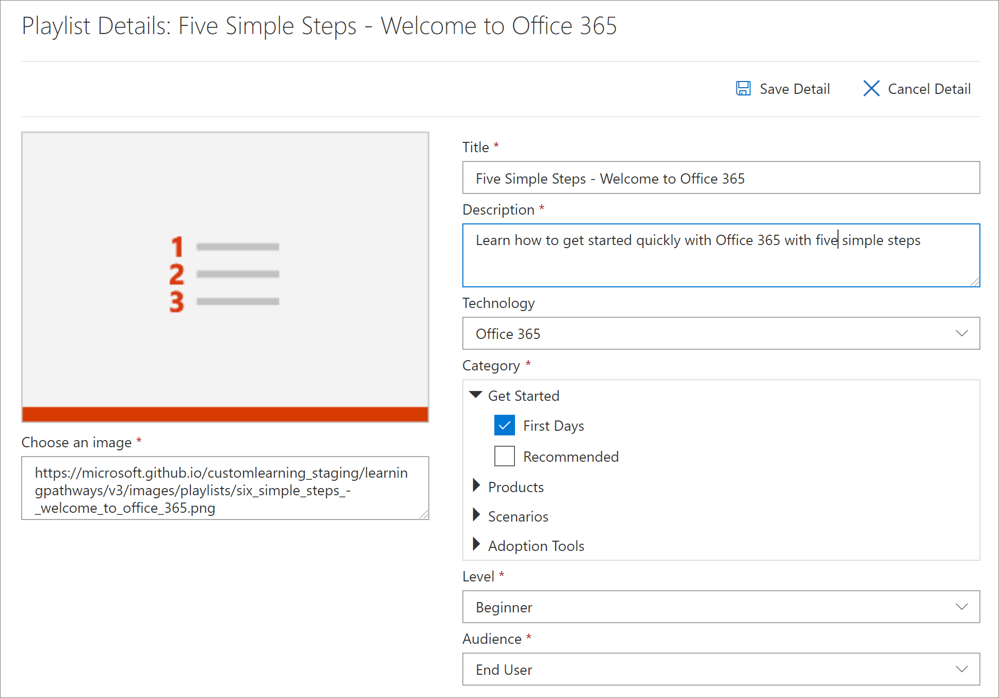

# 再生リストをコピーするCopy a Playlist
多くの場合、組織によって作成されたアセットでアセットを削除または置換することによって、Microsoft が提供する再生リストを変更する必要があります。Quite often, organizations need to modify a Microsoft-supplied playlist by removing or replacing an asset with an asset created by the organization. たとえば、6つのシンプルなステップの再生リストから、最初からステップを削除することができます。For example, you might want to remove a step from the Start with Six Simple Steps playlist. ラーニング経路のコピー再生リスト機能を使用して、6つのシンプルなステップの再生リストを簡単にコピーし、アセットを削除したり、アセットを置き換えたり、新しいアセットを追加したりすることができるようになりました。Now you can use the learning pathways Copy Playlist feature to easily copy the Six Simple Steps playlist and simply remove an asset, replace an asset, or add new assets. 

## 再生リストをコピーするにはTo copy a playlist

1. Microsoft 365 learning の経路の **ホーム** ページで、[ **Office 365 のトレーニング**] をクリックします。From the Microsoft 365 learning pathways **Home** page, click **Office 365 training**.
2. [ **管理** ] アイコンをクリックします。Click the **Administration** icon.
3. [ **最初の日**] で、 **6 つの簡単な手順 (Office 365 再生リストへようこそ** ) をクリックしてから、[ **プレイリストのコピー**] をクリックします。Under **First Days**, click the **Six Simple Steps - Welcome to Office 365** playlist, and then click **Copy Playlist**. 
4. [ **詳細の編集**] をクリックし、次の例に示されているように、 **タイトル** と **説明** のフィールドに入力して、[ **詳細の保存**] をクリックします。Click **Edit Detail**, and then fill in the **Title** and **Description** fields as shown in the following example, then click **Save Detail**.  
 

## 再生リストにアセットを追加または削除するAdd or remove assets from a playlist
カスタムプレイリストを使用すると、次のことができます。With custom playlists, you can:
- Microsoft アセットを追加および削除するが、Microsoft からアセットを編集することはできません。add and remove Microsoft assets, but not edit the assets from Microsoft
- 作成した組織または SharePoint アセットから、カスタムの既存の SharePoint アセットを追加、削除、および編集できます。add, remove, and edit custom existing SharePoint assets from your organization or SharePoint assets that you create. 

### 再生リストからアセットを削除するRemove an asset from a playlist
- [ **管理** ] ページを下にスクロールし、[ **再生リストのアセット** ] の下にある手順5の [削除] アイコンをクリックし **ます。モバイルアプリを設定**します。Scroll down the **Administration** page, and then under **Playlist Assets** click the delete icon for **Step 5. Set up mobile apps**. 

## 再生リストからアセットが削除されていることを確認するVerify the asset is removed from the playlist
1. **Microsoft 365 トレーニング**ページのタブに戻ります。Return to the tab with the **Microsoft 365 training** page.
2. [ **最初の日**] をクリックしてから、 **5 つの簡単な手順 [Office 365 再生リストへようこそ] を** クリックします。Click **First Days**, then click the **Five Simple Steps - Welcome to Office 365** playlist. 
3. 再生リストをクリックして、アセットが削除されたことを確認します。Click through the playlist to verify that the asset has been removed.

