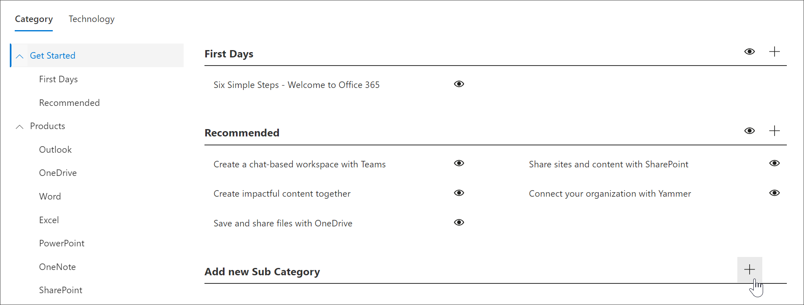

# サブカテゴリを作成する 
場合によっては、新しいサブカテゴリを作成する必要があります。たとえば、最初の [日] サブカテゴリが組織に対して機能しない場合は、新しいサブカテゴリを作成して、組織のニーズに合わせて再生リストを追加することができます。 

1. カスタム学習の**ホーム**ページで、[ **Office 365 training**] をクリックし、Web パーツの [**システム**] メニューをクリックして、[**プレイリストの管理**] をクリックします。 
2. **カテゴリ**を選択します。この例では、[**はじめ**に] を選択します。  
3. ページを下にスクロールし、 
3. [**新しいサブカテゴリの追加] +** アイコンをクリックします。  

> [!TIP]
> Microsoft が提供するサブカテゴリは非表示にすることができますが、編集または削除することはできません。 

## サブカテゴリを編集する
- サブカテゴリの**編集**アイコンを選択し、サブカテゴリのタイトルを編集して、[**保存**] をクリックします。

## サブカテゴリを非表示にする
- サブカテゴリの eyeball を選択して非表示にします。 

## サブカテゴリを削除する
- サブカテゴリの**編集**アイコンを選択し、[削除] を選択し**ます。** 
