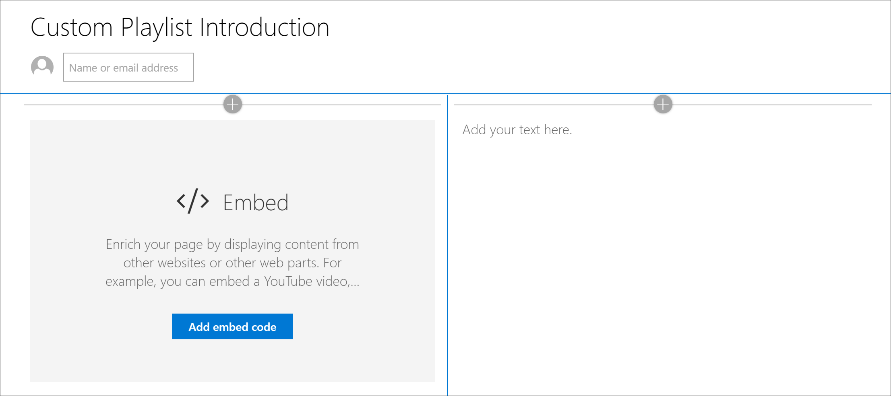
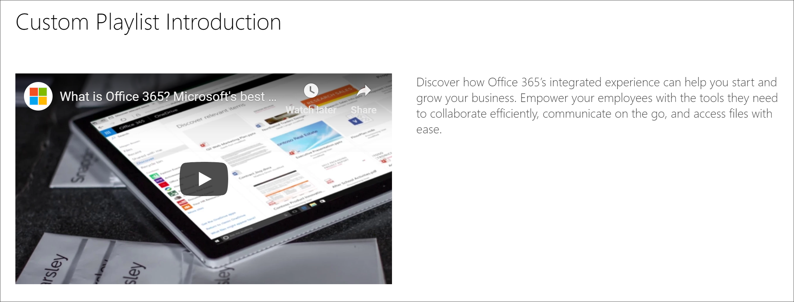

# カスタムSharePointのページを作成する

学習経路のユニークな機能の 1 つは、Microsoft のアセットと、作成した SharePoint アセットから組み立てられたプレイリストを作成する機能です。 この例では、プレイリストを作成する前SharePointページを作成します。 Web ページから再生リストSharePoint作成する機能は、Microsoft または組織から利用可能な Web パーツを使用してページを作成するさまざまな機会を提供します。 たとえば、プレイリストには、YouTube の埋め込みビデオを含む SharePoint ページ、Office 365 フォームから作成されたフォーム、または埋め込みレポートPower BIできます。 この例では、埋め込み Web パーツとテキスト Web パーツを使用してページを作成する方法について説明します。  

## カスタムプレイリストSharePointページを作成する

1. [歯車] SharePoint **クリック** し、[ページの追加 **] をクリックします**。
2. ページ **の左側にある [新しいセクションの追加] (+)** をクリックし、セクション レイアウトの [2 つの **列** ] をクリックします。
3. 左側の列で、[+] をクリックし、[埋め込み] **Web パーツを** クリックします。 
4. 右側の列で、[+] をクリックし、[ **テキスト] Web パーツを** クリックします。 ページは次のように表示されます。

### YouTube からビデオとテキストを追加する

1. ブラウザーで、YouTube に移動します。 この例では、「Microsoft の最高Office 365生産性アプリOffice 365」を検索します。
2. ビデオをクリックして再生し、一時停止してから右クリックします。 
3. [埋 **め込みコードのコピー**] をクリックし、次のページにSharePointします。 
4. [ **埋め込み] Web** パーツで **[埋** め込みコードの追加] をクリックし、YouTube ビデオからコードを追加します。
5. YouTube ページに戻り、ビデオの **説明テキスト** をコピーします。 
6. [テキスト] ページSharePoint、**テキスト** Web パーツを選択し、YouTube ビデオからテキストをコピーします。
7. [ユーザー設定 **] ページの [** タイトル] 領域で [web パーツの編集] SharePointを選択し、[カスタム プレイリストの概要] ページに名前を付きます。 
8. [ **レイアウト] で**、[プレーン] **を** 選択し、[タイトル領域] プロパティ **ウィンドウ** を閉じます。 これで、ページは次のようになります。 

### ページを発行する

- [発行] **ボタンを選択** します。 これで、カスタムプレイリストにこのページSharePoint追加する準備ができました。 