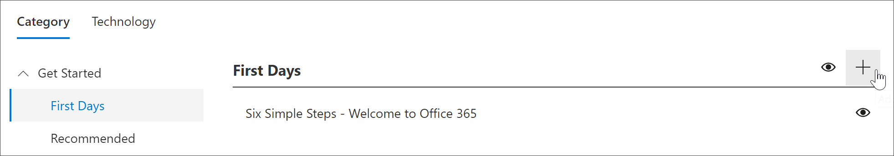
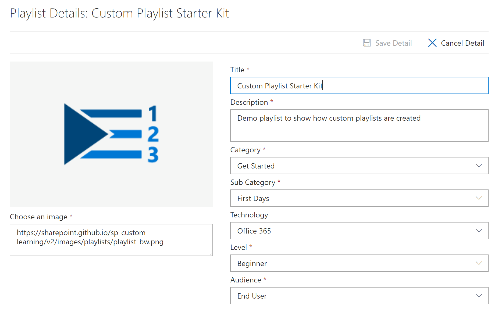
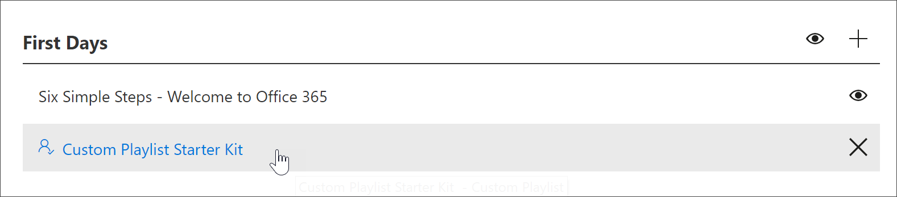
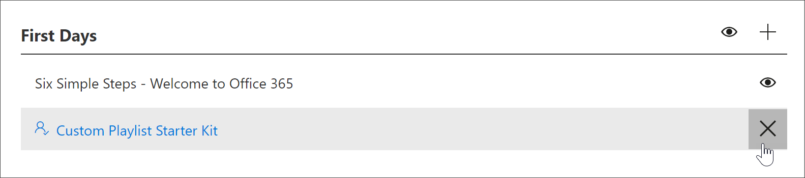

# カスタム再生リストを作成する

Microsoft 365 の学習経路を使用すると、組織の固有のニーズに合わせてカスタマイズされたカスタムの再生リストを一から作成できます。 たとえば、Microsoft Teams に新入者向けのオンボードのプレイリストを作成します。 または、独自の役割に適した情報を使用して、エグゼクティブ管理者のプレイリストを作成します。 または、6個ではなく、3つの簡単な手順を含む Microsoft 365 プレイリストの最初の日を作成します。 任意のサブカテゴリにカスタムプレイリストを追加できます。 たとえば、**最初の日**、 **Excel**のような**製品**サブカテゴリ、または作成したサブカテゴリでもあります。 このセクションでは、再生リストを作成し、次のセクションのプレイリストにアセットを追加する方法について説明します。これには、 [カスタムプレイリストにアセットを追加](custom_addassets.md)します。

## 再生リストを作成する 

1. Microsoft 365 learning の経路の **ホーム** ページで、[ **Office 365 のトレーニング**] をクリックし、Web パーツから [ **管理** ] アイコンを選択します。 
2. [ **管理**] アイコンサブカテゴリを選択します。 この例では、[ **最初の日**] を選択します。  
3. [+] アイコンをクリックします。  

4.  次の例に示されているように、再生リスト内のフィールドに入力します。 この例では、既定のアイコンのままにしておくことができます。 

5.  完了したら、[ **詳細の保存**] を選択します。 

## 再生リストを編集する

- **カスタム学習管理**ページで、再生リストをクリックし、[**詳細の編集**] をクリックします。  

### 再生リストを削除する

- カスタム学習管理ページで、再生リストの [ **削除** ] アイコンをクリックします。  

