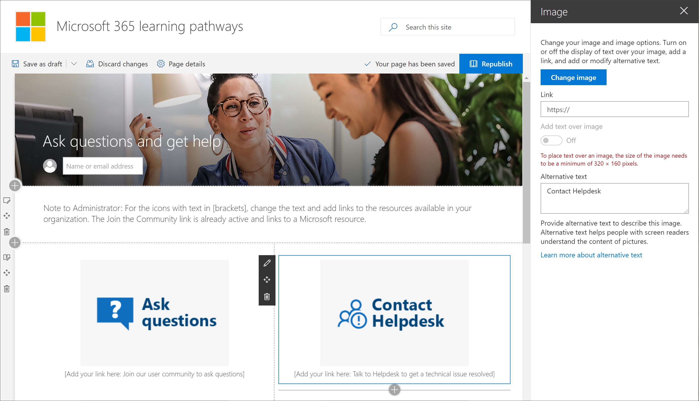

# サイトをカスタマイズするCustomize the site

Microsoft 365 learning のラーニングサイトは SharePoint のコミュニケーションテンプレートに基づいているため、組織のニーズに合わせてサイトを簡単に変更することができます。The Microsoft 365 learning pathways site is based on a SharePoint communication template, so it's easy to modify the site to meet the needs of your organization. サイト名、ロゴ、メニュー項目、およびページ上のコンテンツを変更することができます。You can change the site name, logo, menu items, and the content on the pages. 

> [!TIP]
> 従業員からフィードバックを収集し、定期的にサイトを更新します。Gather feedback from your employees and periodically update the site. たとえば、新しいイベントが利用可能になったときに、トレーニングイベントカレンダーを更新することができます。For example, you can update the Training events calendar as new events become available. 新しいサービスを開始するときに、コンテンツを表示したり、新しいサービスを起動する目的で設計された対象指定トレーニングのプレイリストを作成したりすることができます。When launching new services, you can unhide content and build targeted training playlists designed for the launch of the new services. 

## サイトおよび web ページをカスタマイズするCustomize the site and web pages

ラーニングパスサイトは完全にカスタマイズできます。The learning pathways site is fully customizable. SharePoint サイトまたは web ページのカスタマイズ方法を熟知していない場合は、「support.office.com で[sharepoint サイトをカスタマイズ](https://support.office.com/en-us/article/customize-your-sharepoint-site-320b43e5-b047-4fda-8381-f61e8ac7f59b)する」の記事を参照することをお勧めします。If you are not familiar with how to customize your SharePoint site or web pages, we suggest you review the [Customize your SharePoint site](https://support.office.com/en-us/article/customize-your-sharepoint-site-320b43e5-b047-4fda-8381-f61e8ac7f59b) article on support.office.com. 

### 質問をカスタマイズしてヘルプを表示するCustomize Ask questions and get help

ラーニングポイントサイトの管理者として、組織内のリソースを参照するための [**ヘルプとサポートの取得**] ページ上のリンクを変更することをお勧めします。As an administrator of the learning pathways site, one of the things you’ll want to do is change the links on the **Get Help and Support** page to point to resources in your organization. 

1.  ラーニング経路のホームページで、[**質問をお寄せ**ください] および [ヘルプを取得] メニュー項目をクリックします。From the learning pathways Home page, click the **Ask questions and get help** menu item.
2.  [**編集**] ボタンをクリックします。Click the **Edit** button.
3.  ヘルプオプションの画像の上にカーソルを移動し、[ **web パーツの編集**] をクリックします。Hover over a Help option image, then click **Edit web part**.

4.  [**リンク**] ボックスに、内部リソースの URL を入力します。In the **Link** box, enter the URL for the internal resource. 
5.  リンクされていない他の2つの画像に対して手順3と4を繰り返します。Repeat steps 3 and 4 for the other two images that aren’t linked.

### ページ上のテキストを変更するChange the text on the page

1. テキスト領域をポイントして、ページのテキストを編集します。Hover over the text area, then edit the text for the page. 
2. 完了したら [**発行**] ボタンをクリックします。Click the **Publish** button when you’re done

## その他のカスタマイズオプションOther customization options
編集を考慮する必要があるその他のページは次のとおりです。Other pages you might want to consider editing are:

- トレーニングイベントのカレンダー .aspxTraining events calendar.aspx
- Default.aspx のヒーロー web パーツThe Hero web part on Home.aspx

