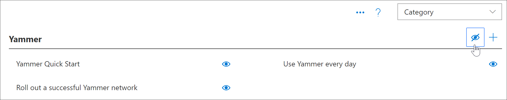

# 2019年11月バージョン3.0 機能の更新プログラム
お客様のフィードバックに基づいて、次の新機能がラーニング・バージョン3.0 に追加されています。

## コンテンツの更新と編集の予定表
教育経路の1つとして、最新のコンテンツがあります。 この点については、最初に四半期ごとにコンテンツを更新しました。 コンテンツ更新プログラムには、四半期ごとに更新されるコンテンツ更新の記事が反映されています。 コンテンツの更新については、「 [Learning のコンテンツの更新](custom_contentupdates.md)」を参照してください。

## Microsoft 365 成功センター
管理者とサイトコレクションの所有者が学習経路を最大限に活用できるように、Microsoft 365 learning の経路のサクセスセンターを追加しました。 サクセスセンターは、リソースの計画と導入に関するリンク、および学習経路の計画、カスタマイズ、導入、導入、測定に関するガイダンスを提供します。 詳細については、「[学習経路管理者成功センター](custom_successcenter.md) 」を参照してください。

## 再生リストナビゲーション
お客様のフィードバックに基づいて、[次へ] ボタンと [前へ] ボタンを使用して、ナビゲーションをより明確にしました。 また、ナビゲーション領域内に目次を追加して、ユーザーが再生リスト内のアイテムの完全なリストを簡単に確認したり、再生リスト内のアセットに直接移動したりできるようにしています。 

## 再生リストをコピーする
多くのお客様は、完全に新しい再生リストを作成しなくても、Microsoft が提供するプレイリストでいくつかの単純な事柄だけを変更する必要があることを表しています。 たとえば、6つのシンプルなステップの再生リストから、最初からステップを削除するという一般的な要求があります。 これで、プレイリストを Microsoft catalog の再生リストを含む既存の再生リストからコピーし、その再生リストを変更することができます。 たとえば、6つの簡単な手順をコピーし、3つの手順を削除して、再生リストを3つの簡単な手順に変更できるようになりました。 詳細については、「[再生リストをコピーする](custom_copyplaylist.md)」を参照してください。

## 向上した検索機能 
管理ページから再生リストを作成する場合の検索機能が改善されました。 検索結果では、検索結果で重複する名前を区別するための追加の詳細が提供されます。 検索結果の項目をクリックして、アセットをプレビューすることもできます。 詳細については、「[カスタムプレイリストを作成する](custom_copyplaylist.md)」を参照してください。

