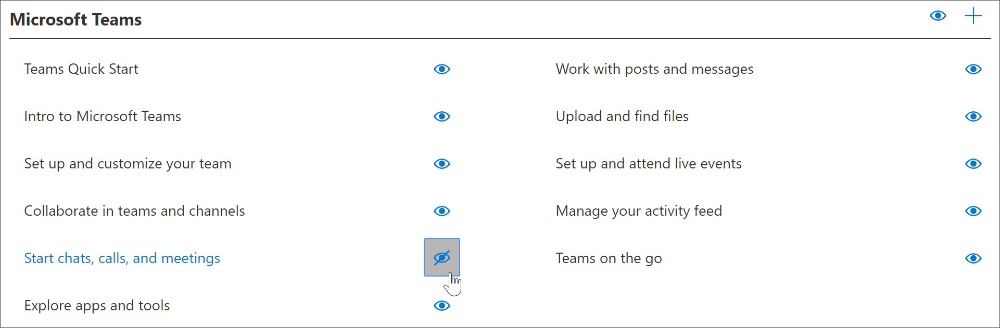
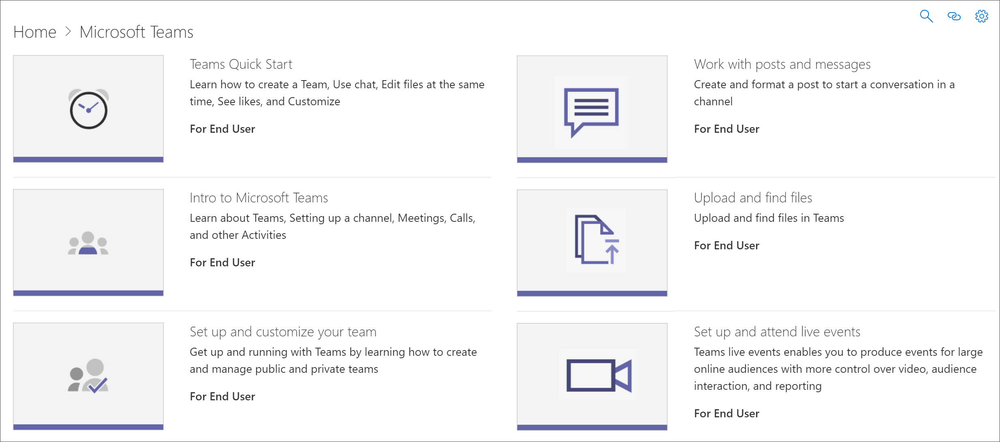

# 再生リストを表示または非表示にするHide and show Playlists

環境の学習経路を調整するには、Microsoft が提供するプレイリストを非表示にして、組織用に作成した再生リストに置き換える必要がある場合があります。To tailor learning pathways for your environment, you may need to hide playlists provided by Microsoft and replace them with playlists that you create for your organization. たとえば、一般的なお客様の使用例として、6つのシンプルなステップの再生リストを Microsoft から非表示にして、組織またはユーザーグループ用に作成した再生リストに置き換えることができます。For example, a common customer use case is to hide the Six Simple Steps playlist from Microsoft and replace it with a playlist that you create for your organization or user group. 

## プレイリストを非表示にするHide a playlist

1. [ラーニングの経路]**ホーム**ページから、 **Office 365 トレーニング**タイルをクリックします。From the learning pathways **Home** page, click the **Office 365 training** tile.
2. ラーニングポイント web パーツから、[**システム**] メニューを選択し、[**プレイリストの管理**] を選択します。From the learning pathways web part, select the **System** menu, then select **Administer Playlist**. これで2つのタブが表示されるようになります。1つは [**学習経路の管理**] ページです。**Office 365 トレーニング**ページと共に1つ。You should now have two tabs open: One with the **learning pathways Administration** page; and one with the **Office 365 training** page. 
3. **カスタム学習管理**ページの [**カテゴリ**] で、サブカテゴリを選択し、[eyeball] を選択して非表示にします。From the **Custom Learning Administration** page, under **Category**, select a subcategory, and then select the eyeball for a playlist to hide it. この例では、最初の [**日**] サブカテゴリをクリックし、 **6 つのシンプルなステップ**の再生リストを非表示にします。For this example, click the **First Days** subcategory, and then hide the **Six Simple Steps** playlist.  

### 再生リストが非表示になっていることを確認するVerify the playlist is hidden
- 再生リストが非表示になっていることを確認するには、「 **Office の使用を開始**しています365ページが読み込まれたブラウザー] タブを選択し、ページを更新します。To verify the playlist is hidden, select the browser tab with the **Get Started with Office 365** page loaded, and then refresh the page. **最初の日**のサブカテゴリが表示され、 **6 つの簡単な手順**が非表示になります。You should now see the **First Days** subcategory and **Six Simple Steps** is hidden. この場合、サブカテゴリには1つのプレイリストのみがあり、非表示になっているので、学習経路は空のサブカテゴリを表示するのではなく、サブカテゴリも非表示にします。In this case, there is only one playlist in the subcategory and it's hidden, so learning pathways also hides the subcategory rather than display an empty subcategory. 

## 再生リストを表示するUnhide a playlist

- **カスタム学習管理**ページで、[**カテゴリ**] の下のサブカテゴリを選択し、再生リストを選択して、非表示にした再生リストの eyeball を選択します。From the **Custom Learning Administration** page, under **Category**, select a subcategory, select a playlist, and then select the eyeball for the hidden playlist to unhide it. この例では、**最初の1日**のサブカテゴリの下の**6 つのシンプルなステップ**の再生リストを再表示します。For this example, unhide the **Six Simple Steps** playlist under the **First Days** subcategory.  

