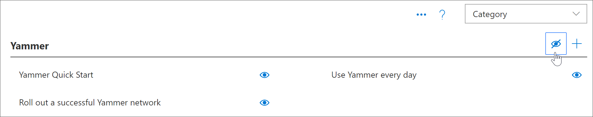
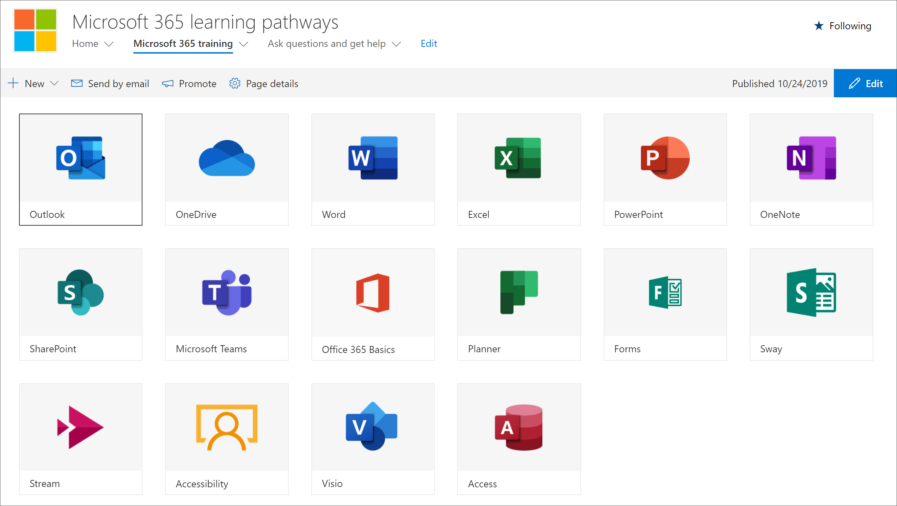

# サブカテゴリを表示または非表示にするHide and show Subcategories

カスタム学習管理を使用すると、サブカテゴリの表示と非表示を切り替えることができます。With Custom Learning Administration, you can hide and show subcategories. たとえば、yammer をロールアウトしていない企業は yammer サブカテゴリを非表示にすることができます。そのため、ユーザーは yammer のコンテンツを使用できません。For example, companies that don’t roll out Yammer can hide the Yammer subcategory, so Yammer content won't be available to users. これにより、組織では使用できないサービスに関連する情報を他の方法で表示する可能性があるユーザーからの、望ましくないサポートの呼び出しを防ぐことができます。This prevents unwanted support calls from users who might otherwise see information related to services that aren't available in your organization.

## サブカテゴリを非表示にするHide a subcategory 

1. カスタム学習ホームページから、 **Office 365 トレーニング**タイルをクリックします。From the Custom Learning Home page, click the **Office 365 training** tile.
2. カスタム学習 Web パーツで、[システム] メニューを選択し、[**プレイリストの管理**] を選択します。From the Custom Learning Web part, select the System menu, then select **Administer Playlist**. これで、2つのタブが表示されます。1つは**カスタム学習管理**ページで、もう1つは**Office 365 トレーニング**ページです。You should now have two tabs open: One with the **Custom Learning Administration** page, and one with the **Office 365 training** page. 
3. **カスタム学習管理**ページの [**カテゴリ**] で、サブカテゴリを選択し、サブカテゴリの eyeball を選択して非表示にします。From the **Custom Learning Administration** page, under **Category**, select a subcategory, and then select the eyeball for the subcategory to hide it. この例では、 **Yammer**サブカテゴリを非表示にします。For this example, hide the **Yammer** subcategory.  

### サブカテゴリが非表示になっていることを確認するVerify the subcategory is hidden
- サブカテゴリが非表示になっていることを確認するには、「 **Office の使用を開始**しています365ページが読み込まれたブラウザー] タブを選択し、ページを更新します。To verify the subcategory is hidden, select the browser tab with the **Get Started with Office 365** page loaded, and then refresh the page. これで、[製品] カテゴリに Yammer サブカテゴリが非表示になります。You should now see the Yammer subcategory hidden in the Products category. 

## サブカテゴリの表示Unhide a subcategory 

- **カスタム学習管理**ページで、[**カテゴリ**] の下のサブカテゴリを選択し、非表示のサブカテゴリの eyeball を選択します。From the **Custom Learning Administration** page, under **Category**, select a subcategory, and then select the eyeball for the hidden subcategory to unhide it. この例では、Yammer サブカテゴリを再表示します。For this example, unhide the Yammer subcategory.