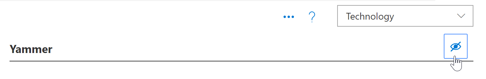
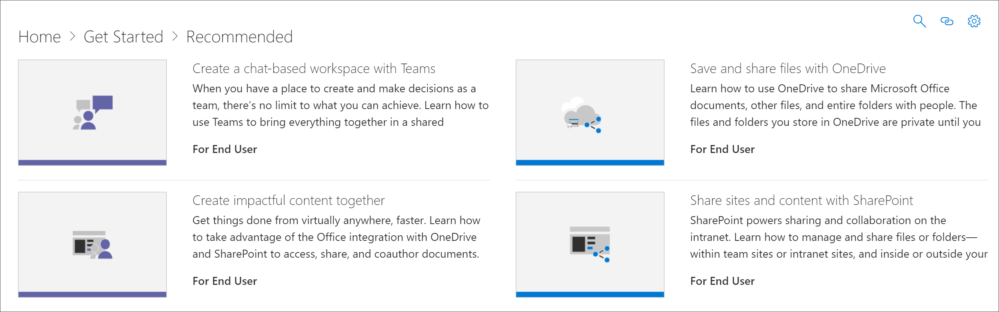

# テクノロジの非表示と表示Hide and show Technology

場合によっては、組織でサポートされていないテクノロジのコンテンツを非表示にする必要があります。[テクノロジの非表示機能は、Web パーツ全体にわたってテクノロジが表示されないようにすることを目的としています。これにより、サブカテゴリまたはプレイリストで非表示にするのではなく、コンテンツを非表示にしたり表示したりできます。たとえば、yammer サブカテゴリを非表示にすることはできますが、"yammer を使用して組織に接続する" など、特定のシナリオのプレイリストに yammer が表示されることがあります。特定のテクノロジがエンドユーザーに公開されないようにするには、テクノロジを使用して非表示にすることができます。In some cases, you’ll want to hide content for a technology that’s not supported in your organization. The Hide Technology feature is designed to prevent technology from appearing throughout the Web part. It offers a broader way to hide and show content than hiding it by subcategory or playlist. For example, you can hide a Yammer subcategory, but Yammer may still show up in certain scenario playlists such as "Connect your organization with Yammer". To ensure a specific technology is not exposed to end users, you can hide it by Technology. 

## テクノロジを非表示にするHide a Technology

1. カスタム学習**ホーム**ページから、 **Office 365 トレーニング**タイルをクリックします。From the Custom Learning **Home** page, click the **Office 365 training** tile.
2. カスタム学習 Web パーツで、[**システム**] メニューを選択し、[**プレイリストの管理**] を選択します。これで、2つのタブが表示されるようになります。1つは**カスタム学習管理**ページで、もう1つは**Office 365 トレーニング**ページです。From the Custom Learning Web part, select the **System** menu, then select **Administer Playlist**. You should now have two tabs open. One with the **Custom Learning Administration** page, and one with the **Office 365 training** page. 
3. **カスタム学習管理**ページで、**テクノロジ**をクリックし、そのテクノロジを非表示にする eyeball を選択します。この例では、 **Yammer**テクノロジをクリックし、非表示にします。From the **Custom Learning Administration** page, click a **Technology**, and then select the eyeball for the Technology to hide it. For this example, click the **Yammer** technology, and then hide it.  

### 再生リストが非表示になっていることを確認するVerify the playlist is hidden
1. **Yammer**テクノロジが非表示になっていることを確認するには、 **Office 365 トレーニング**ページが読み込まれたブラウザータブを選択して、ページを更新します。Yammer のサブカテゴリが非表示になっていることがわかります。To verify **Yammer** technology is hidden, select the browser tab with the **Office 365 training** page loaded, and then refresh the page. You should now see the Yammer subcategory is hidden. 
2. **推奨**サブカテゴリをクリックします。Yammer の [プレイリストを使用して組織を接続する」が非表示になっていることがわかります。Click the **Recommended** subcategory. You'll notice that the Connect your organization with Yammer playlist is hidden. 

## テクノロジの表示/非表示Unhide a Technology

- [**カスタム学習管理**] ページで、[**テクノロジ**] の下の [テクノロジ] を選択し、非表示のテクノロジの eyeball を選択して非表示にします。この例では、 **Yammer**テクノロジを再表示します。From the **Custom Learning Administration** page, under **Technology**, select a technology, then select the eyeball for the hidden technology to unhide it. For this example, unhide the **Yammer** technology. 