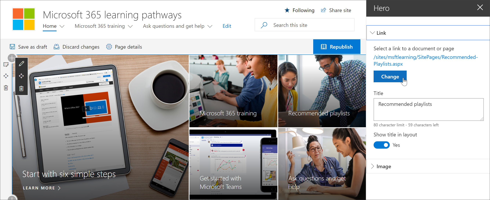
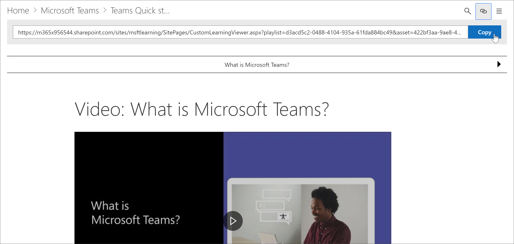
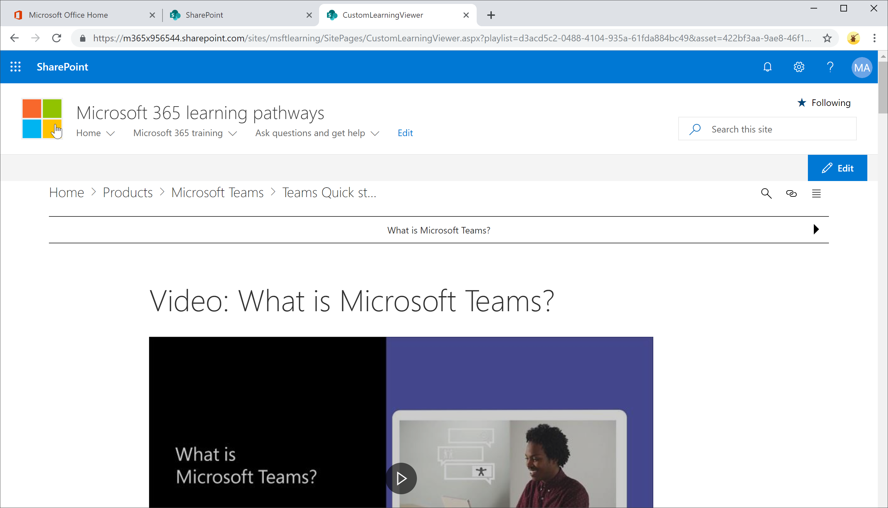

# カスタム学習コンテンツへのリンク

カスタム学習を使用すると、次の2つの方法でコンテンツにリンクすることができます。

- 表示するコンテンツに対してフィルター処理された Web パーツをホストするページにリンクします。 
- Web パーツのインスタンスへの直接リンク

## ページへのリンク

カスタム学習 Web パーツで新しいページと学習経験を作成した場合は、表示するコンテンツを表示するように構成された Web パーツを使用してページにリンクできます。前のセクションでは、Excel の再生リストをページに表示する方法について説明しました。これで、ホームページを編集してページにリンクすることができました。 

1. ホームページで、[**編集**] をクリックします。
2. ホームページのタイルのいずれかで [**詳細の編集**] をクリックします。この例では、推奨さ**れるプレイリスト**のタイルを編集します。
3. [**リンク**] で、[**変更**] をクリックします。

4. [**サイト**]、[**サイトページ**] の順にクリックしてリンク先のページをクリックし、[**開く**] をクリックします。この例では、前のセクションで説明した**Create-your-own-experience**ページにリンクします。
5. [ヒーローのプロパティ] ウィンドウを閉じ、[**発行**] をクリックして、リンクをテストします。 

## カスタム学習 web パーツへのリンク
カスタム学習を使用すると、管理者またはエンドユーザーは、web パーツを含むページに依存しない web パーツのインスタンスにリンクすることができます。コピーしたリンクやリンクを他のページから共有することができます。コピーされたリンクをクリックすると、CustomLLearningViewer ページにカスタム学習 web パーツインスタンスが表示されます。例を見てみましょう。 

1. ホームページで、[ **Office 365 トレーニング**] をクリックします。
2. [ **microsoft teams**] をクリックし、[ **microsoft teams への導入] を**クリックします。
3. [**コピー** ] アイコンをクリックします。

4. カスタム学習メニューから [ホーム] をクリックします。
5. コピーした URL をブラウザーのアドレスバーに貼り付けて、enter キーを押します。 

次の図に示すように、リンクは CustomLearningViewer ページにジャンプし、コピーされたリンクのパラメーターに基づいてコンテンツを表示します。 

