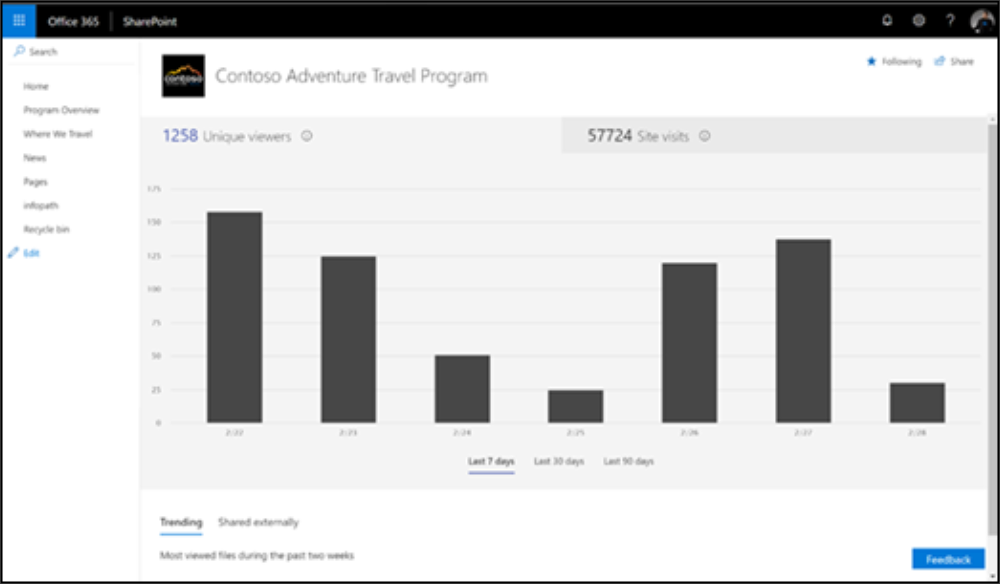

# Microsoft 365 ラーニング パスの影響を測定する

管理者は、SharePoint の組み込みのサイト利用状況レポート機能を活用して、Microsoft 365 ラーニング パスの組織への影響を測定する必要があります。 影響を測定する主なシナリオは次の 2 つがあります。 
- サイト レベルへの影響 - 365 の特定のサイトのカスタム Officeデータを表示する 
- 組織レベルへの影響 – 組織内の他のすべてのサイトOffice 365 の使用状況に関するカスタマー ラーニングを理解する

## サイトレベルの影響

SharePoint Online サイトの所有者は、ユーザーがサイトを操作する方法を示す情報を表示できます。 たとえば、サイトにアクセスしたユーザー数、サイトのアクセス回数、および最も多く閲覧されたファイルのリストを確認できます。 「レポート [の詳細」を参照してください](https://support.office.com/article/view-usage-data-for-your-sharepoint-site-2fa8ddc2-c4b3-4268-8d26-a772dc55779e)。 

## 組織レベルの影響
Office 365 管理センター SharePoint サイト使用状況レポートを使用すると、管理者は、他のすべての SharePoint サイトに対して Office 365 サイトのカスタム学習から取得する値の高レベルビューを取得できます。 「レポート [の詳細」を参照してください](/office365/admin/activity-reports/sharepoint-site-usage?view=o365-worldwide)。
 
参照先の記事に従って、次の手順を実行します。 
1. SharePoint サイト使用状況レポートにアクセスする方法について説明します。 
2. SharePoint サイト使用状況レポートの詳細を解釈する。 [サイト URL] フィールドで並べ替え、Microsoft 365 ラーニング パス サイトを簡単に識別できます。 
3. レポートのエクスポート機能を活用して、より高度なデータ分析を行う場合、または組織のサイト数が 2,000 を超える場合。 

## フィードバック

現在、レポートは SharePoint サイト レベルに制限されています。 強化されたレポート機能要求の優先順位付けを支援するために、投票を User [Voice](https://go.microsoft.com/fwlink/?linkid=2109552) フォーラムに貸します。