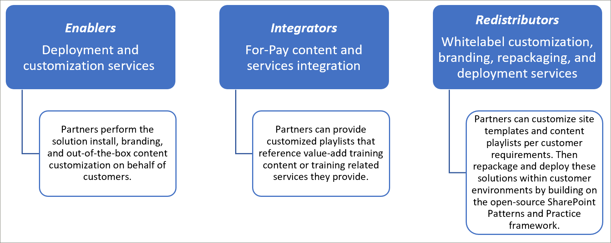
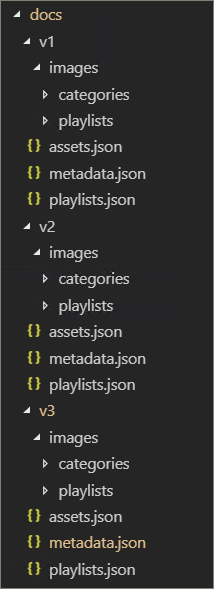
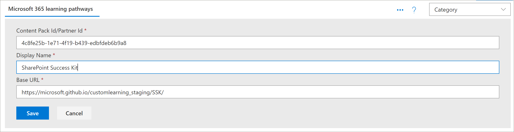
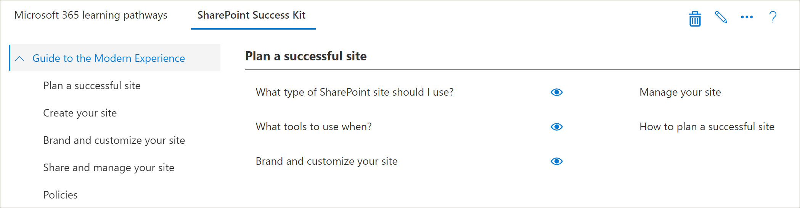
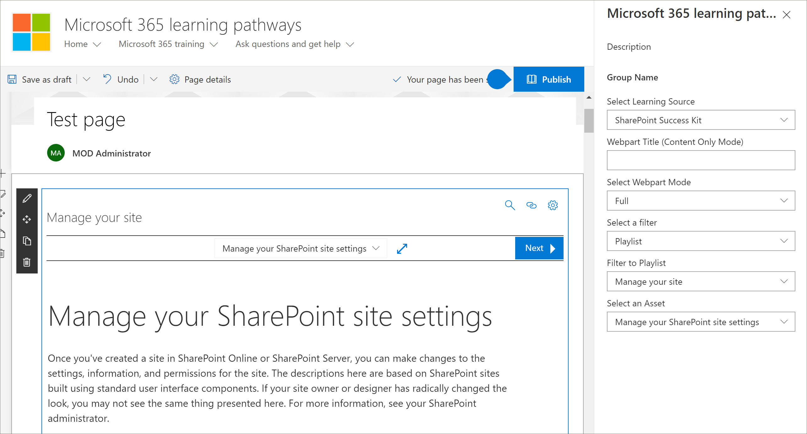

# パートナー統合モデルPartner integration models
SharePoint Online プロビジョニングサービスからは、Microsoft 365 learning の内容を直接 ' ' 外 ' にすることはできませんが、パートナーが利用して、調整された付加価値のあるサービスオファーリングを作成するために使用できるいくつかの統合モデルがあります。While it’s not possible to supplement the Microsoft 365 learning pathways content directly ‘out of the box’ from the SharePoint Online Provisioning service, there are several integration models that partners can leverage to create aligned value-add service offerings. 上記のパートナー統合モデルは、より複雑で、投資のレベルが高い順に示されています。The partner integration models above are presented in order of ascending complexity and levels of investment. そのため、お客様のビジネスモデルに基づいて専門知識を構築し、より高度なレベルにお客様を卒業することをお勧めします。Hence our guidance is to build your expertise and graduate to more advanced levels based on your business models.

 

## どのようにして作業を開始すればよいですか?How should I get started? 
開始するには、以下のベストプラクティスを参照してください。To get started, here are some best practices to follow.     

### 1. まず、イネーブラーとしての専門知識を習得します。1. Begin with building expertise as an Enabler. 
ラーニングパストレーニングポータルを有効にして、対象とする Microsoft のコンテンツを実行することにより、お客様の基礎をすぐに達成できるように支援することができます。You can help a percentage of your customer base right away by enabling their learning pathways training portal and performing targeted Microsoft content curation. 学習経路のプロビジョニングの手順については、「」を参照してください https://docs.microsoft.com/office365/customlearning/custom_provision 。For instructions on provisioning learning pathways, see https://docs.microsoft.com/office365/customlearning/custom_provision.  

### 2. サービスをインテグレーターとして拡張する2. Then extend your services as an Integrator
コンテンツやサービスの統合ニーズの量によっては、投資の自動化に関する分析を実行します。Perform an automation return on investment analysis - depending on the quantity of your content and/or services integration needs. たとえば、支払い対象のコンテンツを参照したり、サービスを参照したりする目的のカスタムプレイリストを手動で作成することができる場合は、コンテンツ統合のガイドラインに従って開発と運用のコストを考慮することが適切でない場合があります。For example, it may not make sense to take on the development and operational costs with respect to our content integration guidelines if you can quickly manually create a targeted custom playlist(s) pointing to your for-pay content or reference your services.

### 3. 投資収益率の実現時に再頒布を検討する3. When the return on investment makes sense – consider Redistribution 
投資収益率が有効になった場合は、再配信されたソリューションを構築するための再頒布 (または関連する学習経路パートナーの作業) を検討してください。When the return on investment makes sense – consider Redistribution (or working with related learning pathways partners) to build repackaged solutions. これらは、カスタマイズされたサイトを抽出し、お客様の環境に展開するためのソリューションを提供する、SharePoint のパターンとプラクティスのフレームワークに基づいています。These are based on the SharePoint Patterns and Practice framework which provides solutions to extract customized sites and then deploy into customer environments 

## パートナー提供のコンテンツ統合ガイドラインPartner-provided content integration guidelines
Microsoft 365 学習経路のコンテンツは、ラーニングパッケージのコンテンツマニフェストとして機能する JSON ファイルのセットによって駆動されます。Content for Microsoft 365 learning pathways is driven by a set of JSON files that act as content manifests for your learning package. 次の3つのファイルがあります。 metadata.json、playlists.json、assets.json。There are three files: metadata.json, playlists.json, and assets.json. これらのファイルは、web パーツが認識し、コンテンツ配信ネットワーク (CDN) からホストされて web パーツが読み込まれるようになるモデルと一致するように構造化する必要があります。These files need to be structured to match the models the web part recognizes and then hosted from a content delivery network (CDN) to allow the web part to load them. Microsoft は、開始するためにこれらのファイルのスターターテンプレートを提供します。Microsoft will provide starter templates of these files to get you started.  

**免責事項:** JSON ファイル構造は、今後のソリューション作業に基づいて変更される可能性があります。**Disclaimer:** the JSON file structure is subject to change based on upcoming solution work. Microsoft 365 learning の経路パートナーの早期導入プログラム (EAP) には、このような差し迫った変更が通知されます。The Microsoft 365 learning pathways partner Early Adopter Program (EAP) will be informed of any impending changes of this nature. お客様の下位互換性や移行のガイダンスと共に、Along with any customer backwards compatibility and/or transition guidance. 

### Microsoft 365 学習経路ソリューションをダウンロードするDownload the Microsoft 365 learning pathways solution
GitHub リポジトリから、Microsoft 365 learning の経路を含むソリューション (JSON ファイル) をダウンロードすることができ https://github.com/pnp/custom-learning-office-365 ます。You can download the Microsoft 365 learning pathways solution, along with the JSON files, from the GitHub repository: https://github.com/pnp/custom-learning-office-365. 現時点では、Microsoft は、ソリューションに対して GitHub プル要求を行っていないことに注意してください。Note that at this time, Microsoft is not taking GitHub pull request on the solution. ただし、独自のカスタムコンテンツパックを作成するための開始点として、GitHub ファイルを使用することができます。But you can use the GitHub files as a starting point for creating your own custom content pack. 

### Metadata.jsの構造Metadata.json Structure
このファイルは、メニューと構造の頭脳と考えることができます。You can think of this file as the brains of the menus and structure. すべてのナビゲーション構造と、他の2つのファイル内のデータの選択リストが含まれています。It contains all the navigation structure as well as pick lists for data in the other two files. 

|              名前Name        |                     説明Description                                                               | 
|:-----------------------------|-------------------------------------------------------------------------------------------|
|**テクノロジー****Technologies**              |コンテンツはタグ付けされ、割り当てられたテクノロジに基づいて非表示にすることができます。Content is tagged and can be hidden based on the Technology it’s assigned.                 |  
|&nbsp;&nbsp;Rid&nbsp;&nbsp;Id                |テクノロジを表す GUIDGUID representing the technology                                                           |  
|&nbsp;&nbsp;拡張子&nbsp;&nbsp;Name              |テクノロジの表示名Display name of the technology                                                             |
|&nbsp;&nbsp;*被験者 []*&nbsp;&nbsp;*Subjects[ ]*     |テクノロジのサブセットであるサブジェクトの配列An array of subjects that are a subset of the technology                                   | 
|&nbsp;&nbsp;&nbsp;&nbsp;Rid&nbsp;&nbsp;&nbsp;&nbsp;Id    |Subject を表す GUIDGUID representing the subject                                                              |
|&nbsp;&nbsp;&nbsp;&nbsp;拡張子&nbsp;&nbsp;&nbsp;&nbsp;Name  |件名の表示名Display name of the subject                                                                |
|**カテゴリ []****Categories [ ]**             |カテゴリは webpart のナビゲーションを通知します。Categories inform the navigation of the webpart. 各カテゴリはナビゲーションのトップレベルを表します。Each category represents a top level of the navigation                                                                                                                 |
|&nbsp;&nbsp;Rid&nbsp;&nbsp;Id                |カテゴリ/サブカテゴリを表す GUIDGUID representing the category/subcategory                                                 |
|&nbsp;&nbsp;拡張子&nbsp;&nbsp;Name              |カテゴリ/サブカテゴリの表示名Display name for the category/subcategory                                                  |
|&nbsp;&nbsp;画質&nbsp;&nbsp;Image             |UX に表示されるイメージの URL (CDN ベースを基準)URL for the image that should be displayed in the UX (relative to the CDN base)            |
|&nbsp;&nbsp;テクノロジー Id&nbsp;&nbsp;TechnologyId      |このコンテンツが関連付けられているテクノロジの GUID (オプション–空の文字列)The GUID of the Technology this content is related to (optional – empty string)            |
|&nbsp;&nbsp;SubjectId&nbsp;&nbsp;SubjectId         |このコンテンツが関連付けられている件名の GUID (オプション–空の文字列)The GUID of the Subject this content is related to (optional – empty string)               |
|&nbsp;&nbsp;ソース&nbsp;&nbsp;Source            |ソースアレイから、ユーザーによって追加されたカスタムデータ以外の UX で特に使用されていないものは、"テナント" としてマークされており、UX 管理領域では "テナント" にマークされていないものは編集できません。From Source array, not specifically used in UX other than custom data added by the user is marked as “Tenant” and the UX admin area does not allow editing of anything not marked “Tenant”.                           |
|&nbsp;&nbsp;*サブカテゴリ []*&nbsp;&nbsp;*Subcategories[ ]*|サブカテゴリは基本的に、レベル2から下のナビゲーションレベルになります。Sub-Categories are basically the nav level from level 2 down. この構造体は、ネストされたばかりのカテゴリと同じです。The structure is the same as a Category just nested.          |
|**対象ユーザー []****Audiences [ ]**             |カテゴリ/サブカテゴリに関連付けられた再生リストがさまざまな対象ユーザーにタグ付けされている場合、利用可能な対象ユーザーを表示するためのセレクターを使用できます。When playlists associated with a category/subcategory are various audiences tagged, a selector will be available to show the available audiences. |         
|&nbsp;&nbsp;Rid&nbsp;&nbsp;Id                |対象ユーザーの GUIDGUID of the audience                                                                       |  
|&nbsp;&nbsp;拡張子&nbsp;&nbsp;Name              |対象ユーザーの表示名Display name of the audience                                                               |       
|**ソース []****Sources [ ]**               |ユーザーによって追加されたカスタムデータ以外の UX で特に使用されていない、ソースでコンテンツにタグ付けされている文字列の配列は、"テナント" としてマークされており、UX 管理エリアでは "テナント" にマークされていないものの編集を許可しません。Array of strings that tag content with its source, not specifically used in UX other than custom data added by the user is marked as “Tenant” and the UX admin area does not allow editing of anything not marked “Tenant”.                                                   |  
|**Levels []****Levels  [ ]**               |カテゴリ/サブカテゴリに関連付けられている再生リストがさまざまなレベルでタグ付けされている場合は、使用可能なレベルを示すセレクターを使用できます。When playlists associated with a category/subcategory are various levels tagged, a selector will be available to show the available levels.             |  
|&nbsp;&nbsp;Rid&nbsp;&nbsp;Id                |レベルの GUIDGUID of the Level                                                                          |  
|&nbsp;&nbsp;拡張子&nbsp;&nbsp;Name              |レベルの表示名Display name of the Level                                                                  | 
|**StatusTag []****StatusTag  [ ]**           |状態タグは、UX で公開されるさまざまな状態のコンテンツを識別するために使用されます。Status tag is to identify content with various status that will be exposed in the UX. これらのフラグの一部は、コンシューマーに表示され、管理者にのみ表示されます。Some of these flags will be show to the consumer and some only to the admin.                                                   |  
|&nbsp;&nbsp;Rid&nbsp;&nbsp;Id                |Stat_ タグの GUIDGUID of the StatugTag                                                                      |  
|&nbsp;&nbsp;拡張子&nbsp;&nbsp;Name              |StatusTag の表示名Display name of the StatusTag                                                              | 
|**テレメトリ []****Telemetry  [ ]**            |                                                                                           |  
|&nbsp;&nbsp;AppInsightsKey&nbsp;&nbsp;AppInsightsKey    |Viewer web パーツの読み込みを追跡するように設定した app insights キーの GUID。GUID of the app insights key that you have set up to track the loading of the viewer web part. 追跡は、テナント全体の管理者によってオフにすることができますが、送信される情報は、テナント id を使用して匿名化 user となります。詳細については、このセクションを参照してください。 https://github.com/pnp/custom-learning-office-365#disabling-telemetry-collectionTracking can be turned off by an administrator for the entire tenant, but the information sent is anonymized user with the tenant id. Please see this section for more information https://github.com/pnp/custom-learning-office-365#disabling-telemetry-collection               |  
|**バージョン****Version**                   |バージョン情報は、web パーツが更新されたことを管理者に示すためにソリューションによって使用されます。また、大幅な変更が行われた場合には、web パーツがカスタムコンテンツを最新バージョンのマニフェストに自己更新できるようにします。Version information is used by the solution to indicate to administrators that the webpart has updated and also allow the webpart to self-update custom content to the latest version of the manifest if significant changes have been made.         | 
|&nbsp;&nbsp;マニフェスト&nbsp;&nbsp;Manifest          |マニフェストのバージョンThe version of the manifest                                               |
|&nbsp;&nbsp;ManifestMinWebPart&nbsp;&nbsp;ManifestMinWebPart|マニフェストのバージョンと共に動作する web パーツの最小バージョンThe minimum version of the webpart that works with the version of the manifest             |
|&nbsp;&nbsp;CurrentWebPart&nbsp;&nbsp;CurrentWebPart    |UX に表示されるイメージの URL (CDN ベースを基準)URL for the image that should be displayed in the UX (relative to the CDN base)            |
|&nbsp;&nbsp;RepoURL&nbsp;&nbsp;RepoURL           |更新 web パーツの命令があるリポジトリの url。The url of the repository where the updating web part instructions are.                    |
|**コンテンツパック****Content Packs**             |この時点では、追加の CDN のコンテンツパックはサポートされていません。At this time content packs for additional CDN’s is not supported. コンテンツパックを使用すると、M365LP を利用してコンテンツを提供したり、独自のカスタム CDNs を使用したりする、プロビジョニングサービスを利用してプロビジョニングできる他の Microsoft が作成したソリューションを提案することができます。Content packs allow Microsoft to suggest other Microsoft created solutions that can be provisioned via the Provisioning service that leverage M365LP to deliver content and are in and of themselves custom CDNs.       | 
|&nbsp;&nbsp;Rid&nbsp;&nbsp;Id                |コンテンツパック/CDN の GUIDGUID of the content pack/CDN                                                              |
|&nbsp;&nbsp;拡張子&nbsp;&nbsp;Name              |CDN の表示名Display name of the CDN                                                                   |
|&nbsp;&nbsp;Description&nbsp;&nbsp;Description       |コンテンツパックを追加するための UI に表示される説明Description to be displayed in UI for adding a content pack                               |
|&nbsp;&nbsp;画質&nbsp;&nbsp;Image             |コンテンツパックを追加するための UI に表示される画像Image to be displayed in UI for adding a content pack                                     |
|&nbsp;&nbsp;ProvisionURL&nbsp;&nbsp;ProvisionURL      |コンテンツパックのサイトコレクションを作成するためのプロビジョニングサービスパッケージの URLThe URL to the provisioning service package to create the content pack’s site collection  |
|&nbsp;&nbsp;CDNbase&nbsp;&nbsp;CDNbase           |コンテンツパックのマニフェストのベース URLThe Base URL for the manifests for the content pack                                       |
|AssetOriginsAssetOrigins                  |後で説明するファイルの assets.jsで使用されている URL の送信元の配列。An array of URL origin’s utilized in the assets.json file described later. 送信元 URL がサポートしている場合は、post メッセージが help_getClientHeight に送信されます。If the origin URL supports it, a post message will be sent to help_getClientHeight. 次の data プロパティの "help_getClientHeight = {height of content}" ("help_getClientHeight = 5769" など) での応答では、iFrame をフレームコンテンツの適切な高さにサイズ変更できます。A response in the data property of: "help_getClientHeight={height of content}" (for example "help_getClientHeight=5769") will allow the iFrame to be resized to the appropriate height of the framed content.         |

### Playlists.jsの構造Playlists.json Structure
playlists.js: 再生リストマニフェストは、再生リストに関するメタデータと、再生リストに含まれているアセットを示すオブジェクトの配列です。playlists.json – The playlists manifest is an array of objects that describe the metadata about a playlist and the assets that are included in the playlist.

|              名前Name        |                     説明Description                                                               | 
|:-----------------------------|-------------------------------------------------------------------------------------------|
|IDId                            |プレイリストを表す GUIDGUID representing the playlist                                                             |  
|TitleTitle                         |再生リストの表示名Display name of the playlist                                                               |
|イメージImage                         |再生リストを視覚的に表示するための相対 URL (CDN から画像へ)Relative URL (from CDN) to an image to visualize the playlist                              |                      
|LevelIdLevelId                       |関連付けられたレベルAssociated level                                                                           |
|AudienceIdAudienceId                   |関連付けられている対象ユーザーAssociated audience                                                                        |
|テクノロジー IdTechnologyId                 |関連付けられたテクノロジAssociated technology                                                                      |
|SubjectIdSubjectId                    |カテゴリ/サブカテゴリの表示名Display name for the category/subcategory                                                  |
|ソースSource                        |ソースアレイからは、ユーザーによって追加されたカスタムデータ以外の UX で特に使用されていないものは "テナント" としてマークされており、UX 管理領域では "テナント" にマークされていないものは編集できません。From the source array, not specifically used in UX other than custom data added by the user is marked as “Tenant” and the UX admin area does not allow editing of anything not marked “Tenant”.                                              |
|CatIdCatId                         |プレイリストを表示するコンテナーを表すカテゴリまたはサブカテゴリ ID。The Category or SubCategory ID that represents the container the playlist should be shown in. 現在、マニフェストは、サブカテゴリの子も持っている場合、コンテナーとしてカテゴリまたはサブカテゴリを選択することをサポートしていません。Currently the manifest does not support selecting a Category or SubCategory as the container if it also has SubCategory children.        |
|説明Description                   |UX の各再生リストについて説明が示されています。A description showed for each playlist in the UX                                           |
|StatusTagIdStatusTagId                   |関連付けられた状態タグAssociated status tag                                                                      |
|StatusNoteStatusNote                    |管理者に表示されるコンテンツに関するメモNotes about content displayed to administrators                                            |
|*Assets []**Assets[]*                        |このプレイリストの一部であるアセットの GUID の配列が表示順に表示されます。An array of GUID’s for the assets that are part of this playlist, in display order.        |         

### Asset.jsの構造Asset.json Structure
playlists.js: 再生リストマニフェストは、再生リストに関するメタデータと、再生リストに含まれているアセットを示すオブジェクトの配列です。playlists.json – The playlists manifest is an array of objects that describe the metadata about a playlist and the assets that are included in the playlist.

|              名前Name        |                     説明Description                                                               | 
|:-----------------------------|-------------------------------------------------------------------------------------------|
|IDId                            |プレイリストを表す GUIDGUID representing the playlist                                                             |  
|TitleTitle                         |再生リストの表示名Display name of the playlist                                                               |
|説明Description                   |---                                                                                           |                      
|URLURL                           |IFrame に適用される、アセットのソース urlThe source url for the asset, to be applied to the iFrame                                  |
|テクノロジー IdTechnologyId                  |関連付けられたテクノロジAssociated technology                                                                      |
|SubjectIdSubjectId                     |関連する件名Associated subject                                                                         |
|ソースSource                        |カテゴリ/サブカテゴリの表示名Display name for the category/subcategory                                                  |
|StatusTagIdStatusTagId                   |関連付けられた状態タグAssociated status tag                                                                      |
|StatusNoteStatusNote                    |管理者に表示されるコンテンツに関するメモ。Notes about content displayed to administrators.                                           |

### キャッシュCaching
Viewer web パーツの現在のバージョンは、キャッシュされたバージョンのマニフェストファイルを24時間利用します。The current version of the viewer web part utilizes a cached version of the manifest files for 24 hours. 24時間後に、web パーツをヒットした最初のユーザーは、ソース CDN からマニフェストをダウンロードし、その情報を非表示のテクノロジや再生リストとマージして、ユーザー設定サブカテゴリ、再生リスト、アセットに結合することで、パフォーマンスによってキャッシュを更新します。After 24 hours, the first user that hit’s the webpart takes the performance hit to refresh the cache by downloading the manifests from the source CDN and merge that information with hidden technologies and playlists as well as merging in custom sub-categories, playlists, and assets. または、管理者 web パーツは常に、マニフェストからコンテンツをダウンロードし、それをマージして、キャッシュを更新します。Alternately the admin web part always downloads the content from the manifests and merges them in and updates the cache.  そのため、管理者は管理ページになるように、管理者 web パーツを読み込んで、いつでもキャッシュ更新を強制することができます。So, in other words, the administrator can force a cache update at any time by loading the admin web part, aka going to the Administration page.

## コンテンツパックのガイドラインContent Pack Guidelines
コンテンツパック機能は、次のシナリオのロックを解除します。The Content Pack feature unlocks the following scenarios:
- パートナーが付加価値のあるカスタム学習コンテンツをお客様の環境に合わせて再配布する機能The ability for partners to redistribute value-added custom learning content custom tailored to customers’ environment
- 強力なトレーニングチームと IT サポートを備えた組織が、独自の内部システムおよびガバナンスで指示されたカスタム学習コンテンツを構築することができます。The ability for organizations with a strong training team and IT support to build custom learning content directed at their own internal systems and governance
- お客様が将来的に選択できる追加の学習経路を Microsoft が提供する機能The ability for Microsoft to deliver additional learning pathways in the future that customers can opt into

この現在のドキュメントセットは、機能が複雑であるため、パートナーを意図的に対象としています。This current documentation set is intentionally targeted for Partners due to the feature’s complexity. サービスチームは、今後のシナリオ #2 をサポートし、有効にするために積極的に取り組んでいます。The service team is actively working to better support and enable scenario #2, in the future. 

### コンテンツパックのしくみHow Content Packs work
Microsoft では、マニフェストファイルとイメージのコンテンツ配信ネットワーク (CDN) ソースとして GitHub ページを使用しています。Microsoft utilizes GitHub pages as a Content Delivery Network (CDN) source for its manifest files and images. GitHub リポジトリのルートに docs フォルダーがあり、マニフェストファイルの各バージョンのサブフォルダーが含まれています。We have a docs folder at the root of our GitHub repository that includes sub folders for each version of the manifest files. 各フォルダーの内部には、マニフェストファイルが3つあり、すべてのカテゴリ、サブカテゴリ、および再生リストイメージを格納する images フォルダーがあります。Inside each folder there are three manifest files, plus an images folder to store all the category, subcategory, and playlist images. 

ラーニングポイントソリューションを独自のコンテンツパックで拡張するために Microsoft が選択する必要があるのと同じバージョン管理構造を維持することが重要です。It is important that you maintain the same versioning structure that Microsoft does should you choose to extend the learning pathways solution with your own content pack. CDN エンドポイントにバージョンフォルダーを含めないでください。これは、web パーツがサポートしているマニフェストのバージョンが、CDN の url に自動的に追加されるためです。Your CDN endpoint should not include the version folder, as the manifest version the web part supports is baked into it and is automatically appended to the CDN url. マニフェストファイルを改訂したときは、いつでも新しいインスタンスを作成できます。We will obviously give you time to create new instances of your manifest files any time we revision it.

 

GitHub ページを CDN ソースとして利用する方法の詳細については、次のヘルプドキュメントを参照してください [https://help.github.com/en/articles/configuring-a-publishing-source-for-github-pages](https://help.github.com/en/articles/configuring-a-publishing-source-for-github-pages) 。For more information about utilizing GitHub pages as your CDN source please see the following help documentation: [https://help.github.com/en/articles/configuring-a-publishing-source-for-github-pages](https://help.github.com/en/articles/configuring-a-publishing-source-for-github-pages).

Microsoft のソリューションを使用すると、これらのファイルにアクセスできるユーザーに関してセキュリティが存在しないため、アセットに関する情報が公開されます。Microsoft’s solution makes the information about the assets open to the public as there is no security around who has access to these files. お客様は、コンテンツの一部またはすべてに対して支払いを行う必要がある場合には、ソリューションの技術的な制限事項と、GitHub ページを使用することによって、要件を考慮する必要がありません。We believe that there should be a free layer of content for a consumer, that said if you have a need for pay wall for some or all of your content you will need to implement this differently within the technical limitations of the solution and using GitHub pages is by no means a requirement. ここで説明したバージョン番号の構造を維持している場合、使用する CDN プロバイダーは問題ありません。Any CDN provider you would like to use is fine if you maintain the version numbering structure we’ve outlined. 前述したように、web パーツがサポートするマニフェスト構造のバージョンはコードに組み込まれており、CDN URL に自動的に追加されます。As stated previously, the version of the manifest structure the web part supports is baked into the code and is automatically appended to the CDN URL. 

### コンテンツパックの統合ガイダンスContent Pack Integration Guidance 
管理者およびビューア web パーツが拡張され、コンシューマーがテナントで追加の CDN エンドポイントを構成できるようになります。これにより、表示するデータをソースにする必要がある CDN をビューアー web パーツが選択できるようになります。The admin and viewer web parts have been extended to allow the consumer to configure additional CDN endpoints in their tenant which will then allow the viewer web part to select which CDN they should source the data they display. 

この機能について考慮すべき重要なフレーミング:Key framing to keep in mind for this feature: 
- これはパートナー再配布シナリオに適用される主なシナリオで、手動再生リストの構成が煩雑すぎる場合This is primary applicable for partner redistribution scenarios – where manual playlist configuration is too cumbersome 
- カスタムコンテンツパックは高度な機能であり、web コンテンツの管理が豊富なパートナーのみが使用します。Custom Content Packs are an advanced feature and should only be used by Partners with experience administrating web content. 信頼できないコンテンツソースは、安全でないコンテンツをサイトに導入することがあります。Untrustworthy content sources may introduce unsafe content into your site. 信頼できるソースのみを追加する必要があります。You should only add sources that you trust.

> **重要** カスタムコンテンツパックを追加する前に、Microsoft 365 learning パス3.0 以降をプロビジョニングしておく必要があります。**IMPORTANT** Before adding a Custom Content Pack, you must have provisioned Microsoft 365 learning pathways 3.0 or later. Microsoft 365 learning の経路をプロビジョニングする方法については、「 [microsoft 365 learning](https://docs.microsoft.com/office365/customlearning/custom_provision)の Informataion を準備する」を参照してください。For informataion about provisioning Microsoft 365 learning pathways, see [Provision Microsoft 365 learning pathways](https://docs.microsoft.com/office365/customlearning/custom_provision).

### コンテンツの空白省略可能Content Whitelisting
パートナーとして、お客様の環境にコンテンツがホワイトリストされていることを確認するために、コンシューマーを支援する責任があります。As a partner it’s your responsibility to assist your consumers in making sure your content is whitelisted in their environment. 自分の環境でテストシナリオを作成して、コンテンツが iFrame としてファイアウォール内の SharePoint ページに含まれることを検証することをお勧めします。We suggest you create a test scenario in their environment to validate that your content can be iFrame’d into a SharePoint page inside of their firewall. [カスタム再生リストの](https://docs.microsoft.com/office365/customlearning/custom_createnewpage)手順については、「SharePoint ページの作成」の手順に従って、これが該当することを確認してください。Follow the [Create SharePoint pages for Custom Playlists](https://docs.microsoft.com/office365/customlearning/custom_createnewpage) instructions to confirm this is the case.

### コンテンツパックをラーニング経路に追加するAdd a Content Pack to Learning Pathways
JSON を作成し、CDN を定義した後、連絡先パックをラーニングに追加することができます。Once you've created modified the JSON and defined your CDN, you can add the Contact Pack to learning pathways. 

1. ラーニング経路サイトの **ホーム** ページで、[ **ホーム** ] をポイントし、[ **ラーニングポイント管理**] をクリックします。From the learning pathways site **Home** page, point to **Home** and then click **Learning pathways administration**. 
2. **管理**ページで、[ **...] をクリックします。** ページの右上隅にコンテンツパックを追加します。From the **Administration** page, click the **... Add Content Pack** in the upper-right corner of the page.
3. [カスタムコンテンツパック] をクリックし、コンテンツパックの名前を入力して、JSON ファイルが配置されている CDN を指定します。Click Custom Content Pack, and then enter a name of the Content Pack and then specify the CDN where the JSON files are located.

4. [**保存**] をクリックします。Click **Save**. これで、カスタムコンテンツパックのコンテンツが [管理] ページに表示されるようになります。The content from your Custom Content Pack should now appear in the Administration page. 次に例を示します。Here is an example. 

### Web パーツのコンテンツパックにフィルターを適用するFilter to the Content Pack in the web part
学習経路を使用すると、ラーニングポイント web パーツをページに追加し、カスタムコンテンツパックソースをポイントするように web パーツをフィルター処理して、web パーツを目的のカテゴリ、サブカテゴリ、再生リスト、およびアセットにフィルタすることができます。With learning pathways, you can add the learning pathways web part to a page, filter the web part to point to the Custom Content Pack source, and then filter the web part to the category, subcategory, playlist, and asset that you want. 

1. [学習経路] サイトで、[ **新規作成**]、[ **ページ**] の順にクリックします。From the learning pathways site, click **New**, and then **Page**.
2. [ **白紙**] をクリックし、[ **ページの作成**] をクリックします。Click **Blank**, and then **Create Page**.
3. ページに名前を付けます。Give the page a name. 
4. ページの左側にある [ **+ 新しいセクションの追加** ] をクリックします。Click **+ Add a new section** on the left side of the page.
5. [ **+** 新規作成] セクションの [中央] をクリックし、[ **Microsoft 365 learning の経路** ] web パーツを追加します。Click **+** in the top-middle of the new section, and then add the **Microsoft 365 learning pathways** web part.
6. Web パーツをクリックし、[ **編集** ] アイコンをクリックします。Click the Web part, and then click the **Edit** icon.
7. [ **学習ソースの選択** ] ボックスで、カスタムコンテンツパックを選択し、必要なコンテンツに web パーツをフィルター処理します。In the **Select the Learning Source** box, select your Custom Content Pack, and and then filter the web part to the content you want. 以下に、カスタムコンテンツパックから再生リストにフィルターを適用した Web パーツの例を示します。The following provides an example of the Web part filtered to a playlist from a Custom Content Pack.

  

