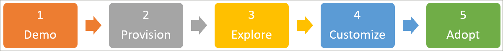

# パートナー オンボーディング ガイド
次の3つの手順に従って、学習経路を使い始めることができます。 3つの手順を使用すると、顧客とプレゼンテーションを行うために使用できる説得力のあるデモを構築できます。 

## 1. Microsoft 365 のデモ環境を作成する
Demos.microsoft.com を使用してデモ環境を作成すると、サービスをプロビジョニングして検証し、顧客への学習経路を提示することができます。 これらの目的のために、すべてのパートナーがへのアクセス権を持ってい https://demos.microsoft.com ます。 デモ環境を初めて使用する場合は、demos.microsoft.com の **入門ガイド** を使用できます。

## 2. Microsoft 365 learning の経路をプロビジョニングする
ラーニング経路は、SharePoint Online プロビジョニングサービスを使用してプロビジョニングできます。
- 学習経路をプロビジョニングするには、 [Microsoft 365 learning のラーニング](https://provisioning.sharepointpnp.com/details/3df8bd55-b872-4c9d-88e3-6b2f05344239) のソリューションページにアクセスしてください。 [ラーニング経路のセットアップオプション](https://docs.microsoft.com/office365/customlearning/custom_setupoptions)を確認します。 
- ソリューションの [前提条件](https://docs.microsoft.com/office365/customlearning/custom_provision) を確認してください。これは、お客様が SharePoint に対して行った、テナントアプリカタログなどの適切なアクセス許可または必要な環境の構成が適切に行われていない可能性があることを示しています。
- 管理者以外の役割を使用してソリューションを展開し、プロビジョニングサービスのエラー処理および電子メールサービスについて理解を深めてください。

## 3. 新たに準備された学習経路サイトを調べて、その機能を理解します。
[新しくプロビジョニングされた学習経路サイトを調べて](https://docs.microsoft.com/office365/customlearning/custom_exploresite) 、その機能を理解します。 コンテンツと機能の更新に関する情報、および計画、カスタマイズ、導入、および測定影響のガイダンスについては、「 [管理者成功センター」](https://docs.microsoft.com/office365/customlearning/custom_successcenter) を参照してください。

## 4. 学習経験をカスタマイズする
次の機能領域を使用して[、学習経路の環境をカスタマイズし](https://docs.microsoft.com/office365/customlearning/custom_overview)ます。
- [サブカテゴリ](https://docs.microsoft.com/office365/customlearning/custom_hideshowsub)、 [再生リスト](https://docs.microsoft.com/office365/customlearning/custom_hideshowplaylists)、および [テクノロジ](https://docs.microsoft.com/office365/customlearning/custom_hideshowtech)の表示と非表示を切り替えます。
- [再生リストをコピーする](https://docs.microsoft.com/office365/customlearning/custom_copyplaylist)
- [カスタム再生リストを作成](https://docs.microsoft.com/office365/customlearning/custom_createnewplaylist) します。 [SharePoint ページ](https://docs.microsoft.com/office365/customlearning/custom_createnewpage)、 [再生リストの作成](https://docs.microsoft.com/office365/customlearning/custom_createnewplaylist)、 [アセットの追加](https://docs.microsoft.com/office365/customlearning/custom_addassets)、 [サブカテゴリの作成](https://docs.microsoft.com/office365/customlearning/custom_createnewcat)を開始します。

## 5. サンプル学習経路コミュニケーションキャンペーンの作成
ダウンロード可能な [導入キット](https://teamworktools.azurewebsites.net/m365lp/m365lpadoptionkit.zip) に基づいてサンプルの学習経路通信キャンペーンを作成し、手順4で作成したカスタムコンテンツを強調表示します。 このことは、完全な顧客の利便性を促進する際に活用できます。 

