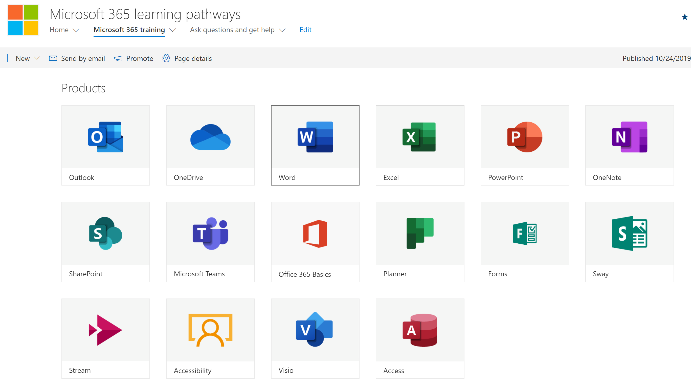
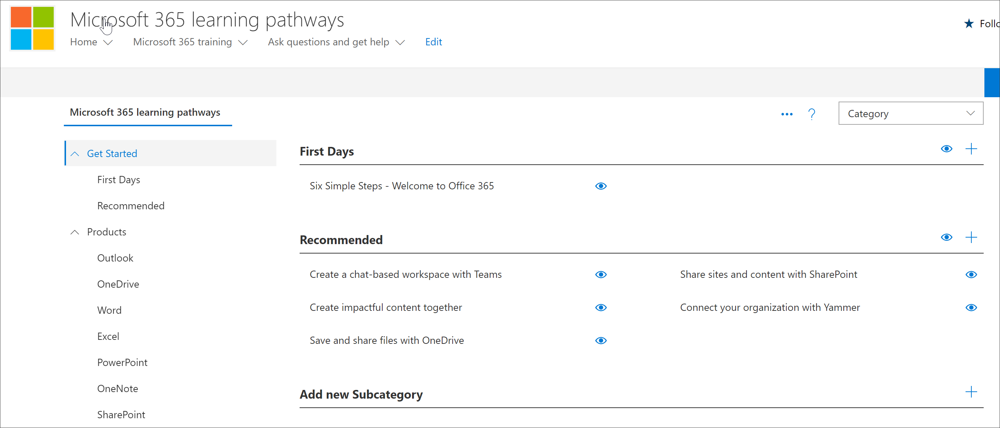

# 学習経路のコンテンツを計画するPlan your learning pathways content
学習経路をMicrosoft 365する前に、利用できる学習コンテンツ、ツール、および機能を調査する時間を取るのをお考えください。Before you dive into rolling out Microsoft 365 learning pathways, it’s a good idea to take some time to survey the learning content, tools, and capabilities available to you. 弊社の目標は、組織のユーザーを可能な限り迅速かつ効率的に、迅速かつ効率的に迅速かつ生産的に行うのを支援することです。Our goal is to help you get your organization's users up to speed, and productive, as quickly and efficiently as possible. 学習経路の計画に関しては、次の 3 段階のプロセスをお勧めします。When it comes to planning for learning pathways, we recommend a three-step process:

1. **利用可能なリソース (** 学習経路で提供されるリソースと組織で利用可能なリソースの両方) を確認します。**Review the available resources** – both the resources provided through learning pathways and the resources available in your organization. 最適な学習計画は、組織の Microsoft リソースとリソースの両方を組み合わせています。The best learning plans combine both Microsoft resources and resources from your organization.
2. **ラーニング パスウェイ ツールの機能を知る** - 簡単なツアーを提供します。**Get to know the capabilities of the Learning Pathways tool** - we'll give you a quick tour. 
3. **コンテンツ プランを作成する** - 利用可能な導入ガイドを確認して、全体的な計画の作成に役立ちます。**Create a content plan** – review the available Adoption Guides to help you with building an overall plan.

## 利用可能なリソースを確認するReview the available resources
学習経路のコンテンツ 計画Microsoft 365作成する前に、利用可能なすべてのリソースを見つめ、少し時間を取って確認してください。Before you create a content plan for Microsoft 365 learning pathways, take some time to discover all the resources that are available to you.  

### サイトの学習経路SharePointするReview the learning pathways SharePoint site
このMicrosoft 365学習経路ソリューションは、SharePointカタログに接続された Web パーツを備える、さまざまなコミュニケーション サイトを提供します。The Microsoft 365 learning pathways solution provides a SharePoint communication site with a web part that's connected to an online catalog. サイトSharePoint、ロゴ、ページ、メニューアイテム、テーマ、タイルなど、完全にカスタマイズできます。The SharePoint site is fully customizable, including the site name, logo, pages, menu items, themes, and tiles. タイルとメニュー項目をクリックして、学習経路サイトで利用できる機能を見つけることができます。Take some time to click the tiles and menu items to discover what's available with the learning pathways site.

### Web パーツを使用してオンライン カタログからコンテンツを確認するReview the content from the Online catalog with the Web part
既定では、Web パーツは、コミュニケーション サイト内の一連のページSharePointされます。The Web part, by default, is added to a series of pages in the SharePoint Communication site. コンテンツの完全なセットは、[トレーニング] ページMicrosoft 365表示されます。The complete set of content is provided on the Microsoft 365 training page. [Microsoft 365ページでは、学習経路に利用可能なすべてのトレーニングを表示するように構成された学習経路 Web パーツがホストされます。The Microsoft 365 training page hosts the learning pathways Web part configured to show all the training available for learning pathways. 

**[トレーニング] ページMicrosoft 365するには****To view the Microsoft 365 Training page**
1. [トレーニング] メニュー Microsoft 365をクリックします。Click the Microsoft 365 training menu item. 
1. ページを下にスクロールすると、すべてのカテゴリとサブカテゴリが表示されます。Scroll down the page to view all the categories and subcategories.
2. タイヤを少し蹴る。Kick the tires a bit. いくつかのサブカテゴリをクリックし、いくつかのプレイリストをクリックして、学習経路コンテンツの整理方法を確認します。Click a few subcategories, and then click a few playlists to get a feel for how learning pathways content is organized. 

### [管理] ページの表示View the Administration Page
[管理] ページには、使用可能なコンテンツの一覧が表示されます。The Administration page provides a listing of the content available to you. ここで、コンテンツの非表示、新しいプレイリストの作成、プレイリストの追加、編集、削除を行います。This is where you can hide content, create new playlists, and add, edit, and remove playlist. さまざまなカテゴリとプレイリストをクリックして、利用可能なコンテンツの全機能を確認します。Click through the various categories and playlists to see the full breath of the content available. 

**[管理] ページを表示するには。****To view the Administration page.**
1. ラーニング パス サイトで、[ホーム] メニューのドロップダウン矢印をポイントし、[ラーニング パスの管理] をクリックします。From the learning pathways site, point to the Home menu dropdown arrow, then click Learning pathways Administration.  
2. 次に、さまざまなカテゴリ、サブカテゴリ、プレイリストをクリックして、利用可能なコンテンツの息吹を感じ取る。Then click through the various categories, subcategories, and playlists to get a feel for the breath of content available to you. 

   

### ラーニング パスウェイの機能をMicrosoft 365するGet to know the capabilities of Microsoft 365 Learning Pathways
[Microsoft 365ラーニング パス] を使用すると、Microsoft が提供するコンテンツと作成したコンテンツを混在して、組織固有の特定のポリシーと手順をターゲットにできます。With Microsoft 365 Learning Pathways, you can have content provided by Microsoft mixed with content you create to target specific policies and procedures that are unique to your organization. ベスト プラクティスとして、可能な限り Microsoft が提供するコンテンツを活用してください。As a best practice, try to leverage Microsoft-provided content as much as possible. Microsoft は、個々のアセットを定期的に更新し、四半期ごとにコンテンツの完全なインベントリを更新します。Microsoft updates individual assets on a regular basis and updates the full inventory of content on a quarterly basis. 通常、組織は 10 ~ 20% の一意のコンテンツを作成し、残りの 80% を Microsoft に任せ、最新の状態を維持します。Typically an organization will create 10-20% unique content, then leave the remaining 80% to Microsoft to keep up-to-date. 次の一覧では、コンテンツの学習経路を整理する方法と、変更または作成できるコンテンツのガイドラインについて説明します。The following lists describes how learning pathways content is organized, along with guidelines for the content that can be modified or created. コンテンツをカスタマイズするためのガイダンスは、管理サクセス センターの [学習経路のカスタマイズ] セクションで提供されます。Guidance for customizing content is provided in the Customizing learning pathways section of the Admin Success Center.

- **カテゴリ** - サブカテゴリのコンテナーです。**Categories** - are containers for subcategories. カテゴリは Microsoft によって提供され、作成または変更することはできません。Categories are provided by Microsoft and cannot be created or modified.
- **サブカテゴリ - プレイリスト** のコンテナーです。**Subcategories** - are containers for playlists. Microsoft では、変更できないサブカテゴリが提供されますが、独自のサブカテゴリを作成できます。Microsoft provides subcategories which you cannot modify, but you can create your own subcategories. 
- **プレイリスト** - アセットのコンテナーです。**Playlist** - are containers for assets. Microsoft では、変更できないプレイリストが提供されますが、独自のプレイリストを作成できます。Microsoft provides playlists which you cannot modify, but you can create your own playlists.  
- **アセット** - プレイリスト内の学習ページです。**Assets** - are the learning pages within playlist. Microsoft は、変更できないプレイリストにアセットを提供しますが、独自のアセットを作成してプレイリストに追加できます。estMicrosoft provides assets in playlists which you cannot modify, but you can create your own assets and add them to playlists.est

### Microsoft からのその他のリソースを確認するReview additional resources from Microsoft
Microsoft では、学習経路のコンテンツを計画する際に活用できるヘルプとトレーニング リソースを提供しています。Microsoft provides help and training resources that you can leverage when planning for content for learning pathways.  

-  [OfficeヘルプとトレーニングOffice Help and Training](https://support.office.com)
-  [Office 365 トレーニング センターOffice 365 Training Center](https://support.office.com/office-training-center)

### 組織内の学習リソースを確認するReview the learning resources in your organization
組織内で既に利用可能な学習コンテンツの在庫を取り込む。Take stock of the learning content already available to you in your organization.
たとえば、組織には、Microsoft 365 準備、ヘルプデスク、オンボーディング、トレーニング専用のカスタム クイック スタート ガイド、チート シート、SharePoint ページが既に存在している可能性があります。For example, your organization have may already have custom Quick Start Guides, Cheat Sheets, or SharePoint pages dedicated to Microsoft 365 readiness, HelpDesk, onboarding or training. 既存のSharePointは、Microsoft 365 ポータルのプレイリストに組み込むか、またはプレイリスト内の Microsoft コンテンツと混在して組織の対象となるプレイリストを作成できます。Existing SharePoint assets can be incorporated into the Microsoft 365 Portal playlists and or mixed with Microsoft content in a playlist to build a targeted playlist for your organization. 組織のコンテンツと Microsoft のコンテンツを混在させる方法の詳細については、「学習経路のカスタマイズ [」を参照してください](custom_overview.md)。管理サクセス センターの [学習経路のカスタマイズ] セクション。For more information about mixing your organization's content with Microsoft's content, see the [Customizing learning pathways](custom_overview.md).Customizing learning pathways section of the Admin Success Center.

### 導入リソースの活用Leverage the Adoption Resources
数日以内に学習経路の使用を開始できますが、新しいテクノロジや一連のサービスをオンボーディングする学習キャンペーン戦略を実行する前に、いくつかの前もって計画を立ておくのが最善です。Note that you can get started using learning pathways within days, but it’s best to do some up-front planning before executing a learning campaign strategy to onboard a new technology or set of services. コンテンツ 計画の策定と学習経路の使用は、全体的な変更管理戦略の計画におけるより広範な取り組みの一環であり、全体的な戦略を計画するために活用できる導入資料を提供します。Developing a content plan and using learning pathways is really part of a more extensive effort in planning an overall Change Management strategy, so we provide adoption materials that you can leverage for planning your overall strategy. 計画作業の一環として、「導入リソース」 [を参照してください](https://resources.techcommunity.microsoft.com/adoption/)。As part of your planning effort, check out [Adoption Resources](https://resources.techcommunity.microsoft.com/adoption/).

### 学習計画の作成と反復Build a Learning Plan and Iterate 
ラーニング パスウェイを正常に展開した多くの企業は、特定のシナリオやテクノロジに焦点を当てたラーニング キャンペーンを採用しています。Many companies who’ve successfully rolled out Learning Pathways have adopted Learning campaigns focusing on specific scenarios or technologies. たとえば、「もっと共同作業を行う -Teamsを使用する」、または「モバイルでもっとモバイルOutlookします。For example, "Be more collaborative - using Teams" or “Be more mobile with Outlook mobile.” ダウンロード可能な導入キットを使用して、潜在的な学習キャンペーンの例 [を確認できます](https://teamworktools.azurewebsites.net/m365lp/m365lpadoptionkit.zip)。You can see examples of potential learning campaigns using the [downloadable Adoption Kit](https://teamworktools.azurewebsites.net/m365lp/m365lpadoptionkit.zip).

 
