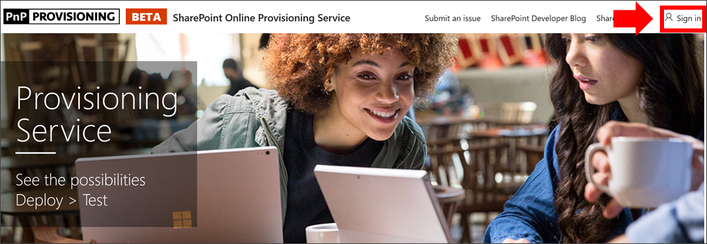
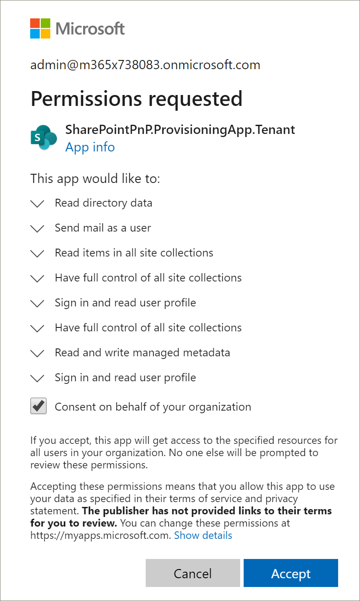
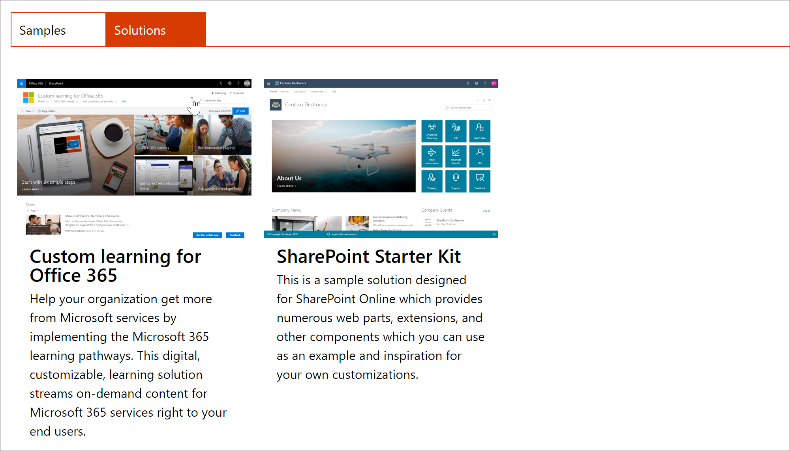
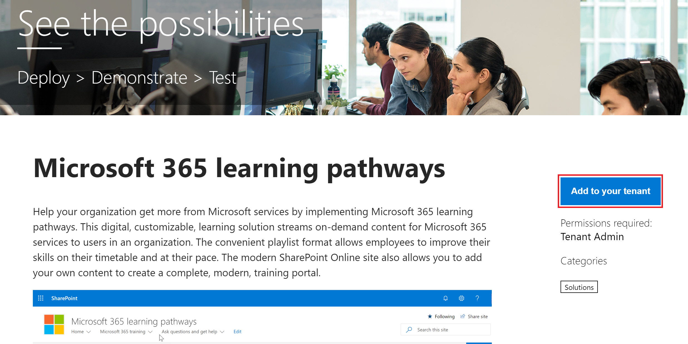

# カスタム学習をプロビジョニングするProvision Custom Learning

SharePoint Online プロビジョニングサービスを使用すると、Office 365 テナント管理者は、いくつかの簡単なクリックでプロビジョニングプロセスを開始できます。With the SharePoint Online Provisioning Service, an Office 365 Tenant Administrator can start the provisioning process with a few simple clicks. プロビジョニングサービスは、カスタム学習をプロビジョニングするために推奨される方法です。The Provisioning Service is the recommended way to provision Custom Learning. 処理を開始するには、短時間で簡単です。It's fast, easy, and takes only a few minutes to start the process. ただし、プロビジョニングサービスを開始する前に、プロビジョニングの前提条件を満たしていることを確認してください。Before getting started with the Provisioning Service, however, make sure you've met the prerequisites for provisioning.

## 前提条件Prerequisites
 
プロビジョニングサービス[SharePoint Online プロビジョニングサービス](https://provisioning.sharepointpnp.com)を使用してカスタム学習を正常にセットアップするには、プロビジョニングを実行するユーザーが次の前提条件を満たしている必要があります。To successfully set up Custom Learning with the Provisioning Service [SharePoint Online Provisioning Service](https://provisioning.sharepointpnp.com), the person doing the provisioning must meet the following pre-requisites: 
 
- カスタム学習をプロビジョニングするユーザーは、カスタム学習をプロビジョニングするテナントのテナントのアドミニストレーターである必要があります。The person provisioning Custom Learning must be a Tenant Administratorof the tenant where Custom Learning will be provisioned.  
- テナントアプリカタログは、SharePoint 管理センターの [アプリ] オプションで使用できる必要があります。A tenant App Catalog must be available within the Apps option of the SharePoint Admin Center. 組織に sharepoint テナントのアプリカタログがない場合は、 [sharepoint Online のドキュメント](https://docs.microsoft.com/en-us/sharepoint/use-app-catalog)を参照して作成します。If your organization does not have an SharePoint tenant App catalog, refer to the [SharePoint Online documentation](https://docs.microsoft.com/en-us/sharepoint/use-app-catalog) to create one.  
- カスタム学習をプロビジョニングするユーザーは、テナントアプリカタログのサイトコレクションの所有者である必要があります。The person provisioning Custom Learning must be a Site Collection Owner of the Tenant App Catalog. ユーザーのカスタム学習が、アプリカタログのサイトコレクションの所有者ではない場合は、[次の手順を完了](addappadmin.md)して続行します。If the person provisioning Custom Learning is not a Site Collection Owner of the App Catalog [complete these instructions](addappadmin.md) and continue. 

### カスタム学習をプロビジョニングするにはTo provision Custom Learning

1. にhttp://provisioning.sharepointpnp.com移動して、ホームページの右上隅から**サインイン**します。Go to http://provisioning.sharepointpnp.com and **sign in** from the upper right hand corner of the home page.  サイトテンプレートをインストールする予定の対象となるテナントの資格情報を使用してサインインします。Sign in with the  credentials for the targeted tenant where you plan to install the site template.

2. **組織の代わりに同意**をクリアし、[**同意**する] を選択します。Clear the **Consent on behalf of your organization** and select **Accept**.

3. ソリューションギャラリーから [ **Office 365 のカスタム学習**] を選択します。Select **Custom Learning for Office 365** from the solution gallery.

4. ソリューションのホームページで、[**テナントに追加する**] を選択します。From the solution home page select **Add to your Tenant**

5. ご使用のインストールに応じて、[プロビジョニング情報] ページのフィールドを入力します。Complete the fields on the provisioning information page as appropriate for your installation. 少なくとも、プロビジョニングプロセスに関する通知を取得する電子メールアドレスと、サイトをプロビジョニングする宛先の URL を入力します。At a minimum enter the email address where you wish to get notifications about the provisioning process and the destination URL for your site to be provisioned to.  
> [!NOTE]
> サイトの宛先 URL を、"/sites/MyTraining" や "/teams/LearnOffice365" などの従業員にとってわかりやすいものにします。Make the destination URL for your site something friendly to your employees such as "/sites/MyTraining" or "/teams/LearnOffice365".

6. カスタム\*\*\*\* 学習をテナント環境にインストールする準備ができたら、[準備] を選択します。Select **Provision** when ready to install Custom Learning into your tenant environment.  プロビジョニングプロセスには最大15分かかります。The provisioning process will take up to 15 minutes. サイトがアクセスできる状態になると、メールによって ([プロビジョニング] ページで入力した通知の電子メールアドレスに) 通知されます。You will be notified via email (to the notification email address you entered on the Provisioning page) when the site is ready for access. 

> [!IMPORTANT]
> カスタム学習サイトをプロビジョニングするテナント管理者は、サイトに移動し、CustomLearningAdmin を開いてカスタム学習管理プロパティを初期化する必要があります。The Tenant Admin who provisions the Custom Learning site must go to the site, and then open CustomLearningAdmin.aspx to initialize Custom Learning Admin properties. この時点で、テナント管理者はサイトに所有者を割り当てる必要があります。At this time, the Tenant Admin should also assign Owners to the site. 

## プロビジョニングが成功したことを検証するValidate Provisioning Success

プロビジョニングが完了すると、テナント管理者は PnP プロビジョニングサービスから電子メールを受信します。When provisioning is complete, the Tenant Admin receives an email from the PnP Provisioning Service. 管理者は、電子メールで提供されているサイトへのリンクをコピーして、指示に従ってサイトに移動することができます。The admin can copy the link to the site provided in the email, and then follow the instructions to go to the site. または、テナント管理者は <YOUR-SITE-COLLECTION-URL>/sitepages/CustomLearningAdmin に移動できます。Alternately, the tenant admin can navigate to <YOUR-SITE-COLLECTION-URL>/SitePages/CustomLearningAdmin.aspx. これにより、最初に使用するカスタム学習を設定する customconfig リストアイテムが初期化されます。This initializes the CustomConfig list item that sets up Custom Learning for its first use. このページを最初に開いたユーザーは、テナント管理者、サイトコレクション管理者、またはサイトの所有者である必要があります。The person who first opens this page must be a Tenant Admin,Site Collection Admin, or Owner of the site. 次のようなページが表示されます。You should see a page that looks like this: 

## サイトに所有者を追加するAdd Owners to Site
テナント管理者は、サイトをカスタマイズするユーザーになる可能性があるので、サイトに所有者を割り当てる必要があります。As the Tenant Admin, it's unlikely you'll be the person customizing the site, so you'll need to assign Owners to the site. 所有者はサイトの管理権限を持っているため、サイトのページを変更したり、サイトを再ブランド化したりできます。Owners have administrative privileges on the site so they can modify site pages and rebrand the site. また、カスタム学習 Web パーツを通じて配信されるコンテンツを非表示にしたり、表示したりすることもできます。They also have the ability to hide and show content delivered through the Custom Learning Web part. また、カスタムのプレイリストを作成してカスタムサブカテゴリに割り当てることもできます。They'll also have the ability to build custom playlist and assign them to custom subcategories.  

1. [SharePoint の**設定**] メニューの [**サイトの権限**] をクリックします。From the SharePoint **Settings** menu, click **Site Permissions**.
2. [**高度なアクセス許可の設定**] をクリックします。Click **Advanced Permission Settings**.
3. [ **Office 365 所有者向けのカスタム学習] を**クリックします。Click **Custom learning for Office 365 Owners**.
4. [**新しい** > **ユーザーをこのグループに追加する**] をクリックし、所有者にするユーザーを追加して、[**共有**] をクリックします。Click **New** > **Add Users to this group**, add the people you want to be Owners, and then click **Share**.

8. ページの右上隅にある**次**のオプションをクリックして、サイトをフォローします。Click the **Following** option in the upper right hand corner of the page to follow the site.  

### 次のステップNext Steps
- webpart に含まれる[既定のコンテンツ](sitecontent.md)について説明します。Explore the [default content](sitecontent.md) included in the webpart.
