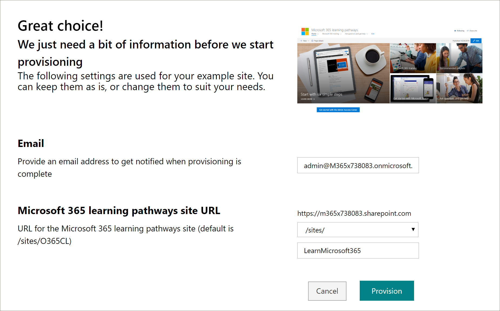
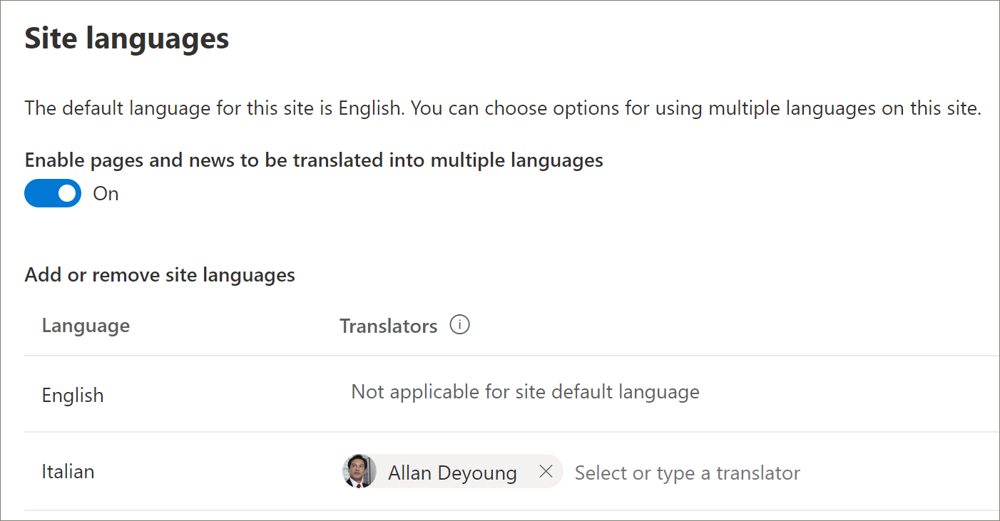

# 新しい学習経路ソリューションを準備するProvision a new learning pathways solution 
テナントでプロビジョニングされたラーニング経路を持っていない組織では、SharePoint look book サービスを使用して多言語の学習経路ソリューションを追加することができます。Organizations that that don’t have learning pathways provisioned in their tenant can use the SharePoint look book service to add the multilingual learning pathways solution. このオプションを使用すると、ラーニングパス SharePoint テンプレートが9つの言語に翻訳され、最小限の変更で使用できます。With this option, the learning pathways SharePoint template is translated into nine languages and can be used with a minimum of modification. 

> [!IMPORTANT]
> テナントに既に学習経路がプロビジョニングされている場合は、学習経路を [更新](custom_update.md) することをお勧めします。If you already have learning pathways provisioned in your tenant, it's recommended that you [update](custom_update.md) learning pathways. 学習経路の新しいインスタンスをインストールする場合は、既存のサイトから新しいサイトにカスタマイズを手動で転送する必要があります。If you install a new instance of learning pathways, you will need to manually transfer any customizations from the existing site to the new site. 

## 多言語サポートの前提条件Prerequisites for multilingual support
 
Microsoft 365 learning の経路を look book サービスで正常にセットアップするには、プロビジョニングを実行するユーザーが次の前提条件を満たしている必要があります。To successfully set up Microsoft 365 learning pathways with the look book service, the person doing the provisioning must meet the following pre-requisites:   
 
- ユーザープロビジョニングの学習経路は、学習経路がプロビジョニングされるテナントのテナント管理者である必要があります。The person provisioning learning pathways must be a Tenant Administrator of the tenant where learning pathways will be provisioned.  
- テナントアプリカタログは、SharePoint 管理センターの [アプリ] オプションで使用できる必要があります。A tenant App Catalog must be available within the Apps option of the SharePoint Admin Center. 組織が SharePoint テナントのアプリカタログを持っていない場合は、 [Sharepoint Online のドキュメント](https://docs.microsoft.com/sharepoint/use-app-catalog) を参照して作成します。If your organization doesn't have an SharePoint tenant App Catalog, refer to the [SharePoint Online documentation](https://docs.microsoft.com/sharepoint/use-app-catalog) to create one. 学習経路をプロビジョニングする前に、アプリカタログを作成してから少なくとも2時間待つ必要があります。You must wait at least two hours after creating the App Catalog before provisioning learning pathways.  
- ユーザープロビジョニングの学習経路は、テナントのアプリカタログのサイトコレクションの所有者である必要があります。The person provisioning learning pathways must be a Site Collection Owner of the Tenant App Catalog. 学習経路をプロビジョニングするユーザーがアプリカタログのサイトコレクションの所有者ではない場合は、 [次の手順を実行](addappadmin.md) して続行します。If the person provisioning learning pathways is not a Site Collection Owner of the App Catalog, [complete these instructions](addappadmin.md) and continue. 

## テナント管理者アカウントに言語が選択されていないことを確認するEnsure the Tenant Admin account doesn't have a language selected
学習経路をプロビジョニングする前に、テナントの管理者アカウントに言語が選択されていないことを確認してください。Before you provision learning pathways, ensure that the Admin Account for the tenant doesn't have a language selected. 管理者アカウントに言語が選択されていないかどうかを確認する方法は次のとおりです。Here’s how to verify if the Admin account doesn't have a language selected. 
1.  エッジ管理プロファイルを使用して、office.com に移動します。With your Edge Admin profile, go to office.com.
2.  ユーザー資格情報を入力します (必要な場合)。Enter the user credentials (if necessary).
3.  Microsoft 365 で、[ **すべてのアプリ** > Delve] をクリックします。In Microsoft 365, click **All Apps** > Delve. 
4.  [ **Me**  >  **Update Profile**] をクリックします。Click **Me** > **Update Profile**.
5.  ページを下にスクロールし、[ **言語と地域の設定を変更する方法**] をクリックします。Scroll down the page and click **How can I change language and regional settings**.
6.  **ここ**をクリックし、省略記号 [...] をクリックし**ます。**Click **here**, and then click the ellipses **...**.
7.  [ **表示言語**] の下に、 **言語が選択されていない**ことが表示されます。Under **My Display Languages**, you should see **No languages selected**. 言語が選択されている場合は、選択を解除します。If a language is selected, unselect it.

### 学習経路をプロビジョニングするにはTo provision learning pathways

1. 「 [Microsoft 365 learning の方法」ページ](https://lookbook.microsoft.com/details/3df8bd55-b872-4c9d-88e3-6b2f05344239)に移動します。Go to the [Microsoft 365 learning pathways solution page](https://lookbook.microsoft.com/details/3df8bd55-b872-4c9d-88e3-6b2f05344239).
2. [ **テナントに追加] を**クリックします。Click **Add to your tenant**. テナントにサインインしていない場合、プロビジョニングサービスはテナント管理者の資格情報を要求します。If you aren't signed into to your tenant, the Provisioning Service will ask for your Tenant Admin credentials. 
3. [要求されたアクセス許可] ダイアログボックスで、 **組織の代理** として [同意する] を選択し、[ **同意**する] を選択します。From the Permissions requested dialog box, select **Consent on behalf of your organization** and then select **Accept**.

Look book サービスでは、テナントのアプリカタログを作成し、アプリケーションをテナントのアプリカタログにインストールし、サイトテンプレートをプロビジョニングするためにこれらのアクセス許可が必要です。The look book service requires these permissions to create the tenant App Catalog, install the application into the tenant App Catalog and provision the site template. テナントに全体的な影響はありません。There's no overall impact on your tenant. これらのアクセス許可は、ソリューションのインストールの目的で明示的に使用されます。These permissions are explicitly used for the purpose of the solution installation. インストールを続行するには、これらのアクセス許可を受け入れる必要があります。You must accept these permissions to continue with the installation.

4. インストールに応じて、事前設定情報ページのフィールドに入力します。Complete the fields on the provisioning information page as appropriate for your installation. 少なくとも、事前設定プロセスに関する通知を受け取るメールアドレスと、サイトの事前設定先のリンク先 URL を入力します。At a minimum, enter the email address where you wish to get notifications about the provisioning process and the destination URL for your site to be provisioned to.  
> [!NOTE]
> 「/sites /MyTraining」や「/teams /LearnMicrosoft365」など、サイトのリンク先 URL を従業員にとってわかりやすいものにします。Make the destination URL for your site something friendly to your employees such as "/sites/MyTraining" or "/teams/LearnMicrosoft365".

6. テナント環境に学習経路をインストールする準備ができたら **、[準備** ] をクリックします。Click **Provision** when ready to install learning pathways into your tenant environment.  事前設定プロセスには最大 15 分かかります。The provisioning process can take up to 15 minutes. サイトの準備ができたらメールで通知されます。You will be notified via email when the site is ready. 

> [!IMPORTANT]
> ラーニングポイントサイトをプロビジョニングするテナント管理者は、サイトに移動し、 **CustomLearningAdmin** を開いて学習経路管理プロパティを初期化する必要があります。The Tenant Admin who provisions the learning pathways site must go to the site, and then open **CustomLearningAdmin.aspx** to initialize learning pathways Admin properties. この時点で、テナント管理者はサイトに所有者を割り当てる必要があります。At this time, the Tenant Admin should also assign Owners to the site. 

## プロビジョニングが成功したことを検証し、CustomConfig リストを初期化するValidate Provisioning Success and Initialize the CustomConfig List

プロビジョニングが完了すると、サイトをプロビジョニングしたテナント管理者が、look book サービスから電子メールを受信します。When provisioning is complete, the Tenant Admin who provisioned the site receives an email from the look book service. 電子メールには、サイトへのリンクが含まれています。The email contains a link to the site. この時点で、テナント管理者は、電子メールで提供されているリンクを使用してサイトに移動し、最初に使用するサイトを設定する必要があります。At this point, the Tenant Admin should go to the site using the link provided in the email and set up the site for first use:

- `<YOUR-SITE-COLLECTION-URL>sites/<YOUR-SITE-NAME>/SitePages/CustomLearningAdmin.aspx` に移動します。Go to `<YOUR-SITE-COLLECTION-URL>sites/<YOUR-SITE-NAME>/SitePages/CustomLearningAdmin.aspx`. \*\*CustomLearningAdmin.aspx **を開くと、初めて使用するためのラーニング パスを設定する**CustomConfig \*\*リスト アイテムが初期化されます。Opening **CustomLearningAdmin.aspx** initializes the **CustomConfig** list item that sets up learning pathways for first use. 次のようなページが表示されます。You should see a page that looks like this:

## サイトに所有者を追加するAdd Owners to Site
テナント管理者は、サイトをカスタマイズするユーザーになる可能性があるので、サイトにいくつかの所有者を割り当てる必要があります。As the Tenant Admin, it's unlikely you'll be the person customizing the site, so you'll need to assign a few owners to the site. 所有者はサイトの管理権限を持っているため、サイトのページを変更したり、サイトを再ブランド化したりできます。Owners have administrative privileges on the site so they can modify site pages and rebrand the site. また、コンテンツを表示および表示したり、カスタムの再生リストやサブカテゴリを作成したりすることもできます。They also have the ability to hide and show content and build custom playlist and subcategories.  

1. [SharePoint の **設定** ] メニューの [ **サイトの権限**] をクリックします。From the SharePoint **Settings** menu, click **Site Permissions**.
2. [ **高度なアクセス許可の設定**] をクリックします。Click **Advanced Permission Settings**.
3. [ **Microsoft 365 learning の経路の所有者**] をクリックします。Click **Microsoft 365 learning pathways Owners**.
4. [**新しい**  >  **ユーザーをこのグループに追加する**] をクリックし、所有者にするユーザーを追加します。Click **New** > **Add Users to this group**, and then add the people you want to be Owners. 
5. 共有メッセージ内の [サイトを探索](custom_exploresite.md) するためのリンクを追加し、[ **共有**] をクリックします。Add a link to [Explore the Site](custom_exploresite.md) in the Share message, and then click **Share**.

## 翻訳者をサイトに追加するAdd translators to the site
サイトの翻訳者を使用する場合は、それらのユーザーにアクセス許可を割り当てることができます。If you will be using translators for the site, you can assign them permissions. 翻訳者にはメンバ権限以上が必要です。Translators require Member permissions or higher. 

## サイトで複数の言語を使用するためのオプションを選択するChoose options for using multiple languages on the site
SharePoint look book サービスは、学習経路サイトを9つの言語で作成します。The SharePoint look book service creates the Learning Pathways site in nine languages. 次の推奨事項が適用されます。The following recommendations apply:
- サポートしたくない言語をオフにするTurn off the languages you don’t want to support
- 多言語サイトをサポートしていない場合は、多言語の機能をオフにします。If you are not supporting a multilingual site, turn off the multi-lingual feature. このトピックで後述する「多言語サポートをオフにする」セクションを参照してください。See the "Turn off multilingual support" section later in this topic.

### サポートしない言語を削除するRemove languages you don’t want to support
1つの言語のみをサポートする組織では、既定の英語の言語に加えて、サポートされていない言語を削除することをお勧めします。For organizations that choose to support only one language, in addition to the default English language, we recommend removing languages that aren’t supported. 
1. [学習経路] サイトから、ページの右上にある [ **設定** ] を選択し、[ **サイト情報**] を選択します。From the Learning Pathways site, select **Settings** from the top-right of the page, and then select **Site information**.
2. [サイト情報] ウィンドウの下部にある [ **すべてのサイト設定の表示**] を選択します。At the bottom of the site information pane, select **View all site settings**.
3. [ **サイトの管理**] で、[ **言語設定**] を選択します。Under **Site Administration**, select **Language settings**.
4. [ **ページとニュースを複数の言語に翻訳する**] で、トグルを **[オン**] にします。Under **Enable pages and news to be translated into multiple languages**, slide the toggle to **On**. 既定でオンになっている必要があります。It should be On by default.
5. [サイトの言語の追加または削除] で、[ **削除** ] をクリックして、サイトで不要な言語を削除します。Under Add or remove site languages, click **Remove** to remove the languages you don't need for the site. 次の例は、既定の英語の言語に加えて、サイトでサポートされているイタリア語を表示するための [言語設定] ページの例を示しています。The following shows an example of the Language Settings page to show Italian supported for the site, in addition to the default English language.

> [!NOTE]
> 言語を削除するときは、既定の英語の言語を削除することはできません。When removing languages you cannot remove the default English language. 

### 翻訳者を割り当てるAssign translators
ページを翻訳する場合は、必要に応じて、言語ごとに1つまたは複数の翻訳者を割り当てることができます (サイトの既定の言語を除く)。If you're going to translate pages, optionally assign one or more translators for each language (except the site default language). 
- [ **トランスレーター** ] 列で、トランスレーターにする人物の名前の入力を開始し、リストから名前を選択します。In the **Translator** column, start typing the name of a person you want to be a translator, and then select the name from the list. 

> [!NOTE]
> 組織の Active Directory 内のすべてのユーザーは、翻訳者として割り当てることができます。Anyone in your organization's Active Directory can be assigned as a translator. 翻訳者に割り当てられたユーザーには、適切なアクセス許可が自動的に付与されることはありません。People assigned as translators will not automatically be given appropriate permissions. サイトへの編集権限を持たないユーザーがサイトにアクセスしようとすると、アクセスを要求できる web ページが表示されます。When someone without edit permissions to a site tries to access the site, they will be directed to a web page where they can request access.

## 多言語サポートをオフにするTurn off multilingual support
英語以外のサイトを使用する場合など、多言語サイトを必要としない場合は、多言語機能をオフにすることをお勧めします。If you don’t want a multilingual site, for example, you want an English-only site, it’s recommended that you turn off the multilingual feature. 

1. [学習経路] サイトから、ページの右上にある [ **設定** ] を選択し、[ **サイト情報**] を選択します。From the Learning Pathways site, select **Settings** from the top-right of the page, and then select **Site information**.
2. [サイト情報] ウィンドウの下部にある [ **すべてのサイト設定の表示**] を選択します。At the bottom of the site information pane, select **View all site settings**.
3. [ **サイトの管理**] で、[ **言語設定**] を選択します。Under **Site Administration**, select **Language settings**.
4. [ **ページとニュースを複数の言語に翻訳する**] で、トグルを **[オン**] にします。Under **Enable pages and news to be translated into multiple languages**, slide the toggle to **On**. 既定でオンになっている必要があります。It should be On by default.
- [ **翻訳するページとニュースを有効**にする] で、[ **オフ**] を選択します。Under **Enable pages and news to be translated**, select **Off**. 

### 言語を追加するAdd languages
ラーニング・経路は9つの言語をサポートしていますが、ラーニング・経路のサイトに対してサポートするために必要な言語のみを追加することをお勧めします。Learning pathways supports 9 languages, but it’s recommended that you add only the languages you need to support for the learning pathways site. いつでも言語を追加できます。You can add langauges at any time. 
- [ **サイト言語の追加または削除**] の下で、 **[言語の選択または入力**] で言語名の入力を開始するか、ドロップダウンから言語を選択します。Under **Add or remove site languages**, start typing a language name in **Select or type a language**, or choose a language from the dropdown. 複数の言語を追加するには、この手順を繰り返します。You can repeat this step to add multiple languages. このページに戻ると、いつでもサイトで言語を追加または削除することができます。You can add or remove languages from your site at any time by going back to this page.
