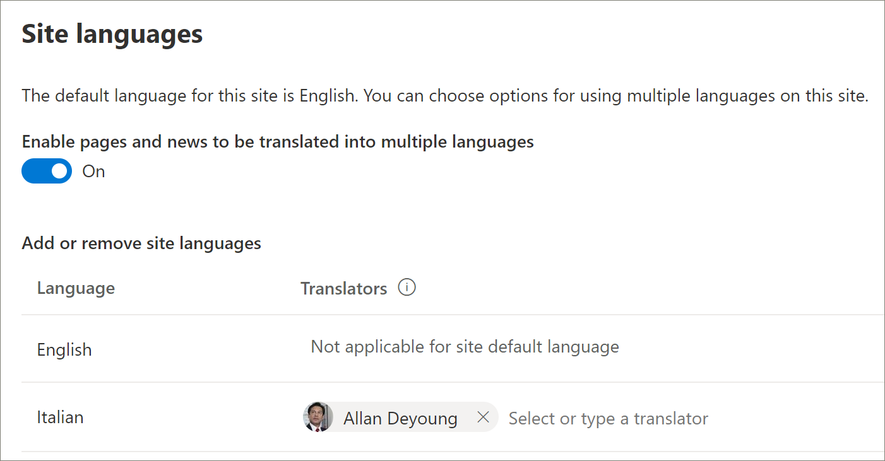

# 多言語ソリューションの新しい学習経路を準備する
テナントに学習経路がプロビジョニングされない組織では、SharePoint プロビジョニング サービスを使用して多言語学習経路ソリューションを追加できます。 このオプションを使用すると、SharePointの学習経路は 9 つの言語に変換され、最小限の変更で使用できます。 

> [!IMPORTANT]
> テナントに学習パスが既に準備されている場合は、学習パスの更新 [パスに従](custom_update_ml.md) う必要があります。 テナント内の既存のインスタンスにラーニング パスをインストールすると、ラーニング パス サイト テンプレートまたはプレイリストに加えた変更が失われる可能性があります。

## 多言語サポートの前提条件
 
プロビジョニング サービスでMicrosoft 365学習経路を正常にセットアップするには、プロビジョニングを行うユーザーが次の前提条件を満たす必要があります。 
 
- ラーニング パスをプロビジョニングするユーザーは、ラーニング パスがプロビジョニングされるテナントのテナント管理者である必要があります。  
- テナント アプリ カタログは、管理センターの [アプリ] オプション内SharePoint必要があります。 組織にテナント アプリ カタログがSharePoint場合は、SharePoint[オンライン](/sharepoint/use-app-catalog)ドキュメントを参照して作成してください。 学習経路をプロビジョニングする前に、アプリ カタログを作成してから少なくとも 2 時間待つ必要があります。  
- ラーニング パスをプロビジョニングするユーザーは、テナント アプリ カタログのサイト コレクション所有者である必要があります。 ラーニング パスをプロビジョニングするユーザーがアプリ カタログのサイト コレクション所有者ではない場合は、次 [の手順を実行](addappadmin.md) して続行します。 

## テナント管理者アカウントに言語が選択されているのを確認する
学習経路を準備する前に、テナントの管理者アカウントに言語が選択されなかからなか確認してください。 管理者アカウントに言語が選択されているのを確認する方法を次に示します。 
1.  エッジ管理者プロファイルを使用して、[エッジ管理] office.com。
2.  必要に応じて、ユーザー資格情報を入力します。
3.  [アプリMicrosoft 365] で、[**すべてのアプリ] をクリック> Delve。** 
4.  [プロファイル **の**  >  **更新] をクリックします**。
5.  ページを下にスクロールし、[ **言語と地域の設定を変更する方法] をクリックします**。
6.  ここを **クリックし**、省略記号 **... をクリックします**。
7.  [ **自分の表示言語]** で、[言語が選択 **されません] が表示されます**。 言語が選択されている場合は、選択を解除します。

### 学習経路を準備する方法

1. [学習経路] [Microsoft 365ページに移動します](https://provisioning.sharepointpnp.com/details/3df8bd55-b872-4c9d-88e3-6b2f05344239)。
2. [テナント **に追加] をクリックします**。 テナントにサインインしていない場合、プロビジョニング サービスはテナント管理者の資格情報を要求します。 
3. [要求されたアクセス許可] ダイアログボックスで、[組織の代理として同意する] を選択し、[同意する] を **選択します**。

プロビジョニング サービスでは、テナント アプリ カタログを作成し、アプリケーションをテナント アプリ カタログにインストールし、サイト テンプレートをプロビジョニングするには、これらのアクセス許可が必要です。 テナントに全体的な影響はありません。 これらのアクセス許可は、ソリューションのインストールの目的で明示的に使用されます。 インストールを続行するには、これらのアクセス許可を受け入れる必要があります。

4. インストールに応じて、事前設定情報ページのフィールドに入力します。 少なくとも、事前設定プロセスに関する通知を受け取るメールアドレスと、サイトの事前設定先のリンク先 URL を入力します。  
> [!NOTE]
> 「/sites /MyTraining」や「/teams /LearnMicrosoft365」など、サイトのリンク先 URL を従業員にとってわかりやすいものにします。

6. テナント環境 **にラーニング** パスをインストールする準備ができたら、[プロビジョニング] をクリックします。  事前設定プロセスには最大 15 分かかります。 サイトの準備ができたらメールで通知されます。 

> [!IMPORTANT]
> 学習経路サイトをプロビジョニングするテナント管理者は、サイトに移動し **、CustomLearningAdmin.aspx** を開いて、学習経路管理プロパティを初期化する必要があります。 この時点で、テナント管理者はサイトに所有者も割り当てる必要があります。 

## プロビジョニングの成功を検証し、CustomConfig リストを初期化する

プロビジョニングが完了すると、サイトをプロビジョニングしたテナント管理者は PnP プロビジョニング サービスから電子メールを受信します。 電子メールには、サイトへのリンクが含まれている。 この時点で、テナント管理者は電子メールに記載されているリンクを使用してサイトに移動し、最初に使用するためにサイトをセットアップする必要があります。

- `<YOUR-SITE-COLLECTION-URL>sites/<YOUR-SITE-NAME>/SitePages/CustomLearningAdmin.aspx`に移動します。 **CustomLearningAdmin.aspx** を開くと、初めて使用するためのラーニング パスを設定する **CustomConfig** リスト アイテムが初期化されます。 次のようなページが表示されます。

![[管理者アプリ] ページ](media/cg-adminapppage.png)

## サイトに所有者を追加する
テナント管理者として、サイトをカスタマイズするユーザーになる可能性は低いので、少数の所有者をサイトに割り当てる必要があります。 所有者はサイトに対する管理者権限を持ち、サイト ページを変更したり、サイトのブランドを変更したりすることができます。 また、コンテンツを非表示にしたり表示したり、カスタムプレイリストやサブカテゴリを作成したりすることもできます。  

1. [アクセス許可 **SharePoint設定]** メニューの [**サイトのアクセス許可] をクリックします**。
2. [**高度なアクセス許可] 設定 をクリックします**。
3. [学習 **Microsoft 365所有者] をクリックします**。
4. [**新**  >  **しいユーザーをこのグループに追加** する] をクリックし、所有者になるユーザーを追加します。 
5. [共有] メッセージで [[サイトの](custom_exploresite.md) 探索] へのリンクを追加し、[共有] を **クリックします**。

## サイトに翻訳者を追加する
サイトに翻訳者を使用する場合は、アクセス許可を割り当てできます。 翻訳者には、メンバーのアクセス許可以上が必要です。 

## サイトで複数の言語を使用するためのオプションを選択する
サービス SharePointプロビジョニング サービスは、9 ラーニングのパスウェイ サイトを作成します。 次の推奨事項が適用されます。
- サポートしない言語をオフにする
- 多言語サイトをサポートしていない場合は、多言語機能をオフにします。 このトピックの後半の「多言語サポートをオフにする」セクションを参照してください。

### サポートしない言語を削除する
既定の英語に加えて、1 つの言語のみをサポートする組織では、サポートされていない言語を削除することをお勧めします。 
1. [パスラーニング] サイトで、ページ **の設定** から [サイト情報] を選択 **します**。
2. サイト情報ウィンドウの下部で、[すべてのサイト設定を表示 **する] を選択します**。
3. [サイト **の管理] で**、[言語の **設定] を選択します**。
4. [ **複数の言語に翻訳する** ページとニュースを有効にする] で、トグルを [オン] に **スライドします**。 既定では On である必要があります。
5. [サイト言語の追加と削除] で、[削除] を **クリックして、** サイトに必要ない言語を削除します。 次に、既定の英語に加えて、サイト設定サポートされているイタリア語を表示する [言語] ページの例を示します。

> [!NOTE]
> 言語を削除する場合は、既定の英語を削除できません。 

### 翻訳者の割り当て
ページを翻訳する場合は、必要に応じて、各言語に 1 つ以上の翻訳者を割り当てる (サイトの既定の言語を除く)。 
- **[翻訳ツール]** 列で、翻訳者になる人の名前を入力し、リストから名前を選択します。 

> [!NOTE]
> 組織の Active Directory 内のすべてのユーザーを翻訳者として割り当てることができます。 翻訳者として割り当てられたユーザーには、適切なアクセス許可が自動的に付与されません。 サイトに対する編集権限のないユーザーがサイトにアクセスしようとすると、アクセスを要求できる Web ページが表示されます。

## 多言語サポートをオフにする
たとえば、多言語サイトが必要ない場合は、英語専用サイトを使用する場合は、多言語機能をオフにしてください。 

1. [パスラーニング] サイトで、ページ **の設定** から [サイト情報] を選択 **します**。
2. サイト情報ウィンドウの下部で、[すべてのサイト設定を表示 **する] を選択します**。
3. [サイト **の管理] で**、[言語の **設定] を選択します**。
4. [ **複数の言語に翻訳する** ページとニュースを有効にする] で、トグルを [オン] に **スライドします**。 既定では On である必要があります。
- [ **ページとニュースの翻訳を有効にする] で、[** オフ] を **選択します**。 

### 言語を追加する
ラーニングは 9 つの言語をサポートしますが、学習経路サイトでサポートする必要がある言語のみを追加する必要があります。 langauges は、いつでも追加できます。 
- [**サイト言語の追加と** 削除] で、[言語の選択または入力] で言語名の入力を開始するか、ドロップダウンから言語を選択します。 この手順を繰り返して、複数の言語を追加できます。 このページに戻って、いつでもサイトの言語を追加または削除できます。