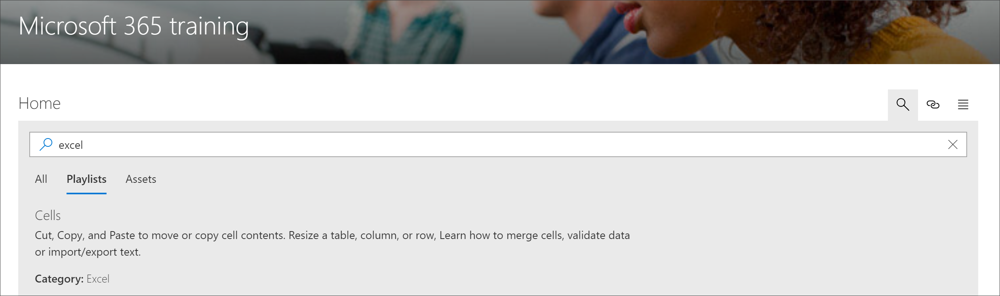

# Microsoft 365 learning の経路のコンテンツを検索する

Microsoft 365 の学習経路は、サブカテゴリ、再生リスト、またはアセットでコンテンツを検索する機能を提供します。 

> [!TIP]
> Microsoft 365 learning の経路検索は、Microsoft によって提供されるコンテンツとカスタムの再生リストまたはサブカテゴリに追加されたコンテンツを含む、経路のコンテンツを学習することを目的としています。 学習機能のプレイリストに含まれていない SharePoint ページは、検索結果には含まれません。     

- **検索**アイコンをクリックして、検索語句を入力します。 

