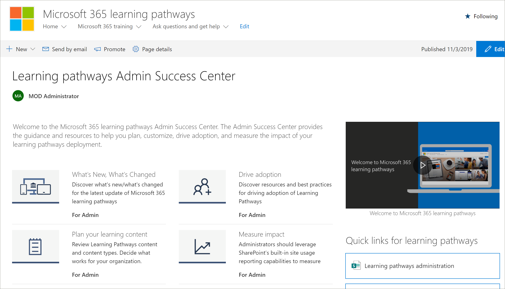

# ラーニング・経路管理者成功センターLearning pathways Admin Success Center

Microsoft 365 learning ・パス管理者成功センターへようこそ。Welcome to the Microsoft 365 learning pathways Admin Success Center. 管理者成功センターは、ラーニングパスの展開の計画、カスタマイズ、導入、および影響の測定に役立つガイダンスとリソースを提供します。The Admin Success Center provides the guidance and resources to help you plan, customize, drive adoption, and measure the impact of your learning pathways deployment.

## Office 365 にサインインするSign in to Office 365 

1.  Web ブラウザーを開き、office.com または組織のサインインの場所に移動します。Open your Web browser and navigate to office.com or your organization’s sign-in location. 
2.  ユーザー名とパスワードを使用してサインインします。Sign in with your user name and password.
3.  テナント管理者から提供された URL を使用してサイトの場所に移動するか、Office 365 のホームページから [SharePoint] を選択して、サイトを選択します。Navigate to the location of the site using the URL supplied by your tenant administrator or select SharePoint from the Office 365 Home page, and then select the site. 

### 管理者成功センターの使用を開始するGet started with the Admin Success Center

管理者成功センターは、ラーニングパスの展開の計画、カスタマイズ、導入、および影響の測定に役立つガイダンスとリソースを提供します。The Admin Success Center provides the guidance and resources to help you plan, customize, drive adoption, and measure the impact of your learning pathways deployment. 

- Microsoft 365 learning の経路の**ホーム**ページで、[**管理者成功センターの開始**] をクリックします。From the Microsoft 365 learning pathways **Home** page, click **Get started with the Admin Success Center**.

ラーニング経路は、ソリューションの管理者成功センター内のガイダンスを提供します。Learning pathways provides guidance within the Admin Success Center in the solution. 管理者成功センターのドキュメントは、このドキュメントセットでも参照できます。Documentation for the Admin Success Center is also available in this documentation set: 

- [学習コンテンツを計画するPlan your learning content](custom_plancontent.md)
- [学習経路をカスタマイズするCustomize learning pathways](custom_overview.md)
- [ドライブ導入Drive adoption](driveadoption.md)
- [測定影響Measure impact](custom_measureimpact.md)

