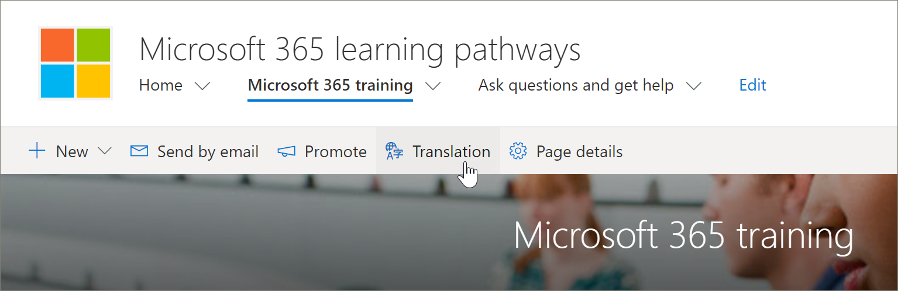
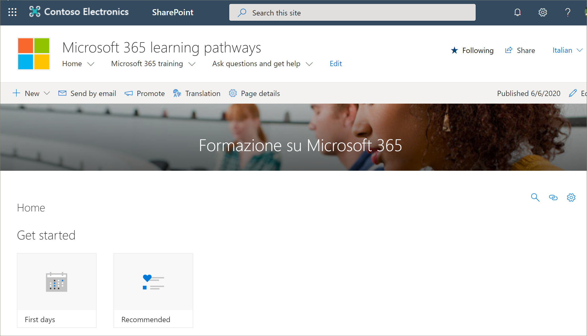

# サイトページを翻訳する
既存のバージョンの learning をバージョン4.0 に更新したか、新しいサイトをプロビジョニングしたかにかかわらず、サイトのページを翻訳するプロセスは同じです。 ただし、注意すべき点がいくつかあります。 
- 新しいラーニングパス多言語4.0 バージョンがプロビジョニングされると、サイトページは9つの言語に翻訳されます。 
- Learning のためのソリューションが多言語の4.0 バージョンに更新されても、ラーニングパスの SharePoint サイトページは変わりません。 翻訳は手動で行う必要があります。 

既定では、ラーニングパスサイトは次のページを提供します。

- Default.aspx
- Start-with-Six-Simple-Steps
- Get-started-with-Microsoft-365
- Get-started-with-Microsoft-Teams
- Get-started-with-SharePoint
- Get-started-with-OneDriive
- Ask-questions-and-get-help
- トレーニングイベントのカレンダー .aspx
- Become-a-Champion
- Recommended-Playlists
- ラーニング・経路管理者成功センター

## 必要な言語のページを作成する
多言語機能を使用できるようにサイトを有効にし、使用する言語を選択したら、必要な翻訳ページを作成できます。 重要な概念を説明するために、Microsoft 365 トレーニングページを例として使用します。 これを行うには、次の手順を実行します。

1.  ラーニング経路の**ホーム**ページで、[ **Microsoft 365 トレーニング**] をクリックします。  
2.  上部のバーで、[**翻訳**] を選択します。

3. サイトで使用できるすべての言語で翻訳用のページを作成する場合は、[**すべての言語の作成**] を選択します。 それ以外の場合は、必要な言語に対してのみ [**作成**] を選択します。 この例では、イタリア語を選択します。
4.  [**表示**] をクリックします。 これで、ページは翻訳の準備ができました。 

### 理解しておくべき重要な概念
次の例では、ページがイタリアに変換されていることに注意してください。 ただし、サイトタイトル、ナビゲーション、および web パーツはまだ英語で表示されます。 

 英語でサイトを設定した後、スペイン語を使用しているユーザー (たとえば、優先する個人の言語) では、手動で編集して、タイトル、ナビゲーション、およびフッターのコンテンツをスペイン語に変換します。 ドイツ語のユーザーが優先する個人の言語としてドイツ語を使用している場合は、ドイツ語の場合と同じです。 コンテンツが翻訳されると、これらの優先言語のすべてのユーザーに対して表示されます。 Web パーツは、ユーザーの優先言語を選択し、その言語で翻訳されたコンテンツを表示します。 

> [!IMPORTANT]
> 重要: 翻訳ページを作成した後、次のことを確認するために、既定の英語のページを発行 (または再発行) する必要があります。
- 翻訳ページは対応する言語サイトに表示されます。
- ニュース web パーツと強調表示されたコンテンツ web パーツで翻訳ページが正しく表示される
- サイトの上部にある [言語] ドロップダウンには、有効にしたすべての言語が含まれています。
- 翻訳者に翻訳要求が通知されます。

## 翻訳者ができること。
翻訳者は、既定の言語ページのコピーを、指定された言語に手動で翻訳します。 ページのコピーが作成されると、電子メールで翻訳者に通知されます。 電子メールには、既定の言語ページと新しく作成された翻訳ページへのリンクが含まれています。 トランスレーターは次のようになります。
1. 電子メールの [**翻訳の開始**] ボタンを選択します。
2. ページの右上にある [**編集**] を選択し、コンテンツを翻訳します。
3. 完了したら、**下書きとして保存**(閲覧者に表示する準備ができていない場合) または、サイトでその言語を使用しているすべてのユーザーにページを表示する準備ができている場合は、[**公開**] または [**ニュースの投稿**] を選択します。

翻訳プロセスの詳細については、「[多言語の通信サイト、ページ、ニュースを作成する](https://support.office.com/en-us/article/2bb7d610-5453-41c6-a0e8-6f40b3ed750c)」を参照してください。 

## 既定の言語ページの更新
[既定の言語] ページが更新された場合は、ページを再発行する必要があります。 その後、翻訳ページの翻訳者に対して、更新が行われたことが電子メールで通知されるので、個々の翻訳ページに更新を行うことができます。

## 次の手順
- [カスタム再生リストを翻訳する](custom_translate_pl_ml.md)
- [Multiligual コンテンツの表示と非表示を切り替える](custom_translate_pl_ml.md)
