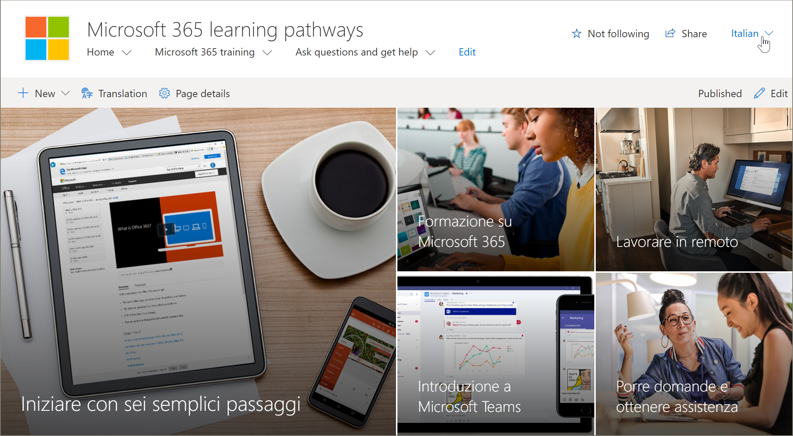
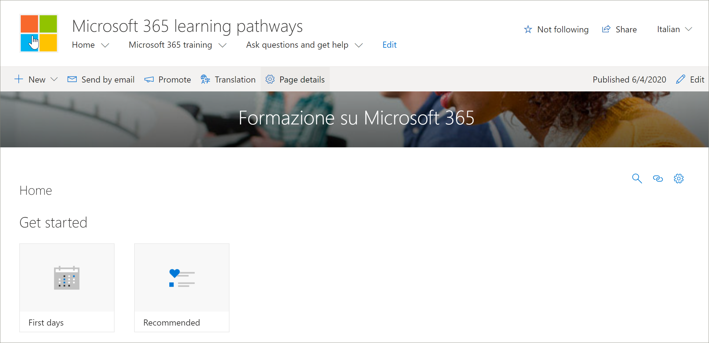

# サイト ページを翻訳するTranslate site pages
学習経路サイトの翻訳を開始する前に、多言語機能が学習経路とどのように機能するのかについて、いくつかの重要な概念を理解することが重要です。Before you start translating the learning pathways site, it’s important to understand a few key concepts of how the multilingual feature works with learning pathways. 
- サイト情報 - ナビゲーション、ロゴ、サイト名の翻訳では、ユーザーの言語プロファイルでサイトを表示し、翻訳する必要があります。Site information - Navigation, logo, and site name translations require that the site is viewed, and translated, in the user’s language profile.  
- ラーニング パス Web パーツを英語以外の言語で表示するには、Web パーツをユーザーの言語プロファイルで表示する必要があります。The learning pathways Web part must be viewed with user’s language profile for it to appear in a non-English language. Web パーツと Microsoft 提供のコンテンツは既に翻訳されています。The Web part and the Microsoft-supplied content are already translated for you. 言語プロファイルの詳細については、「個人の言語と地域の [設定を変更する」を参照してください](https://support.microsoft.com/office/change-your-personal-language-and-region-settings-caa1fccc-bcdb-42f3-9e5b-45957647ffd7)。For more information about languages profiles, see [Change your personal language and regional settings](https://support.microsoft.com/office/change-your-personal-language-and-region-settings-caa1fccc-bcdb-42f3-9e5b-45957647ffd7).
- 学習経路を設定する方法によって、ページを翻訳できるかどうかが決まれます。The way you set up learning pathways determines whether you have translated pages available. Microsoft 365 のルック ブック サービスでプロビジョニングされた新しいサイトでは、9 つの言語でページを翻訳できます。New sites provisioned with the Microsoft 365 look book service will have translated pages in nine languages available. 作成した更新されたサイトまたはサイトには、手動翻訳が必要です。Updated sites or sites you create will require manual translation. 「多言語 [学習パスのセットアップ オプション」を参照してください](custom_setupoptions_ml.md)。See [Setup options for multilingual learning pathways](custom_setupoptions_ml.md).
- コミュニケーション サイトの SharePoint Online 多言語機能によって、多言語による学習経路のサポートが有効になります。Multilingual support for learning pathways is enabled by SharePoint Online multilingual features for communication sites. SharePoint Online 多言語機能の詳細については、「多言語コミュニケーション サイト、ページ、ニュースを作成する [」を参照してください](https://support.office.com/article/2bb7d610-5453-41c6-a0e8-6f40b3ed750c)。To learn about SharePoint Online multilingual features, see [Create multilingual communication sites, pages, and news](https://support.office.com/article/2bb7d610-5453-41c6-a0e8-6f40b3ed750c). 

## 新しくプロビジョニングされたサイトの操作Working with a newly provisioned site
Microsoft 365 ルック ブック サービスから新しい学習経路サイトをプロビジョニングした場合、翻訳されたページは既に利用できます。If you provisioned a new learning pathways site from the Microsoft 365 look book service, the translated pages are already available to you. 既定では、サイトには次のページが表示されます。By default, the site provides the following pages:

- Home.aspxHome.aspx
- Start-with-Six-Simple-Steps.aspxStart-with-Six-Simple-Steps.aspx
- Get-started-with-Microsoft-365.aspxGet-started-with-Microsoft-365.aspx
- Get-started-with-Microsoft-Teams.aspxGet-started-with-Microsoft-Teams.aspx
- Get-started-with-SharePoint.aspxGet-started-with-SharePoint.aspx
- Get-started-with-OneDriive.aspxGet-started-with-OneDriive.aspx
- Ask-questions-and-get-help.aspxAsk-questions-and-get-help.aspx
- トレーニング イベント calendar.aspxTraining events calendar.aspx
- Become-a-Champion.aspxBecome-a-Champion.aspx
- Recommended-Playlists.aspxRecommended-Playlists.aspx
- ラーニング パス管理者サクセス センターLearning pathways Admin Success Center

## 新しくプロビジョニングされたサイトから翻訳されたページを表示するView translated pages from the newly provisioned site
翻訳された学習経路サイトを理解するには、いくつかの翻訳されたページを見てみてみることができます。To get familiar with the translated learning pathways site, let's take a look at a few translated pages.

### 翻訳されたホーム ページを表示するView the translated Home page
[学習経路] ホーム ページで、次の例に示すように、言語ドロップダウンから言語を選択します。From the learning pathways Home page, select a language from the language dropdown as shown in the following example. この例では、右上隅にイタリア語が選択されているのが表示され、すべてのページ要素が翻訳されます。In the example, you see Italian selected in the upper right corner and all the page elements are translated.

### 翻訳された Microsoft 365 トレーニング ページを表示するView the translated Microsoft 365 training page
次に、Microsoft 365 トレーニング ページについて説明します。Now let's take a look at the Microsoft 365 training page. 

1. ラーニング パス サイトの [ホーム]**ページで\*\*\*\*、[Microsoft 365** トレーニング] をクリックします。From the learning pathways site **Home** page, click **Microsoft 365 training**.
2. ページの右上隅で、言語を選択します。In the upper-right corner of the page, select a language. この例では、イタリア語が選択されています。In this example, Italian is selected.

言語が選択されている場合に表示される翻訳What translations are visible when the language is selected?
- SharePoint ページは、上の図に示すように翻訳されます。The SharePoint page is translated as shown in the graphic above. ページ バナーのテキストがイタリア語で表示されます。Notice the text for the page banner is now in Italian.

翻訳が表示されないのは何ですか?What’s translations aren't visible?
- サイト名は英語ですThe site name is in English
- サイト ナビゲーションは英語ですThe site navigation is in English
- Web パーツの学習経路は英語ですThe learning pathways web part is in English

## 完全に翻訳されたサイトを表示するView the fully translated site 
サイト ページ、ナビゲーション、Web パーツなど、完全に翻訳されたサイトを特定の言語で表示するには、その言語に対してユーザーの個人の言語と地域設定を設定する必要があります。To view a fully translated site in a specific language, including the site pages, navigation, and web part, the user’s personal language and regional settings must be set for that language. 言語と地域の設定の詳細については、「個人の言語と地域の [設定を変更する」を参照してください](https://support.microsoft.com/office/change-your-personal-language-and-region-settings-caa1fccc-bcdb-42f3-9e5b-45957647ffd7)。For more information on setting language and regional settings, see [Change your personal language and regional settings](https://support.microsoft.com/office/change-your-personal-language-and-region-settings-caa1fccc-bcdb-42f3-9e5b-45957647ffd7). 別のアカウントを使用するか、別の言語設定を持つ別のユーザーに翻訳されたページを表示をお勧めします。It's recommended that you use a separate account or have another user with the different language settings view the translated pages.  

## 更新または手動でインストールされた学習経路サイトの操作Working with an updated or manually installed learning pathways site
既存の Learning Pathways サイトを更新した場合、または Web パーツを手動で既存のサイトにインストールした場合は、サイト ページを手動で翻訳する必要があります。If you updated an existing Learning Pathways site or manually installed the web part to an existing site, you'll need to manually translate the site pages. Web パーツとコンテンツの学習経路は既に翻訳され、ユーザーの優先言語で表示されます。The learning pathways web part and content are already translated and will appear in the user's preferred language. ページを翻訳するには、「必要な言語のページを作成する」の手順を参照してください。To translate pages, see the following instructions "Create pages for the languages you want". 

## 必要な言語のページを作成するCreate pages for the languages you want
サイトで多言語機能を有効にし、使用可能にする言語を選択したら、必要な翻訳ページを作成できます。Once you've enabled your site for multilingual features and you've chosen the languages you want to make available, you can create the translation pages you want. 

1. 別の言語で使用できる既定の言語ページに移動します。Go to the default language page you want to make available in another language.
2. 上部バーで、[翻訳] を **選択します**。On the top bar, select **Translation**.
3. 必要 **な言語の** [作成] を選択します。Select **Create** for the languages you want.

> [!IMPORTANT]
> 翻訳ページを作成した後、既定の言語ページを発行 (または再発行) して、次の情報を確認する必要があります。After you create the translation pages, you must publish (or republish) the default language page to ensure that:
>- 翻訳ページは、対応する言語サイトに表示されます。Translation pages are shown in the corresponding language site.
>- 翻訳ページは、ニュース Web パーツと強調表示されたコンテンツ Web パーツに正しく表示されます。Translation pages display correctly in the News web part and the Highlighted content web parts.
>- サイトの上部にある言語ドロップダウンには、有効にした言語すべてが含まれます。The language dropdown at the top of the site includes all of the languages you enabled.
>- 翻訳者には、翻訳要求が通知されます。Translators are notified of the translation request.

ページを作成すると、ページの状態 (保存済み、公開済み、など) が各言語の横の翻訳ウィンドウに表示されます。After you create the page(s), the status of the page (draft saved, published, and so on) is shown in the translation pane next to each language. また、割り当てた翻訳者には、翻訳が要求されたという通知が電子メールで送信されます。Also, the translator(s) you assigned will be notified in email that a translation is requested.

### 特定の言語で完全に翻訳されたサイトを表示するView the fully translated site in a specific language
サイト ページ、ナビゲーション、Web パーツなど、完全に翻訳されたサイトを特定の言語で表示するには、その言語に対してユーザーの個人の言語と地域設定を設定する必要があります。To view a fully translated site in a specific language, including the site pages, navigation, and web part, the user’s personal language and regional settings must be set for that language. 言語と地域の設定の詳細については、「個人の言語と地域の [設定を変更する」を参照してください](https://support.microsoft.com/office/change-your-personal-language-and-region-settings-caa1fccc-bcdb-42f3-9e5b-45957647ffd7)。For more information on setting language and regional settings, see [Change your personal language and regional settings](https://support.microsoft.com/office/change-your-personal-language-and-region-settings-caa1fccc-bcdb-42f3-9e5b-45957647ffd7). 別のアカウントを使用するか、別の言語設定を持つ別のユーザーに翻訳されたページを表示する方法が最適であることに注意してください。Note that it’s best to use a separate account or have another user with the different language settings view the translated pages.

## 翻訳者ができること。What does a translator do?
 サイトを英語で設定すると、優先する個人言語としてスペイン語を使用するユーザーが、タイトル、ナビゲーション、フッターのコンテンツを手動で編集してスペイン語に翻訳します。After the site is set up in English, a user with Spanish as their preferred personal language, for example, manually edits and translates the title, navigation, and footer content into Spanish. ドイツ語を優先個人言語として使用しているユーザーは、ドイツ語でも同じようになります。A user with German as their preferred personal language does the same for German. コンテンツが翻訳されると、それらの優先言語のすべてのユーザーに表示されます。Once the content is translated, it will display for all users of those preferred languages. Web パーツは、ユーザーの優先言語を選択し、その言語で翻訳されたコンテンツを表示します。The Web part picks up the user's preferred language and shows the content translated in that language. 

翻訳者は、既定の言語ページのコピーを指定した言語に手動で翻訳します。Translators manually translate the copies of the default language page into the language(s) specified. ページのコピーが作成されると、翻訳者が指定されている場合、翻訳者に電子メールで通知されます。When the copies of the page(s) are created, translators are notified in email if a translator has been specified. 電子メールには、既定の言語ページと新しく作成された翻訳ページへのリンクが含まれています。The email includes a link to the default language page and the newly created translation page. 翻訳者は次の条件を実行します。The translator will:
1. メールの **[翻訳の開始]** ボタンを選択します。Select the **Start translating** button in the email.
2. ページ **の上部** 右側にある [編集] を選択し、コンテンツを翻訳します。Select **Edit** on the top right of the page, and translate the content.
3. 完了したら、[下書きとして保存] **(閲覧** 者に表示する準備ができていない場合) を選択するか、サイトでその言語を使用しているすべてのユーザーにページを表示する準備ができている場合は、[発行] または [ニュースの投稿] を選択します。When done, select **Save as draft** (if you're not ready to make it visible to readers) or if the page is ready to be visible to everyone who is using that language on the site, select **Publish** or **Post news**.

翻訳プロセスの詳細については、「多言語コミュニケーション サイト、ページ、ニュースを作成する [」を参照してください](https://support.office.com/article/2bb7d610-5453-41c6-a0e8-6f40b3ed750c)。For more information about the translation process, see [Create multilingual communication sites, pages, and news](https://support.office.com/article/2bb7d610-5453-41c6-a0e8-6f40b3ed750c). 

## 既定の言語ページの更新Updating the default language page
既定の言語ページを更新すると、ページを再発行する必要があります。When the default language page is updated, the page must be republished. 次に、翻訳ページの翻訳者に対して、更新が行われたという通知が電子メールで送信され、個々の翻訳ページを更新できます。Then, the translator(s) for the translation pages are notified in email that an update has been made so updates can be made to the individual translation pages.

## 多言語サイト名、ナビゲーション、フッターを設定するSet up a multilingual site name, navigation and footer
使用可能な別の言語でサイトのサイト名、ナビゲーション、フッターを表示するには、それぞれを手動で翻訳する必要があります。To show the site name, navigation, and footer of your site in the different languages you've made available, each must be translated manually.

たとえば、英語の既定の言語を使用して通信サイトを作成していて、スペイン語とドイツ語のサイトを有効にしているとします。For example, let's say you've created a  communication site with an English default language, and you've enabled the site for Spanish and German languages. サイトを作成するときに、既定の言語 (この場合、英語) でサイト名と説明を設定します。When you create a site, you set up the site name and description in the default language (in this case, English). サイトの作成後に、サイト名と説明を更新することもできます。You can also update the site name and description after site creation. 次に、ナビゲーション ノードとフッター コンテンツを英語で作成します。Then you create the navigation nodes and footer content in English.

サイトを英語で設定した後に、スペイン語を優先個人言語として使用しているユーザーは、タイトル、説明、ナビゲーション、フッター コンテンツを手動で編集してスペイン語に翻訳します。After the site is set up in English, a user with Spanish as their preferred personal language manually edits and translates the title, description, navigation and footer content into Spanish. ドイツ語を優先個人言語として使用しているユーザーは、ドイツ語でも同じようになります。A user with German as their preferred personal language does the same for German. コンテンツが翻訳されると、それらの優先言語のすべてのユーザーに表示されます。Once the content is translated, it will display for all users of those preferred languages. 

> [!NOTES]
>- 優先する言語でサイト コンテンツを翻訳するユーザーは、サイトの Owners グループのメンバーか、同等のサイトアクセス許可を持っている必要があります。Users who translate the site content for their preferred languages should be members of the Owners group for the site or have equivalent site permissions.
>- 既定の言語でサイト名、ナビゲーション、またはフッターに変更が行われた場合、既存のサイト翻訳を上書きしない限り、別の言語の対応する翻訳済みアイテムは自動的に更新されません。If a change is made to the site name, navigation, or footer in the default language, the corresponding translated item in another language is not automatically updated unless you choose to overwrite existing site translations. これを行う場合、翻訳されたアイテムは既定の言語で更新プログラムに置き換えられるので、手動で再度翻訳する必要があります。If you do that, the translated item is replaced by the update in the default language and would have to be manually translated again. 翻訳を上書きするには、既定の言語の [サイト言語] ページに移動し、[詳細設定の表示] を選択します。To overwrite translations, go to the Site languages page for the default language, and select Show advanced settings. 次に、[翻訳の上書き] のトグルを [オン] にスライドします。Then, slide the toggle for Overwrite translations to On. このオプションは、ページまたはニュース コンテンツには適用されません。This option does not apply to page or news content.

### 完全に翻訳されたサイトを特定の言語で表示するにはTo view the fully translated site in a specific language
サイト ページ、ナビゲーション、Web パーツなど、完全に翻訳されたサイトを特定の言語で表示するには、その言語に対してユーザーの個人の言語と地域設定を設定する必要があります。To view a fully translated site in a specific language, including the site pages, navigation, and web part, the user’s personal language and regional settings must be set for that language. 言語と地域の設定の詳細については、「個人の言語と地域の [設定を変更する」を参照してください](https://support.microsoft.com/office/change-your-personal-language-and-region-settings-caa1fccc-bcdb-42f3-9e5b-45957647ffd7)。For more information on setting language and regional settings, see [Change your personal language and regional settings](https://support.microsoft.com/office/change-your-personal-language-and-region-settings-caa1fccc-bcdb-42f3-9e5b-45957647ffd7). 別のアカウントを使用するか、別の言語設定を持つ別のユーザーに翻訳されたページを表示をお勧めします。It’s recommended that you use a separate account or have another user with the different language settings view the translated pages.

## 詳細情報For more information
- SharePoint コミュニケーション サイト ページの翻訳の詳細については、「多言語コミュニケーション サイト、ページ、ニュースを作成する [」を参照してください](https://support.office.com/article/2bb7d610-5453-41c6-a0e8-6f40b3ed750c)。For more information about translating SharePoint communication site pages, see [Create multilingual communication sites, pages, and news](https://support.office.com/article/2bb7d610-5453-41c6-a0e8-6f40b3ed750c).
- 学習経路のカスタマイズの詳細については、「学習経路のカスタマイズ [」を参照してください](custom_overview.md)。For more information about customizing learning pathways, see [Customize Learning Pathways](custom_overview.md).  
