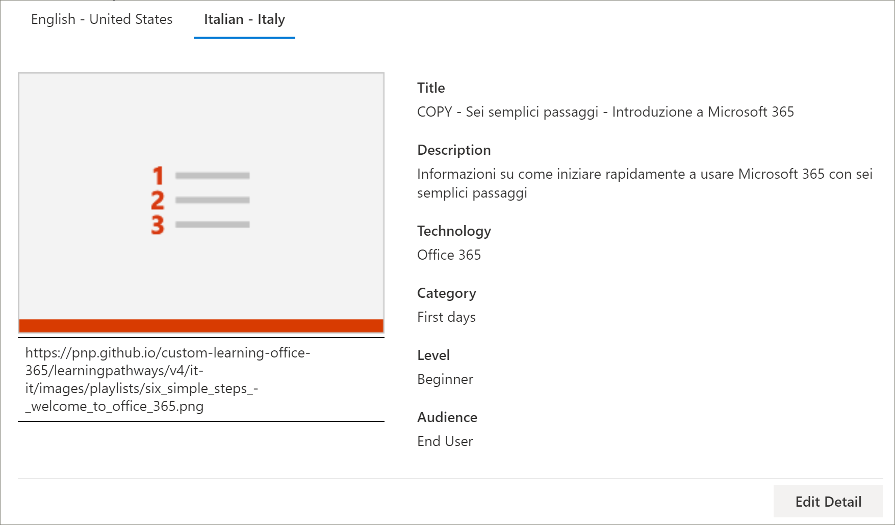
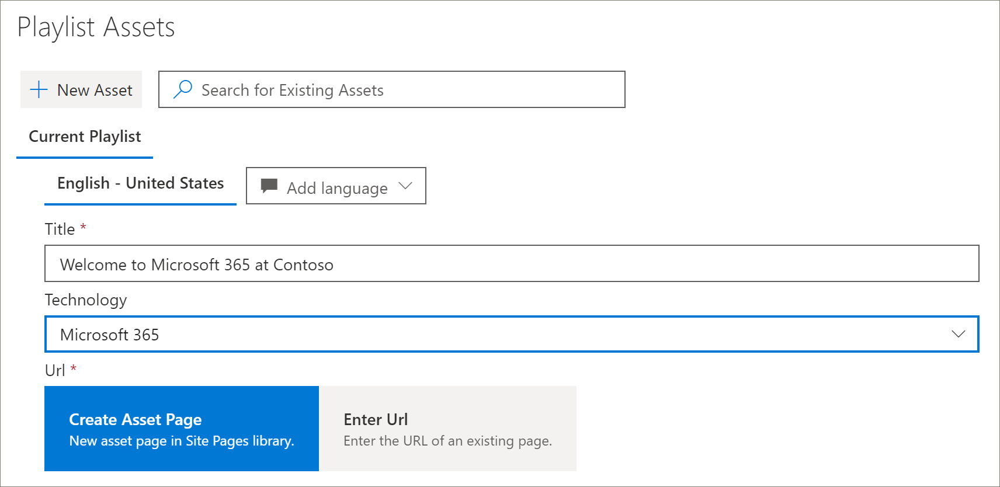
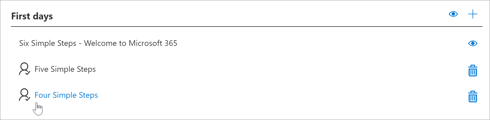
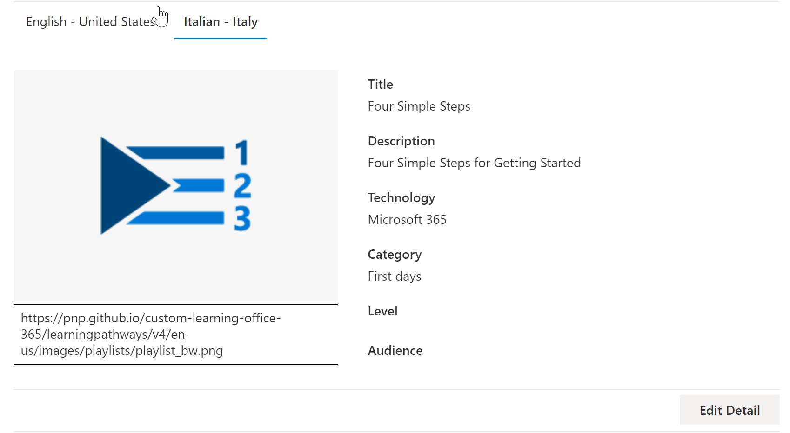

# 学習経路のカスタムプレイリストを翻訳する
学習経路を使用すると、カスタムプレイリストの操作方法は、学習経路の設定方法によって異なります。  

- 新しいラーニングパス多言語サイトを準備している場合は、新しい再生リストをコピーまたは作成し、そのプレイリストをサイトでサポートされている言語に翻訳することができます。
- 既存のカスタムプレイリストを持つ既存の学習機能サイトをアップグレードした場合は、既存の再生リストをサイトでサポートされている言語に翻訳できます。 新しい再生リストをコピーして作成することもできます。 

> [!IMPORTANT]
> - Microsoft が提供した再生リストは既に翻訳されており、再生リストのコピーを作成しない限り変更することはできません。 

## 再生リストを作成またはコピーして翻訳する
新しいラーニング・パス多言語サイトをプロビジョニングした場合、またはサイトを多言語 web パーツでアップグレードした場合は、コピーまたはカスタムプレイリストを作成して、サイトでサポートされている言語に再生リストと再生リストアセットを変換できます。 

### 再生リストをコピーして変換する
新しいカスタムプレイリストを作成して変換する方法を示すために、ラーニング経路の [再生リストのコピー] 機能を使用します。

1.  [ラーニング経路の**ホーム**] メニューから、[ラーニング] [**管理**] をクリックします。 
2.  [ **Microsoft 365 learning の経路**] で [**最初の日**] を選択し、 **6 つの簡単な手順である [microsoft 365 へようこそ**] を選択します。 
3. [**プレイリストのコピー**] をクリックし、ページを下にスクロールして、[**詳細の編集**] をクリックします。   
4. プレイリストのタイトルを変更します。 この例では、再生リストのタイトルを**5 つの簡単な手順**に変更します。 使用可能な言語は、サイトでサポートされている言語によって異なります。 その他の言語を追加するには、サイトにサポートされているその他の言語を追加する必要があります。   
5. [**詳細の保存**] をクリックします。 
6. 既定の言語の右にある言語 (この場合は英語) をクリックして、コピーした再生リストの詳細を表示します。 新しい言語の詳細には、元のコピーされた再生リストが反映され、変換が必要になります。
7. 翻訳する再生リストの詳細をトランスレーターに通知するように注意してください。  

> [!IMPORTANT]
> トランスレーター通知は、カスタムの再生リストには組み込まれません。 翻訳者に手動で通知する必要があります。 翻訳者は、既定の言語詳細のコピーを、指定された言語に手動で翻訳します。 再生リストの詳細に必要な翻訳のトランスレーターに通知する必要があります。 再生リストアセットの追加、編集、削除など、すべての再生リストの変更を完了してから、再生リストの詳細とアセットに必要な翻訳をトランスレーターに通知することをお勧めします。

## カスタムプレイリストで多言語アセットを作成する
Microsoft によって提供される再生リスト内のアセットは編集できず、変換は必要ありません。 Microsoft が提供するアセットは、サイトでサポートされている言語で利用できます。 カスタムアセットを作成したり、既存のカスタムアセットを作成したりする場合は、サイトでサポートされている言語を追加できます。  それでは、プレイリストに新規および既存のカスタムアセットに言語を追加する方法を見てみましょう。 

### プレイリストの新しい多言語アセットを作成する
これらの手順では、このトピックの例で、5つのシンプルなステップのプレイリストを使用していることを前提としています。 

**アセットを作成するには**
1. 5つのシンプルなステップの再生リストの場合は、[**アセット**] の下で [ **+ 新しいアセット**] を選択し、アセットの詳細を入力します。 
- [**タイトル**] に、「Welcome to Microsoft 365 to Contoso」と入力します。 
- [**テクノロジ**] で、[ **Microsoft 365**] を選択します。

2. [ **Create asset**] を選択してから、[**アセットの保存**] を選択します。

**アセットを開くには**
1. 作成したアセットを選択し、[**開く**] をクリックします。  
2. 必要に応じて、ページに変更を加えます。 ここでは、次の例に示すように、ページのタイトルを変更し、ページに何らかのテキストを追加して、[**発行**] をクリックします。 
3. [**翻訳**] をクリックします。
4. 目的の言語に対して [**作成**] を選択します。 この例では、イタリア語を選択します。
5. [**表示**] を選択します。 サポートされている言語に応じて、次の例のようなページが表示されます。

6. **[発行]** をクリックします。
7. 作成した翻訳ページについては、ブラウザーから URL をコピーし、ラーニングパス管理ページに戻ります。

**作成した翻訳アセットの言語を追加するには** 
1. [ラーニングパスの管理] ページに戻り、開いた「5つの簡単な手順」アセットの編集アイコン (鉛筆) を選択します。 
2. [**言語の追加**] をクリックし、言語を選択します。 この例では、イタリア語を選択しました。 
3. 作成した翻訳済みページの URL を入力します。 次の例のようなページが表示されます。 

4. [**アセットの保存**] をクリックします。

## 既存のカスタム再生リストとアセットの言語を追加する
多言語サポートのために学習経路をアップグレードし、既存のカスタムプレイリストとアセットを使用する場合は、サポートされている言語を再生リストとアセットに追加できます。 これらの手順では、言語を追加できるカスタムプレイリストがあることを前提としています。 カスタムプレイリストを持っていない場合は、このトピックで前述した「再生リストを作成またはコピーする」を参照してください。 

> [!IMPORTANT]
> - Microsoft が提供した再生リストは既に翻訳されており、再生リストのコピーを作成しない限り変更することはできません。 カスタム再生リストに対しては、言語のみを追加できます。 
> - カスタムプレイリストおよびアセットの言語を追加するには、多言語サポートと言語を有効にする必要があります。 詳細については、「[言語設定を設定](https://docs.microsoft.com/office365/customlearning/custom_update_ml#set-language-settings)する」を参照してください。 

### 既存の再生リストに言語を追加するには
1.  [ラーニング経路の**ホーム**] メニューから、[ラーニング] [**管理**] をクリックします。 
2.  カスタムプレイリストを選択します。 カスタムプレイリストは、次の例に示すように、チェックマークの付いた [people] アイコンで識別されます。
 
3. [**詳細の編集**] を選択します。 [**詳細の編集**] ボタンを見つけるには、下にスクロールしなければならない場合があります。   
4. [**言語の追加**] を選択し、言語を選択します。  
5. [**詳細の保存**] を選択します。
 使用可能な言語は、サイトでサポートされている言語によって異なります。 その他の言語を追加するには、サイトにサポートされているその他の言語を追加する必要があります。   
5. 既定の言語の右にある言語 (この場合は英語) をクリックして、コピーした再生リストの詳細を表示します。 新しい言語の詳細には、元のコピーされた再生リストが反映され、変換が必要になります。
 
7. 翻訳する再生リストの詳細をトランスレーターに通知するように注意してください。  

**アセットを開くには**
1. 作成したアセットを選択し、[**開く**] をクリックします。  
2. 必要に応じて、ページに変更を加えます。 ここでは、次の例に示すように、ページのタイトルを変更し、ページに何らかのテキストを追加して、[**発行**] をクリックします。 
3. [**翻訳**] をクリックします。
4. 目的の言語に対して [**作成**] を選択します。 この例では、イタリア語を選択します。
5. [**表示**] を選択します。 サポートされている言語に応じて、次の例のようなページが表示されます。

6. **[発行]** をクリックします。
7. 作成した翻訳ページについては、ブラウザーから URL をコピーし、ラーニングパス管理ページに戻ります。

## トランスレーターに通知する
翻訳アセットの作成が終了したら、必要な翻訳をトランスレーターに通知します。 トランスレーターは次のようになります。
- 再生リストの詳細を変換します。
- 資産の詳細を翻訳します。
- アセットの追加された言語ページを翻訳します。
- 翻訳のレビューの準備ができたことを、翻訳の要求者に通知する

## 既存のカスタムプレイリストの言語を追加する
多言語サポートのために学習経路をアップグレードし、既存のカスタムプレイリストとアセットを使用する場合は、サポートされている言語を再生リストとアセットに追加できます。 

> [!IMPORTANT]
> - Microsoft が提供した再生リストは既に翻訳されており、再生リストのコピーを作成しない限り変更することはできません。 カスタム再生リストに対しては、言語のみを追加できます。 
> - カスタムプレイリストおよびアセットの言語を追加するには、多言語サポートと言語を有効にする必要があります。 多言語サポートとオプションを有効にする方法の詳細については、「 [Set Language Settings](https://docs.microsoft.com/office365/customlearning/custom_update_ml#set-language-settings)」を参照してください。 

## トランスレーターの手順
再生リストに言語を追加する場合は、変更をトランスレーターに通知する必要があります。 トランスレーターを次のように指定することができます。 

### 再生リストの詳細を変換する
[ラーニング経路の**ホーム**] メニューから、[ラーニング] [**管理**] をクリックします。 
1. 変換が必要なカスタムの再生リストをクリックしてから、言語をクリックします。 
2. [**詳細の編集**] をクリックし、再生リストの翻訳を行い、[ 
3. [**詳細の保存**] をクリックします。 
4. 翻訳が完了したことを翻訳要求者に通知します。 

### 資産の詳細を翻訳する
[ラーニング経路の**ホーム**] メニューから、[ラーニング] [**管理**] をクリックします。 
1. 変換を必要とするカスタムの再生リストをクリックします。 
2. ページを下にスクロールし、[アセット] の下で、編集するアセットの [編集] を選択して、言語を選択します。 
3. 資産の翻訳を行い、[**アセットの保存**] をクリックします。  

### 資産の追加された言語ページの翻訳
[ラーニング経路の**ホーム**] メニューから、[ラーニング] [**管理**] をクリックします。 
1. 変換を必要とするカスタムの再生リストをクリックします。 
2. ページを下にスクロールし、[アセット] の下でアセットを選択して、言語を選択し、[開く] をクリックします。 
3. ページに対して翻訳を行い、[**発行**] をクリックします。   

## 詳細情報
- 学習経路のカスタマイズの詳細については、「[ラーニング経路をカスタマイズ](custom_overview.md)する」を参照してください。 

