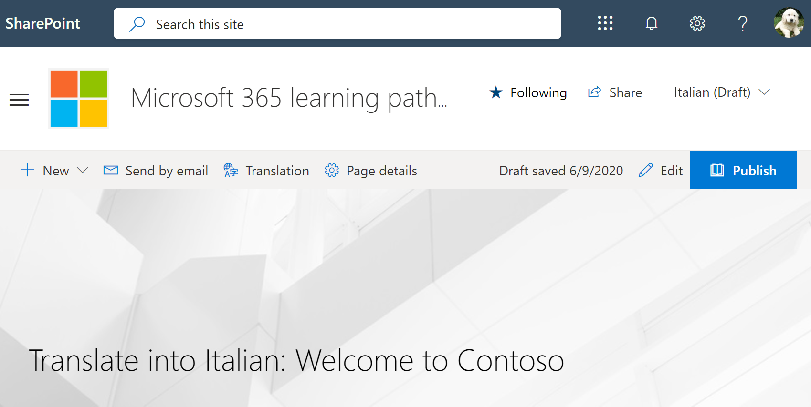
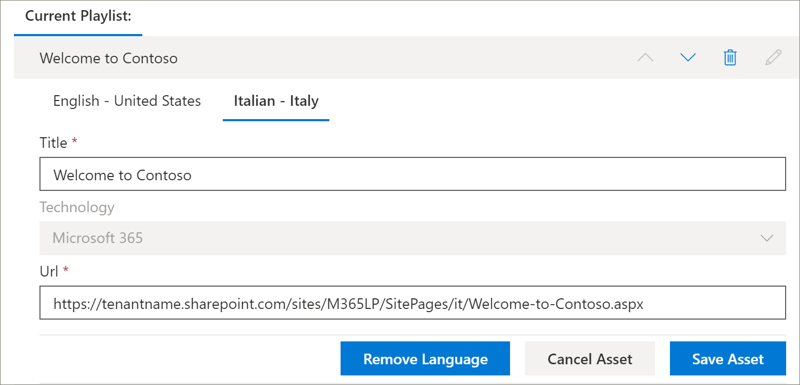

# 学習経路のカスタムプレイリストを翻訳するTranslate a learning pathways custom playlist
サイトの学習経路のカスタム再生リストを作成している場合は、再生リストをこのサイトに対して有効になっている言語に翻訳できます。If you've created learning pathways custom playlists for your site, you can translate the playlists into the languages enabled for this site.

1.  [ラーニング経路の**ホーム**] メニューから、[ラーニング] [**管理**] をクリックします。From the learning pathways **Home** menu, click **Learning pathways administration**. 
2.  カスタムプレイリストをクリックします。Click the custom playlist. この例では、 **5 つの簡単な手順**を使用して Contoso にようこそ。In this example, we'll use **Five Simple Steps - Welcome to Contoso**. 
3.  [**詳細の編集**] をクリックし、[**言語の追加**] ボックスで言語を選択します。Click **Edit Detail**, then in the **Add language** box, select a language. この例では、**イタリア語–イタリア**を使用します。In this example, we'll use **Italian – Italy**. 
5.  [**詳細の保存**] をクリックします。Click **Save Detail**. 

> [!IMPORTANT]
> トランスレーター通知は、カスタムの再生リストには組み込まれません。Translator notifications are not built into custom playlists. 翻訳者に手動で通知する必要があります。Translators will need to be notified manually. 

## 翻訳者ができること。What does a translator do?
翻訳者は、既定の言語ページのコピーを、指定された言語に手動で翻訳します。Translators manually translate the copies of the default language page into the language(s) specified. 再生リストの詳細に必要な翻訳のトランスレーターに通知する必要があります。You will need to notify the translator of the translations required for playlist details. 再生リストアセットの追加、編集、削除など、すべての再生リストの変更を完了してから、必要な翻訳をトランスレーターに通知することをお勧めします。It's recommended that you finish all playlist changes,including adding, editing, or deleting playlist assets, then notify the translator of the required translations.

## カスタム再生リストのアセットを翻訳するTranslate the assets in the custom playlist
Microsoft によって提供される再生リスト内のアセットは編集できず、変換は必要ありません。Any assets in a playlist that are supplied by Microsoft are not editable and do not require translation. テナントの SharePoint サイトからカスタムアセットを追加した場合は、それらのアセットに変換が必要になります。If you’ve added custom assets from your tenant's SharePoint site, those assets will require translation. 次に、プレイリスト内のカスタムアセットを翻訳する方法について説明します。Let's take a look at how to translate a custom asset in a playlist.

### 既存のアセットに言語を追加するAdd a language for an existing asset
1. [**アセット**] の下で、カスタムアセットの横にある [**編集**] アイコンを選択します。Under **Assets**, select the **Edit** icon next to the custom asset. 
2. [**言語の追加**] ボックスで言語を選択し、[**アセットの保存**] を選択します。Select a language from the **Add language** box, and then select **Save Asset**.

### 既存のアセットの言語ページを追加するAdd a language page for an existing asset
1. [資産] 一覧で、英語の資産をクリックし、[**開く**] をクリックします。In the asset list, click the English asset, and then click **Open**.
2. 上部のバーで、[**翻訳**] を選択します。On the top bar, select **Translation**.
3. [言語] ドロップダウンからアセットの言語を選択し、[**作成**] を選択して、[**表示**] を選択します。From the language dropdown, select the language for the asset, select **Create**, and then **View**. ページは次のようになります。Your page should now look something like this. 

4. [**発行**] をクリックし、ページの URL をコピーします。Click **Publish**, and then copy the URL for the page. これは、URL の言語コードを使用して、次のようなものになります。It should look something like this, with the language code in the URL.
https://tenantname.sharepoint.com/sites/M365LP/SitePages/it/Welcome-to-Contoso.aspx.https://tenantname.sharepoint.com/sites/M365LP/SitePages/it/Welcome-to-Contoso.aspx.
5. [SharePoint 管理] ページに戻り、アセットの言語の URL を追加して、[**保存**] をクリックします。Return to the SharePoint Administration page, add the URL for the language for the asset, and then click **Save**. 

6.  ページを上にスクロールして、[**プレイリストを閉じる**] をクリックします。Scroll up the page and click **Close Playlist**.

## 翻訳者の機能What the translator does?
トランスレーターは次のようになります。The translator will:
- 再生リストの詳細を変換します。Translate playlist details.
- 資産の詳細を翻訳します。Translate asset details.
- アセットの追加された言語ページを翻訳します。Translate added language pages for asset.
- 翻訳のレビューの準備ができたことを、翻訳の要求者に通知するNotify the requestor of the translations that the translations are ready for review

### 再生リストの詳細を変換するTranslate playlist details
[ラーニング経路の**ホーム**] メニューから、[ラーニング] [**管理**] をクリックします。From the Learning Pathways **Home** menu, click **Learning pathways administration**. 
1. 変換が必要なカスタムの再生リストをクリックしてから、言語をクリックします。Click the custom playlist that requires translation, then click the languages. 
2. [**詳細の編集**] をクリックし、再生リストの翻訳を行い、[Click **Edit Detail**, make the translations for the playlist, then click 
3. [**詳細の保存**] をクリックします。Click **Save Detail**. 
4. 翻訳が完了したことを翻訳要求者に通知します。Notify the translation requestor that the translation is complete. 

### 資産の詳細を翻訳するTranslate asset details
[ラーニング経路の**ホーム**] メニューから、[ラーニング] [**管理**] をクリックします。From the Learning Pathways **Home** menu, click **Learning pathways administration**. 
1. 変換を必要とするカスタムの再生リストをクリックします。Click the custom playlist that requires translation. 
2. ページを下にスクロールし、[アセット] の下で、編集するアセットの [編集] を選択して、言語を選択します。Scroll down the page, then under Assets, select edit for the asset you want to edit, then select the language. 
3. 資産の翻訳を行い、[**アセットの保存**] をクリックします。Make the translations for the asset, and then click **Save Asset**.  

## 資産の追加された言語ページの翻訳Translate the added language page for the asset
[ラーニング経路の**ホーム**] メニューから、[ラーニング] [**管理**] をクリックします。From the Learning Pathways **Home** menu, click **Learning pathways administration**. 
1. 変換を必要とするカスタムの再生リストをクリックします。Click the custom playlist that requires translation. 
2. ページを下にスクロールし、[アセット] の下でアセットを選択して、言語を選択し、[開く] をクリックします。Scroll down the page, then under Assets, select the asset, select the language, and then click Open. 
3. ページに対して翻訳を行い、[**発行**] をクリックします。Make the translations for the page, and then click **Publish**.  

## 新しい multilangual 再生リストを作成するCreate a new multilangual playlist
サイトの新しい再生リストを作成する方法については、「[カスタムプレイリストを作成](custom_createnewplaylist.md)する」を参照してください。For instructions on how to create a new playlist for a site, see [Create a Custom Playlist](custom_createnewplaylist.md). 再生リストとアセットを作成した後、このドキュメントを参照して、再生リストとアセットを翻訳する方法についての指示をお送りください。After you've created the playlist and assets, refer back to this documentation for instruction on how to translate the playlist and assets. 