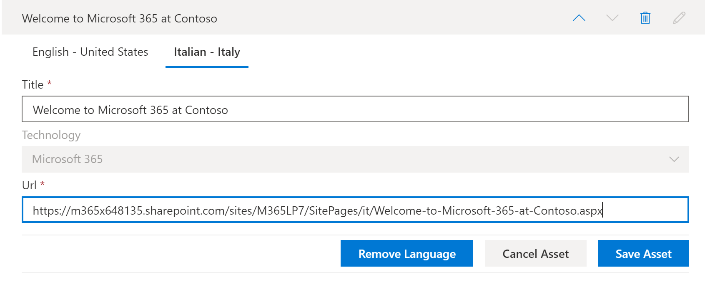

# 学習経路のカスタム再生リストを翻訳するTranslate learning pathways custom playlists
Learning Pathways では、カスタムプレイリストの使い方は、学習経路の設定方法によって異なります。With Learning Pathways, the way you work with custom playlists depends on how you set up learning pathways.  

- 多言語サイトに新しい学習経路を準備した場合は、新しいプレイリストをコピーまたは作成し、サイトがサポートする言語にプレイリストを翻訳できます。If you provisioned a new learning pathways multilingual site, you can copy or create a new playlist and translate the playlist into the languages that the site supports.
- 既存のカスタム プレイリストを含む既存の学習経路サイトをアップグレードした場合は、既存のプレイリストをサイトがサポートする言語に翻訳できます。If you upgraded an existing learning pathways site that has pre-existing custom playlists, you can translate the existing playlists into the languages that your site supports. 新しいプレイリストをコピーして作成することもできます。You can also copy and create new playlists. 

> [!IMPORTANT]
> - Microsoft 提供のプレイリストは既に翻訳済みで、プレイリストのコピーを作成しない限り変更できません。Microsoft-supplied playlists are already translated and can't be modified unless you create a copy of the playlist. 

## プレイリストを作成またはコピーして翻訳するCreate or copy a playlist and have it translated
多言語 Web パーツを使用して新しい学習経路を準備した場合や、多言語 Web パーツを使用してサイトをアップグレードした場合は、カスタム プレイリストをコピーまたは作成し、プレイリストとプレイリストのアセットをサイトでサポートされている言語に翻訳できます。If you've provisioned a new learning pathways multilingual site or upgraded the site with the multilingual web part, you can copy or a create custom playlist and translate the playlist and playlist assets into the languages supported by your site. 

### プレイリストをコピーして翻訳するCopy a playlist and have it translated
新しいカスタム プレイリストを作成し、それを翻訳する方法を説明するために、学習経路のプレイリストのコピー機能を使用します。To demonstrate how to create a new custom playlist and have it translated, we'll use the Copy playlist feature of learning pathways.

1.  [ラーニング パスホーム] メニュー **から、[** ラーニング パス **の管理] をクリックします**。From the learning pathways **Home** menu, click **Learning pathways administration**. 
2.  [Microsoft **365 ラーニング パス]** で、[最初の日] を選択し、[6 つの簡単な手順 **- Microsoft 365** へようこそ] を選択します。 Under **Microsoft 365 learning pathways**, select **First Days**, then select **Six Simple Steps - Welcome to Microsoft 365**. 
3. [プレイリスト **のコピー] を** クリックし、ページを下にスクロールし、[詳細の編集] **をクリックします**。Click **Copy Playlist**, scroll down the page and click **Edit Detail**.   
4. プレイリストのタイトルを変更します。Change the title of the playlist. この例では、プレイリストのタイトルを 5 つの簡単な手順 **に変更します**。In this example, we'll change the playlist title to to **Five Simple Steps**. 使用できる言語は、サイトで選択されているサポートされている言語によって異なっています。The languages available will depend on the supported languages selected for the site. 追加の言語を追加するには、サポートされている言語をサイトに追加する必要があります。To add additional languages, you need to add additional supported languages to the site.   
5. [詳細 **の保存] をクリックします**。Click **Save Detail**. 
6. 既定の言語の右側にある言語 (この場合は英語) をクリックして、コピーされたプレイリストの詳細を表示します。Click a language to the right of the default language (in this case English) to view the copied playlist details. 新しい言語の詳細は、コピーされた元のプレイリストを反映し、翻訳が必要です。The details for the new language reflect the original copied playlist and require translation.
7. 翻訳するプレイリストの詳細を翻訳者に通知するメモを作成します。Make a note to notify the translator of the playlist details to be translated.  

> [!IMPORTANT]
> 翻訳者の通知は、カスタムプレイリストに組み込む必要があります。Translator notifications are not built into custom playlists. 翻訳者には手動で通知する必要があります。Translators will need to be notified manually. 翻訳者は、既定の言語の詳細のコピーを、指定された言語に手動で翻訳します。Translators manually translate the copies of the default language details into the language(s) specified. プレイリストの詳細に必要な翻訳を翻訳者に通知する必要があります。You'll need to notify the translator of the translations required for playlist details. プレイリストアセットの追加、編集、削除など、すべてのプレイリストの変更を完了してから、プレイリストの詳細とアセットに必要な翻訳を翻訳者に通知してください。It's recommended that you finish all playlist changes,including adding, editing, or deleting playlist assets, then notify the translator of the required translations for playlist details and assets.

## カスタム プレイリストで多言語アセットを作成するCreate multilingual assets in a custom playlist
Microsoft が提供するプレイリスト内のアセットは編集不可で、翻訳は必要とされません。Any assets in a playlist that are supplied by Microsoft are not editable and do not require translation. Microsoft が提供するアセットは、サイトでサポートされている言語で利用できます。Microsoft-supplied assets will be available in the languages supported by the site. 作成したカスタム アセット、または既存のカスタム アセットの場合は、サイトでサポートされている言語を追加できます。For custom assets that you create, or existing custom assets, you can add the languages supported by the site.  プレイリストに新しいカスタムアセットと既存のカスタム アセットの言語を追加する方法について説明します。Let's take a look at how to add languages for new and existing custom assets in a playlist. 

### プレイリストの新しい多言語アセットを作成するCreate a new multilingual asset for a playlist
これらの手順では、このトピックの例で 5 つの簡単な手順のプレイリストを使用している必要があります。These instructions assume you're using the Five Simple Steps playlist in the example in this topic. 

**アセットを作成するには****To create the asset**
1. [5 つの簡単な手順] プレイリスト **の [アセット**] で **、[+ 新しいアセット** ] を選択し、アセットの詳細を入力します。For the Five Simple Steps playlist, under **Assets**, select **+ New Asset** and then fill out the details for the asset. 
- [ **タイトル]** に「Contoso の Microsoft 365 へようこそ」と入力します。For **Title**, enter "Welcome to Microsoft 365 at Contoso". 
- [ **テクノロジ]** で **、[Microsoft 365] を選択します**。For **Technology**, select **Microsoft 365**.

2. [アセット **の作成] を** 選択し、[アセットの保存] **を選択します**。Select **Create Asset**, and then select **Save Asset**.

**アセットを開く方法****To open the asset**
1. 作成したアセットを選択し、[開く] を **クリックします**。Select the asset you created, and then click **Open**.  
2. 必要に応じてページに変更を加えます。Make the changes to the page as desired. ここで、ページのタイトルを変更し、次の例に示すようにページにテキストを追加し、[発行] を **クリックします**。For now, you can change the title of the page and add some text to the page as shown in the following example, and then click **Publish**. 
3. [翻訳 **] をクリックします**。Click **Translation**.
4. 必要 **な言語** の [作成] を選択します。Select **Create** for the language(s) you want. この例では、イタリア語を選択します。For this example, we'll select Italian.
5. [表示 **] を選択します**。Select **View**. サポートされている言語に応じて、次の例のようなページが表示されます。You should now see a page similar to the following example depending on your supported languages.

6. **[発行]** をクリックします。Click **Publish**.
7. 作成した翻訳ページの場合は、ブラウザーから URL をコピーし、[学習経路の管理] ページに戻ります。For the translation page you created, copy the URL from the browser and return to the learning pathways Administration page.

**作成した翻訳アセットの言語を追加するには****To add a language for the translation asset you created** 
1. [ラーニング パスの管理] ページに戻り、開いた "5 つの簡単な手順" アセットの [編集] アイコン (鉛筆) を選択します。Return to the learning pathways Administration page and select the Edit icon (pencil) for the "Five Simple Steps" asset you opened. 
2. [言語 **の追加]** をクリックし、言語を選択します。Click **Add language**, and then select a language. この例では、イタリア語を選択しました。In this example, we've selected Italian. 
3. 作成した翻訳ページの URL を入力します。Enter the URL of the translated page you created. 次の例のようなページが表示されます。You should see a page similar to the following example. 

4. [アセット **の保存] をクリックします**。Click **Save Asset**.

## 既存のカスタム プレイリストとアセットの言語を追加するAdd languages for existing custom playlists and assets
多言語サポートの学習経路をアップグレードし、既存のカスタム プレイリストとアセットがある場合は、プレイリストとアセットにサポートされている言語を追加できます。If you have upgraded learning pathways for multilingual support and have existing custom playlists and assets, you can add supported languages for the playlists and assets. 次の手順では、言語を追加できるカスタムプレイリストが必要です。These instructions assume you have a custom playlist to which you can add languages. カスタム プレイリストをお持ちでない場合は、このトピックの「Create or Copy a Playlist」を参照してください。If you don't have a custom playlist, see "Create or Copy a Playlist" earlier in this topic. 

> [!IMPORTANT]
> - Microsoft 提供のプレイリストは既に翻訳済みで、プレイリストのコピーを作成しない限り変更できません。Microsoft-supplied playlists are already translated and can't be modified unless you create a copy of the playlist. カスタムプレイリストの言語のみを追加できます。You can only add languages for custom playlists. 
> - カスタム プレイリストとアセットの言語を追加するには、多言語サポートと言語を有効にする必要があります。To add languages for custom playlists and assets, multilingual support and languages must be enabled. 詳細については、「言語設定の [設定」を参照してください](./custom_update_ml.md#set-language-settings)。For more information, see [Set Language Settings](./custom_update_ml.md#set-language-settings). 

### 既存のプレイリストの言語を追加するにはTo add languages for an existing playlist
1.  [ラーニング パスホーム] メニュー **から、[** ラーニング パス **の管理] をクリックします**。From the learning pathways **Home** menu, click **Learning pathways administration**. 
2.  カスタムプレイリストを選択します。Select a custom playlist. カスタム プレイリストは、次の例に示すように、チェックマークが付くユーザー アイコンによって識別されます。A custom playlist is identified by the people icon with the checkmark, as shown in the following example.
 
3. [詳細 **の編集] を選択します**。Select **Edit Detail**. [詳細の編集] ボタンを見つけるには、下に **スクロールする必要** があります。You may need to scroll down to find the **Edit Detail** button.   
4. [言語 **の追加] を** 選択し、言語を選択します。Select **Add language** and then select a language.  
5. [詳細 **の保存] を選択します**。Select **Save Detail**.
 使用できる言語は、サイトで選択されているサポートされている言語によって異なっています。The languages available will depend on the supported languages selected for the site. 追加の言語を追加するには、サポートされている言語をサイトに追加する必要があります。To add additional languages, you need to add additional supported languages to the site.   
5. 既定の言語の右側にある言語 (この場合は英語) をクリックして、コピーされたプレイリストの詳細を表示します。Click a language to the right of the default language (in this case English) to view the copied playlist details. 新しい言語の詳細は、コピーされた元のプレイリストを反映し、翻訳が必要です。The details for the new language reflect the original copied playlist and require translation.
 
7. 翻訳するプレイリストの詳細を翻訳者に通知するメモを作成します。Make a note to notify the translator of the playlist details to be translated.  

**アセットを開く方法****To open the asset**
1. 作成したアセットを選択し、[開く] を **クリックします**。Select the asset you created, and then click **Open**.  
2. 必要に応じてページに変更を加えます。Make the changes to the page as desired. ここで、ページのタイトルを変更し、次の例に示すようにページにテキストを追加し、[発行] を **クリックします**。For now, you can change the title of the page and add some text to the page as shown in the following example, and then click **Publish**. 
3. [翻訳 **] をクリックします**。Click **Translation**.
4. 必要 **な言語** の [作成] を選択します。Select **Create** for the language(s) you want. この例では、イタリア語を選択します。For this example, we'll select Italian.
5. [表示 **] を選択します**。Select **View**. サポートされている言語に応じて、次の例のようなページが表示されます。You should now see a page similar to the following example depending on your supported languages.

6. **[発行]** をクリックします。Click **Publish**.
7. 作成した翻訳ページの場合は、ブラウザーから URL をコピーし、[学習経路の管理] ページに戻ります。For the translation page you created, copy the URL from the browser and return to the learning pathways Administration page.

## 翻訳者に通知するNotify the translator
翻訳アセットの作成が完了したら、翻訳者に必要な翻訳を通知します。When you've finished creating translation assets, notify the translator of the required translations. 翻訳者は次の条件を実行します。The translator will:
- プレイリストの詳細を翻訳します。Translate playlist details.
- アセットの詳細を翻訳します。Translate asset details.
- アセットの追加言語ページを翻訳します。Translate added language pages for an asset.
- 翻訳がレビューの準備ができていることを要求者に通知するNotify the requestor of the translations that the translations are ready for review

## 既存のカスタム プレイリストの言語を追加するAdd languages for an existing custom playlist
多言語サポートの学習経路をアップグレードし、既存のカスタム プレイリストとアセットがある場合は、プレイリストとアセットにサポートされている言語を追加できます。If you have upgraded learning pathways for multilingual support and have existing custom playlists and assets, you can add supported languages for the playlists and assets. 

> [!IMPORTANT]
> - Microsoft 提供のプレイリストは既に翻訳済みで、プレイリストのコピーを作成しない限り変更できません。Microsoft-supplied playlists are already translated and can't be modified unless you create a copy of the playlist. カスタムプレイリストの言語のみを追加できます。You can only add languages for custom playlists. 
> - カスタム プレイリストとアセットの言語を追加するには、多言語サポートと言語を有効にする必要があります。To add languages for custom playlists and assets, multilingual support and languages must be enabled. 多言語サポートとオプションの有効化の詳細については、「言語設定の設定 [」を参照してください](./custom_update_ml.md#set-language-settings)。For more details on enabling multilingual support and options, see [Set Language Settings](./custom_update_ml.md#set-language-settings). 

## 翻訳者の指示Instructions for the translator
プレイリストに言語を追加する場合は、翻訳者に変更を通知する必要があります。When you add languages to playlists, you need to notify the translator of the changes. 翻訳者に次の情報を指定できます。You can point the translator to the following 

### プレイリストの詳細を翻訳するTranslate playlist details
[ラーニング パスのホーム] **メニューから** 、[ラーニング パス **の管理] をクリックします**。From the Learning Pathways **Home** menu, click **Learning pathways administration**. 
1. 翻訳が必要なカスタムプレイリストをクリックし、言語をクリックします。Click the custom playlist that requires translation, then click the languages. 
2. [ **詳細の編集]** をクリックし、プレイリストの翻訳を行い、Click **Edit Detail**, make the translations for the playlist, then click 
3. [詳細 **の保存] をクリックします**。Click **Save Detail**. 
4. 翻訳要求者に、翻訳が完了したと通知します。Notify the translation requestor that the translation is complete. 

### アセットの詳細を翻訳するTranslate asset details
[ラーニング パスのホーム] **メニューから** 、[ラーニング パス **の管理] をクリックします**。From the Learning Pathways **Home** menu, click **Learning pathways administration**. 
1. 翻訳が必要なカスタムプレイリストをクリックします。Click the custom playlist that requires translation. 
2. ページを下にスクロールし、[アセット] で、編集するアセットの [編集] を選択し、言語を選択します。Scroll down the page, then under Assets, select edit for the asset you want to edit, then select the language. 
3. アセットの翻訳を行い、[アセットの保存] **をクリックします**。Make the translations for the asset, and then click **Save Asset**.  

### アセットの追加された言語ページを翻訳するTranslate the added language page for the asset
[ラーニング パスのホーム] **メニューから** 、[ラーニング パス **の管理] をクリックします**。From the Learning Pathways **Home** menu, click **Learning pathways administration**. 
1. 翻訳が必要なカスタムプレイリストをクリックします。Click the custom playlist that requires translation. 
2. ページを下にスクロールし、[アセット] でアセットを選択し、言語を選択し、[開く] をクリックします。Scroll down the page, then under Assets, select the asset, select the language, and then click Open. 
3. ページの翻訳を行い、[発行] を **クリックします**。Make the translations for the page, and then click **Publish**.   

## 詳細情報For more information
- 学習経路のカスタマイズの詳細については、「学習経路のカスタマイズ [」を参照してください](custom_overview.md)。For more information about customizing learning pathways, see [Customize Learning Pathways](custom_overview.md).