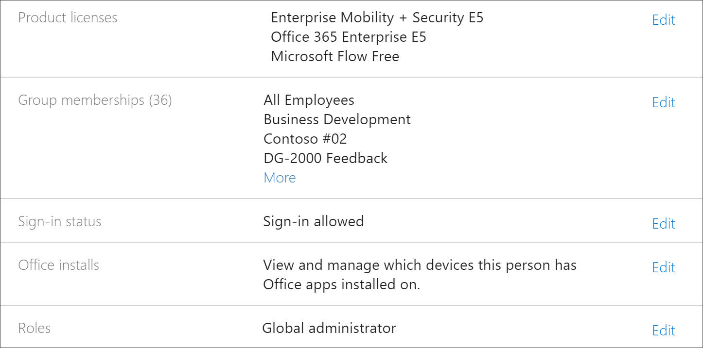
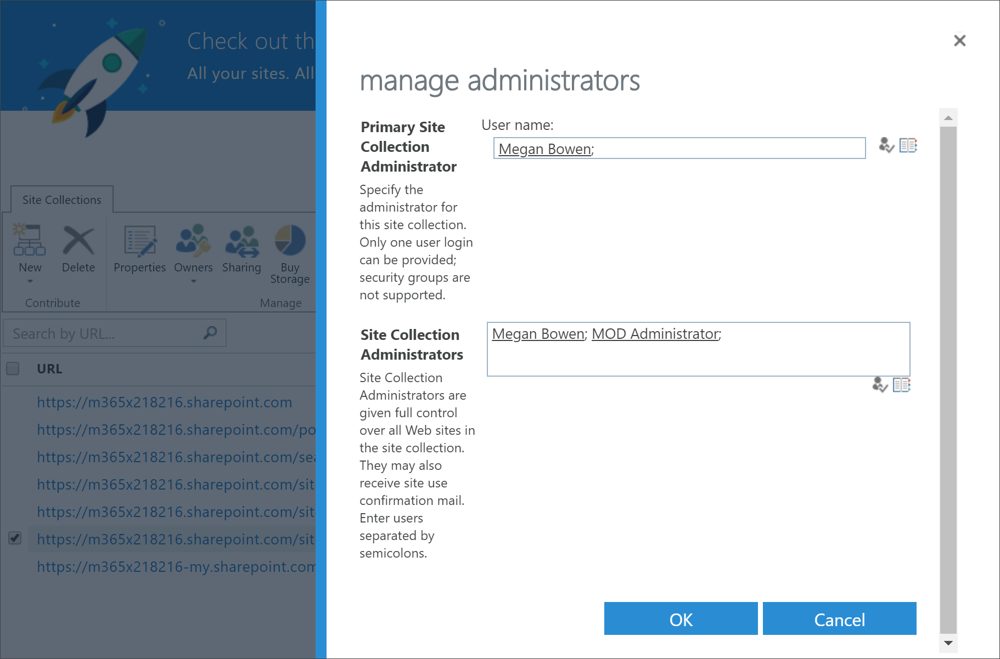
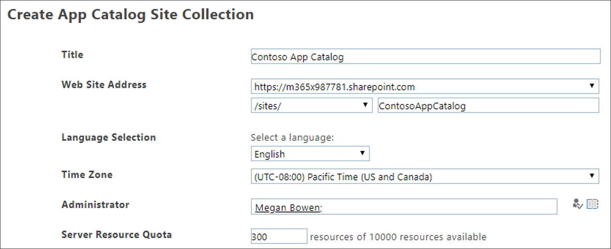

# カスタム学習のトラブルシューティング

Office 365 または SharePoint Online プロビジョニングサービスのカスタム学習で発生する可能性のある問題のトラブルシューティングのヒントを以下に示します。

## テナント管理者のアクセス許可があるかどうかを確認する方法

SharePoint Online プロビジョニングサービスにサインインし、カスタム学習を準備するには、テナント管理者のアクセス許可が必要です。 SharePoint Online プロビジョニングサービスでサインインに関する問題が発生している場合は、全体管理者の役割が割り当てられていることを確認してください。 カスタム学習ソリューションには、テナント管理者のアクセス許可が必要です。それ以外の場合は、Office 365 のグローバル管理者ロールと呼ばれます。 グローバル管理者の役割が割り当てられているかどうかを確認する方法は次のとおりです。

1.  Office.com にサインインします。
2.  [**管理**] をクリックします。
3.  [**ユーザー**] で、[**アクティブなユーザー** ] を選択します。
4.  自分の名前を検索する
5.  [検索結果] で自分の名前をクリックします。 役割の全体管理者が表示します。

### グローバル管理者の役割を持っていない場合
- 組織内のグローバル管理者を検索して、そのユーザーがサービスにサインインしたり、グローバル管理者の役割を割り当てたりするようにします。

## テナントのアプリカタログのトラブルシューティング
カスタム学習では、ターゲットテナントにアプリカタログをプロビジョニングする必要があります。 アプリカタログを作成するには、グローバル管理者のアクセス許可が必要です。 一般的なアプリカタログの問題のトラブルシューティング手順を以下に示します。

### テナントアプリカタログがあるかどうかを確認する方法 
手始めとして、全体管理者のアクセス許可があることを確認します。 前述のテナント管理者権限の手順を参照してください。

1. Office 365 で、[**管理者**] をクリックし、[展開] 矢印 > をクリックして、[すべて > の**管理センター** > **SharePoint****を表示**] をクリックします。
2. [**従来の管理者 SharePoint センター** > **アプリ** > の**アプリカタログ**] をクリックします。
3. [**アプリ**] の下に、[ **SharePoint 用アプリの配布**] というタイトルのタイルが表示します。 タイルが表示されている場合は、テナントのアプリカタログがあります。 下記の「サイトの詳細を**確認する方法**」セクションを参照してください。 タイルが表示されない場合は、テナントのテナントアプリカタログを作成する必要があります。 「 **How to create a Tenant App Catalog** 」セクションを参照してください。

### テナントアプリカタログのサイトコレクションの所有者であることを確認する方法 
Office 365 のカスタム学習をプロビジョニングするには、テナントのアプリカタログのサイトコレクションの所有者である必要があります。 所有者である場合は、determin 方法を参照してください。

1. Office 365 で、[**管理者**] をクリックし、[展開] 矢印 > をクリックして、[すべて > の**管理センター** > **SharePoint****を表示**] をクリックします。
2. [**従来の管理者 SharePoint センター**] をクリックし、**アプリカタログ**を選択します。
3. [**所有者**] を選択し、サイトコレクションの所有者であることを確認します。 これは次のようなものになります。
 

### テナントのアプリカタログを作成する方法 (存在しない場合) 
1. SharePoint Online 管理者アカウントを使用して、Office 365 にサインインします。
2. **[管理者]** をクリックします。
3. [**管理センター**] で、[ **SharePoint**] をクリックします。 
4. [**アプリ** > **アプリカタログ**] をクリックします。
5. [**新しいアプリカタログサイトを作成する**] をクリックし、[ **OK**] をクリックします。 
6.  アプリカタログの情報を入力します。 複数の管理者を含めることができます。 次に例を示します。  

7.  これで完了です。 完了しました。 ただし、カスタム学習のプロビジョニングに移行する前に、アプリカタログの作成が完了したことを確認するために、少なくとも30分待機する必要があります。 

> [!IMPORTANT]
> テナントのアプリカタログを作成した後、少なくとも30分待ってから、カスタム学習をプロビジョニングします。 これにより、アプリカタログのプロビジョニングプロセスが SharePoint 内で完了するようになります。 