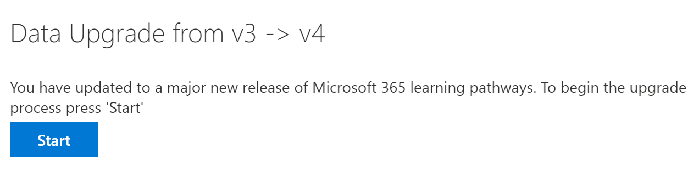

# 学習経路を更新する
既存のラーニング パスウェイ サイトがある場合は、多言語サポート用に更新できます。 多言語 4.0 バージョンへの学習パスを更新するには、Web パーツ パッケージ customlearning.sppkg を SharePoint テナント アプリ カタログにアップロードします。 学習経路を更新する場合:  

- 以前に作成されたカスタムプレイリストとアセットは維持されます
- コンテンツを非表示または表示する設定が維持される
- SharePoint テンプレートの学習経路は変更されません
- 学習経路サイト ページは翻訳されません。 この作業は手動で行う必要があります

## 多言語の学習経路の概要を読む
多言語サポートが学習経路でどのように機能するのかについては、「ラーニング パス多言語の [概要」をご覧ください](custom_overview.md)。 

## 更新の前提条件
学習経路を更新する前に、次の前提条件を満たしている必要があります。
- ラーニング パスを更新するユーザーは、テナント アプリ カタログのサイト コレクション所有者である必要があります。 ユーザープロビジョニング学習パスがアプリ カタログのサイト コレクション所有者ではない場合は、次の手順 [を実行](addappadmin.md) して続行します。 

## 言語設定の設定 
学習経路を更新する前に、サイトの言語設定を設定します。 ラーニング パス サイトの多言語サポートを有効にするには、[ページとニュースを複数の言語に翻訳するを有効にする] を **[オン**] に設定し、サイトでサポートする言語を追加できます。
1.  ラーニング パスサイトで、右 **から [設定** ] を選択し、[サイト情報] **を選択します**。
2.  サイト情報ウィンドウの下部で、[すべてのサイト設定を表示 **する] を選択します**。
3.  [サイト **の管理] で**、[言語の **設定] を選択します**。
4.  [ **複数の言語に翻訳する** ページとニュースを有効にする] で、トグル スイッチを設定します。 
- 複数のサイトの場合は、トグルを **[オン**] にスライドし、[言語の追加] セクションに進みます。 
- 英語専用サイトの場合は、トグルを Off にスライド **します**。

### 言語を追加する
学習経路は 9 つの言語をサポートします。必要な言語のみを追加する必要があります。 このドキュメントで使用されている例では、イタリア語が追加されます。 
- [**サイト言語の追加と** 削除] で、[言語の選択または入力] で言語名の入力を開始するか、ドロップダウンから言語を選択します。 この手順を繰り返して、複数の言語を追加できます。 このページに戻って、いつでもサイトの言語を追加または削除できます。
 
### 翻訳者の割り当て
学習経路の言語設定を定義する場合は、翻訳者を割り当てできます。 翻訳者には外国語プロファイルが設定されている必要があります。 外国語プロファイルの詳細については、「多言語コミュニケーション サイト、ページ、ニュースを作成する [」を参照してください](https://support.office.com/article/2bb7d610-5453-41c6-a0e8-6f40b3ed750c)。  
- サポートされている言語の場合は、[選択] **をクリックするか、翻訳者を入力** し、翻訳者を選択します。 

## ラーニング パス Web パーツ パッケージを更新する
この手順では、学習パス 4.0 Web パーツを SharePoint アプリ カタログにアップロードし、[ラーニング パス管理] ページに移動して更新プロセスを開始します。

### Web パーツ パッケージのアップロード
1.  [GitHub カスタム学習リポジトリに移動](https://github.com/pnp/custom-learning-office-365/tree/master/webpart)し **、customlearning.sppkg** を選択し、PC 上のローカル ドライブにダウンロードします。
2.  まだサインインしていない場合は、テナント管理者またはサイト コレクション管理者アカウントを使用して、テナントにサインインします。 
3.  [管理 **] [**  >  すべての SharePoint **の**  >  **その他の**  >  **機能を表示する] をクリックします**。 
4.  [アプリ **] で**、[開く] **をクリックします**。 
5.  [SharePoint **用**  >  **アプリ カタログ配布アプリ] をクリックします**。 
6.  [ファイル **のアップロード**  >  **] をクリックします**。 
7.  ダウンロードした **customlearning.sppkg** ファイルを選択し **、[OK** 展開] を  >  **クリックします**。 

### 更新プログラムを完了する
1.  [ラーニング パス] サイトで、[ホーム] メニューから [ラーニング **パスの管理** ] **を選択** します。 
2.  更新を求めるメッセージが表示されます。 

3.  **[開始]** をクリックします。 
4. 更新が完了したら、[閉じる] を **クリックします**。 

### 次の手順
- サイトと [Web パーツで提供](custom_exploresite.md) される既定のコンテンツを確認します。
- サイト ページの翻訳の詳細については、「サイト ページの翻訳 [」を参照してください](custom_translate_page_ml.md)。 

