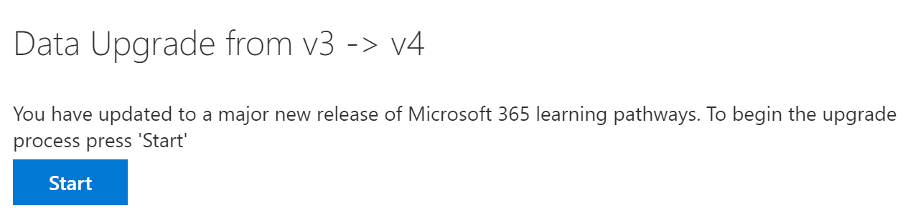

# 多言語サポートの学習経路を更新するUpdate learning pathways for multilingual support
既存のラーニング パスウェイ サイトがある場合は、多言語サポート用に更新できます。If you have an existing Learning Pathways site, you can update it for multilingual support. 多言語 4.0 バージョンへの学習パスを更新するには、Web パーツ パッケージ customlearning.sppkg を SharePoint テナント アプリ カタログにアップロードします。To update learning pathways to the multilingual 4.0 version, you upload the web part package, customlearning.sppkg, to the SharePoint tenant App Catalog. 学習経路を更新する場合:When you update learning pathways:  

- 以前に作成されたカスタムプレイリストとアセットは維持されますAny previously created custom playlists and assets are maintained
- コンテンツを非表示または表示する設定が維持されるSettings to hide or show content are maintained
- SharePoint テンプレートの学習経路は変更されませんThe learning pathways SharePoint template is left unchanged
- 学習経路サイト ページは翻訳されません。The learning pathways site pages aren't translated. この作業は手動で行う必要がありますThis work must be done manually

## 多言語の学習経路の概要を読むRead the learning pathways multilingual overview
多言語サポートが学習経路でどのように機能するのかについては、「ラーニング パス多言語の [概要」をご覧ください](custom_overview_ml.md)。To learn about how multilingual support works for learning pathways, read the [Learning pathways multilingual overview](custom_overview_ml.md)). 

## 更新の前提条件Prerequisites to update
学習経路を更新する前に、次の前提条件を満たしている必要があります。Before updating learning pathways, the following prerequisite must be met:
- ラーニング パスを更新するユーザーは、テナント アプリ カタログのサイト コレクション所有者である必要があります。The person updating learning pathways must be a site collection owner of the tenant App Catalog. ユーザープロビジョニング学習パスがアプリ カタログのサイト コレクション所有者ではない場合は、次の手順 [を実行](addappadmin.md) して続行します。If the person provisioning learning pathways isn't a site collection owner of the App Catalog, [complete these instructions](addappadmin.md) and continue. 

## 言語設定の設定Set language settings 
学習経路を更新する前に、サイトの言語設定を設定します。Before updating learning pathways, set the site language settings. ラーニング パス サイトの多言語サポートを有効にするには、[ページとニュースを複数の言語に翻訳するを有効にする] を **[オン**] に設定し、サイトでサポートする言語を追加できます。To enable multilingual support for the learning pathways site, you can set the **Enable pages and news to be translated into multiple languages** to **On**, and then add the languages you want to support for the site.
1.  ラーニング パスサイトで、右 **から [設定** ] を選択し、[サイト情報] **を選択します**。From the Learning Pathways site, select **Settings** from the top right, and then select **Site information**.
2.  サイト情報ウィンドウの下部で、[すべてのサイト設定を表示 **する] を選択します**。At the bottom of the site information pane, select **View all site settings**.
3.  [サイト **の管理] で**、[言語の **設定] を選択します**。Under **Site Administration**, select **Language settings**.
4.  [ **複数の言語に翻訳する** ページとニュースを有効にする] で、トグル スイッチを設定します。Under **Enable pages and news to be translated into multiple languages**, set the toggle switch. 
- 複数のサイトの場合は、トグルを **[オン**] にスライドし、[言語の追加] セクションに進みます。For a multiligual site, slide the toggle to **On**, and then proceed to the Add Languages section. 
- 英語専用サイトの場合は、トグルを Off にスライド **します**。For an English-only site, slide the toggle to **Off**.

### 言語を追加するAdd languages
学習経路は 9 つの言語をサポートします。必要な言語のみを追加する必要があります。Learning pathways supports nine languages, you should add only the languages you need. このドキュメントで使用されている例では、イタリア語が追加されます。In the examples used in this documentation, Italian will be added. 
- [**サイト言語の追加と** 削除] で、[言語の選択または入力] で言語名の入力を開始するか、ドロップダウンから言語を選択します。Under **Add or remove site languages**, start typing a language name in **Select or type a language**, or choose a language from the dropdown. この手順を繰り返して、複数の言語を追加できます。You can repeat this step to add multiple languages. このページに戻って、いつでもサイトの言語を追加または削除できます。You can add or remove languages from your site at any time by going back to this page.
 
### 翻訳者の割り当てAssign translators
学習経路の言語設定を定義する場合は、翻訳者を割り当てできます。When defining Language settings for learning pathways, you can assign translators. 翻訳者には外国語プロファイルが設定されている必要があります。Translators should have a foreign language profile set up. 外国語プロファイルの詳細については、「多言語コミュニケーション サイト、ページ、ニュースを作成する [」を参照してください](https://support.office.com/article/2bb7d610-5453-41c6-a0e8-6f40b3ed750c)。For more information about foreign language profiles, see [Create multilingual communication sites, pages, and news](https://support.office.com/article/2bb7d610-5453-41c6-a0e8-6f40b3ed750c).  
- サポートされている言語の場合は、[選択] **をクリックするか、翻訳者を入力** し、翻訳者を選択します。For a supported language, click **Select or type a translator** and then select a translator. 

## ラーニング パス Web パーツ パッケージを更新するUpdate the learning pathways web part package
この手順では、学習パス 4.0 Web パーツを SharePoint アプリ カタログにアップロードし、[ラーニング パス管理] ページに移動して更新プロセスを開始します。In this step, you upload the learning pathways 4.0 web part to the SharePoint App Catalog, and then navigate to the learning pathways Administration page to start the update process.

### Web パーツ パッケージのアップロードUpload the web part package
1.  [GitHub カスタム学習リポジトリに移動](https://github.com/pnp/custom-learning-office-365/tree/master/webpart)し **、customlearning.sppkg** を選択し、PC 上のローカル ドライブにダウンロードします。Go to the [GitHub custom learning repository](https://github.com/pnp/custom-learning-office-365/tree/master/webpart), select **customlearning.sppkg** and then download it to a local drive on your PC. 
2.  まだサインインしていない場合は、テナント管理者またはサイト コレクション管理者アカウントを使用して、テナントにサインインします。If you’re not already signed in, sign into your tenant with a Tenant Admin or Site Collection Admin account. 
3.  [管理 **] [**  >  すべての SharePoint **の**  >  **その他の**  >  **機能を表示する] をクリックします**。Click **Admin** > **Show All** > **SharePoint** > **More Features**. 
4.  [アプリ **] で**、[開く] **をクリックします**。Under **Apps**, click **Open**. 
5.  [SharePoint **用**  >  **アプリ カタログ配布アプリ] をクリックします**。Click **App Catalog** > **Distribute Apps for SharePoint**. 
6.  [ファイル **のアップロード**  >  **] をクリックします**。Click **Upload** > **Choose Files**. 
7.  ダウンロードした **customlearning.sppkg** ファイルを選択し **、[OK** 展開] を  >  **クリックします**。Select the **customlearning.sppkg** file you downloaded, click **OK** > **Deploy**. 

### 更新プログラムを完了するComplete the update
1.  [ラーニング パス] サイトで、[ホーム] メニューから [ラーニング **パスの管理** ] **を選択** します。From the Learning Pathways site, select **Learning pathways administration** from the **Home** menu. 
2.  更新を求めるメッセージが表示されます。You’ll see a prompt asking if you want to update. 

3.  **[開始]** をクリックします。Click **Start**. 
4. 更新が完了したら、[閉じる] を **クリックします**。When the update is complete, click **Close**. 

### 次の手順Next Steps
- サイトと [Web パーツで提供](custom_exploresite.md) される既定のコンテンツを確認します。Explore the [default content](custom_exploresite.md) provided in the site and web part.
- サイト ページの翻訳の詳細については、「サイト ページの翻訳 [」を参照してください](custom_translate_page_ml.md)。For more information about translating site pages, see [Translate site pages](custom_translate_page_ml.md). 

