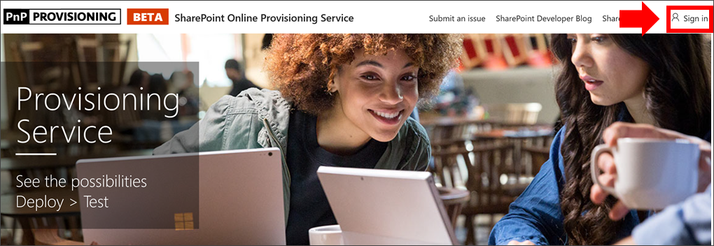
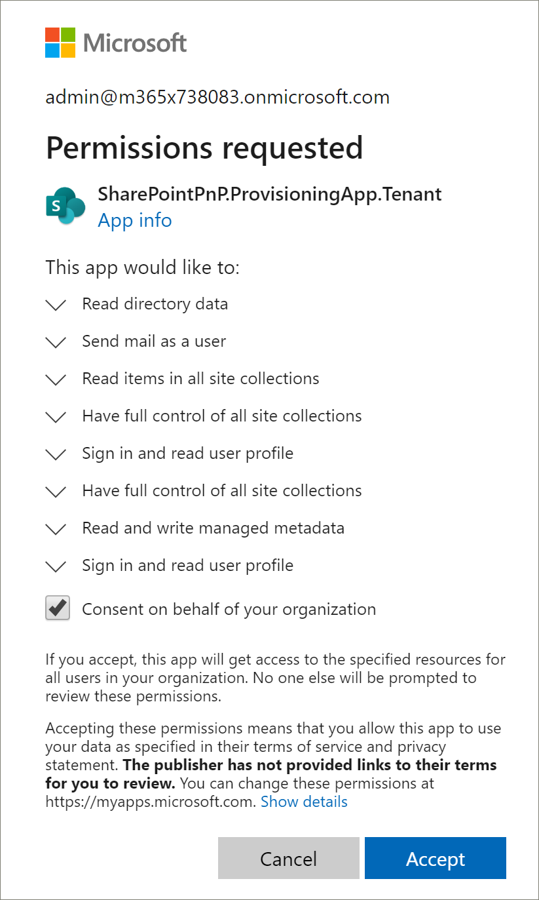

# カスタム 学習の準備

SharePoint Online Provisioning Service を使用すると、Office 365 テナント管理者は、数回クリックしてプロビジョニング プロセスを開始できます。 プロビジョニング サービスは、カスタム 学習をプロビジョニングするための推奨される方法です。 高速で簡単で、プロセスを開始するのに数分しかかからなくなっています。 ただし、プロビジョニング サービスの使用を開始する前に、プロビジョニングの前提条件を満たしていることを確認してください。

## 前提条件
 
プロビジョニング サービス [SharePoint Online](https://provisioning.sharepointpnp.com)プロビジョニング サービスを使用してカスタム 学習を正常にセットアップするには、プロビジョニングを行うユーザーが次の前提条件を満たす必要があります。 
 
- カスタム 学習をプロビジョニングするユーザーは、カスタム学習が準備されるテナントのテナント管理者である必要があります。  
- テナント アプリ カタログは、SharePoint 管理センターの [アプリ] オプション内で使用できる必要があります。 組織に SharePoint テナント アプリ カタログが存在しない場合は [、SharePoint Online](/sharepoint/use-app-catalog) のドキュメントを参照して作成します。  
- カスタム 学習をプロビジョニングするユーザーは、テナント アプリ カタログのサイト コレクション所有者である必要があります。 カスタム 学習をプロビジョニングするユーザーがアプリ カタログのサイト コレクション所有者ではない場合は、次の [手順を実行](addappadmin.md) して続行します。 

### カスタム 学習を準備するには

1. ホーム ページ http://provisioning.sharepointpnp.com の **右上隅** から移動してサインインします。  サイト テンプレートのインストールを計画している対象テナントの資格情報を使用してサインインします。

2. 組織の代理 **として [同意] をオフにし、[** 同意する] を **選択します**。

3. ソリューション **ギャラリーから [カスタム Office 365]** を選択します。
![[365] の [カスタム学習] をOfficeします。](media/inst_select.png)

4. ソリューションのホーム ページで、[**テナント画面に追加] を選択** 
 ![ し、[テナントに追加] を選択します。](media/inst_add.png)

5. インストールに応じて、プロビジョニング情報ページのフィールドに入力します。 少なくとも、プロビジョニング プロセスに関する通知を受け取る電子メール アドレスと、プロビジョニング先サイトの宛先 URL を入力します。  
   > [!NOTE]
   > "/sites/MyTraining" や "/teams/LearnOffice365" など、サイトのリンク先 URL を従業員に優しくします。

   

6. テナント環境 **にカスタム** 学習をインストールする準備ができたら、[プロビジョニング] を選択します。  プロビジョニングプロセスには最大15分かかります。 サイトにアクセスできるようになると、（プロビジョニングページで入力した通知メールアドレスに）メールで通知されます。

> [!IMPORTANT]
> カスタム 学習サイトをプロビジョニングするテナント管理者は、サイトに移動し、CustomLearningAdmin.aspx を開いてカスタム学習管理者プロパティを初期化する必要があります。 この時点で、テナント管理者はサイトに所有者も割り当てる必要があります。 

## プロビジョニングの成功を検証する

プロビジョニングが完了すると、テナント管理者は PnP プロビジョニング サービスから電子メールを受信します。 管理者は、電子メールで提供されているサイトへのリンクをコピーし、指示に従ってサイトに移動できます。 または、テナント管理者は、/SitePages/CustomLearningAdmin.aspx <YOUR-SITE-COLLECTION-URL>に移動できます。 これにより、初めて使用するカスタム学習を設定する CustomConfig リスト アイテムが初期化されます。 このページを最初に開くユーザーは、テナント管理者、サイト コレクション管理者、またはサイトの所有者である必要があります。 次のようなページが表示されます。 

## サイトに所有者を追加する
テナント管理者として、サイトをカスタマイズするユーザーになる可能性は低いので、所有者をサイトに割り当てる必要があります。 所有者はサイトに対する管理者権限を持ち、サイト ページを変更したり、サイトのブランドを変更したりすることができます。 また、カスタム学習 Web パーツを通じて配信されたコンテンツを非表示にし、表示する機能も備っています。 また、カスタム プレイリストを作成し、カスタム サブカテゴリに割り当てる機能も備えます。  

1. [SharePoint の設定] **メニューの** [サイトのアクセス許可 **] をクリックします**。
2. [アクセス **許可の詳細設定] をクリックします**。
3. **[365 所有者のカスタムOffice] をクリックします**。
4. [**新しい**  >  **ユーザーをこのグループに追加** する] をクリックし、所有者になるユーザーを追加し、[共有] を **クリックします**。

8. ページの **右上隅にある** [次へ] オプションをクリックして、サイトをフォローします。  
