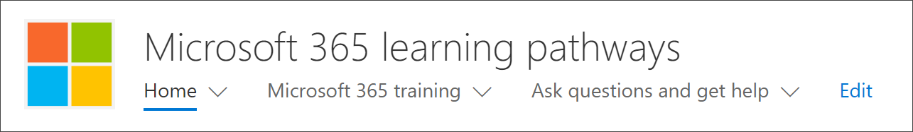
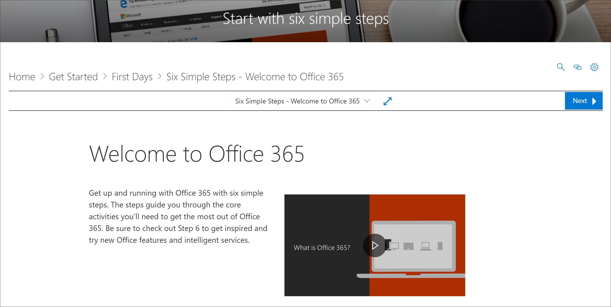
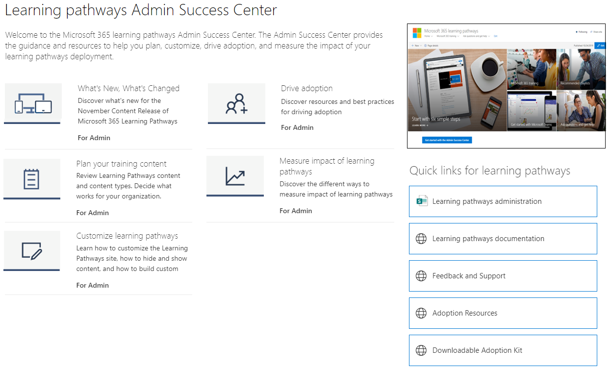

# Microsoft 365 学習経路の Web パートはどこにありますか? 

組織でラーニング パスを準備すると、ラーニング パス サイトと Web パーツが組織のテナントSharePointされます。 プロビジョニングの一環として、Microsoft 365学習 Web パーツは、次の学習経路サイトのMicrosoft 365追加されます。

- Start-with-Six-Simple-Steps.aspx 
- Recommended-Playlists.aspx
- Get-started with-Office 365.aspx
- Get-started-with-Microsoft-Teams.aspx
- Get-started-with-OneDrive.aspx
- Get-started-with-SharePoint.aspx
- ラーニングパス管理サクセス センター.aspx

ページごとに、Web パーツは、ページの意図をサポートするように設計されたカテゴリ、サブカテゴリ、プレイリスト、またはアセットを表示するように構成されています。 後のセクションで説明する学習経路 Web パーツは、SharePoint ページに追加して、特定のカテゴリ、サブカテゴリ、プレイリスト、またはアセットを表示するためにフィルター処理できます。 それでは、見てみよ。 

## 再生リストMicrosoft Teams表示する

Web パーツがフィルター処理されたはじめにページMicrosoft Teamsを使用して、ユーザーの学習プレイリストを表示する例をTeams。 

- [学習経路] ホーム ページで、[開始する]**を選択** Microsoft Teams。

- [学習 **経路] サイト** メニューの [ホーム] メニューをクリックして、サイトのホーム ページに戻ります。

## 6 つの簡単な手順のプレイリストを表示する

**[Start-with-Six-Simple-Steps.aspx]** ページの Web パーツは、[6 つの簡単な手順] プレイリストに最初のアセットを表示するように構成されています。 

- [学習経路] ホーム ページで、[6 つの **簡単な手順で開始] をクリックします**。 

## すべてのトレーニングをMicrosoft 365する

[トレーニング] ページMicrosoft 365 **Web** パーツは、学習経路カタログから利用可能なすべてのカテゴリとサブカテゴリを表示するように構成されています。 これには、Microsoft のサブカテゴリと、組織用に作成するサブカテゴリが含まれます。

- [学習経路] ホーム ページで、[トレーニング] **Microsoft 365クリックします**。 ページが表示され、Web パーツが構成され、カスタム カタログから使用できるすべてのカテゴリとサブカテゴリラーニングされます。

- [学習 **経路] サイト** メニューの [ホーム] メニューをクリックして、サイトのホーム ページに戻ります。

## [管理サクセス センター] ページで Web パーツを表示する

管理サクセス センター ページ **の Web パーツ** は、管理サクセス センターで使用可能なすべてのプレイリストをフィルター処理するように構成されています。 次の例に示すように、Web パーツは管理リソースへのクイック リンクも含むページに追加されます。 

- [ラーニング パス] ホーム ページで、[管理サクセス センター **の使用を開始する] をクリックします**。 ボタンをクリックします。 

- [学習 **経路] サイト** メニューの [ホーム] メニューをクリックして、サイトのホーム ページに戻ります。

