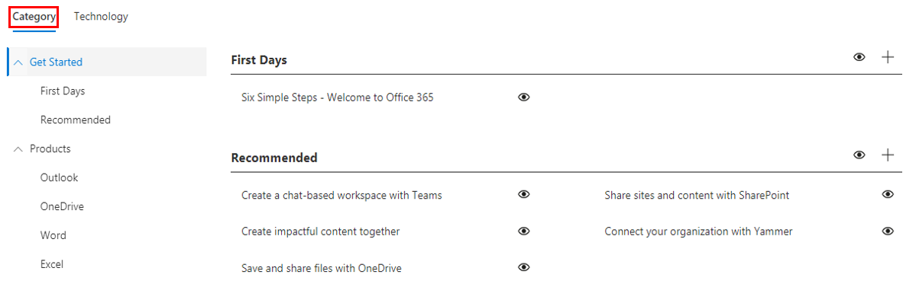

# トレーニングの手順をカスタマイズするCustomize the Training Experience

これはテスト3です。既定では、サイトの動作と webpart の両方に、すべての Office 365 サービスと Windows 10 サービスのコンテンツが含まれています。 これらのサービスの全部または一部のみを会社で利用できる場合は、ユーザーが使用できるコンテンツを調整できます。This is a test three. By default both the site experience and the webpart include content for all Office 365 and Windows 10 services.  If only all or some of these services are available in your company you can adjust what content is available to your users.  

このサイトの所有者が使用できるカスタマイズには、いくつかの種類があります。There are several kinds of customizations that are available to the owners of this site. 

- [web ページをカスタマイズするCustomize web pages](#customizing-web-pages)
- [利用可能なサービスをカスタマイズするCustomize available services](#customize-available-services)
- [プレイリストをカスタマイズして共有するCustomize and share playlists](customplaylist.md)

ユーザーコミュニティにサイトを起動する前に、これらのカスタマイズの一部またはすべてを完了することができます。Some or all of these customizations can be completed before you launch the site to your user community.  

> [!TIP]
> 従業員からのフィードバックを収集し、定期的に追加のカスタマイズを完了します。 新しいサービスを開始するときに、再生リストを追加したり、特定の役割に web ページを移動したり、新しいトレーニングコンテンツを有効にしたりします。Gather feedback from your employees and periodically complete additional customizations.  Add playlists, target webpages to specific roles or turn on new training content when launching new services. 

## web ページのカスタマイズCustomizing web pages

カスタム学習 web サイトは完全にカスタマイズできます。モダン sharepoint Online サイト内でページを作成することに慣れていない場合は、「 [sharepoint サイト](https://support.office.com/en-us/article/customize-your-sharepoint-site-320b43e5-b047-4fda-8381-f61e8ac7f59b)記事を support.office.com でカスタマイズする」を参照してください。You can fully customize the Custom Learning web site. If you are not familiar with creating pages within modern SharePoint Online sites we suggest you review [Customize your SharePoint site](https://support.office.com/en-us/article/customize-your-sharepoint-site-320b43e5-b047-4fda-8381-f61e8ac7f59b) article on support.office.com. 

### **質問をカスタマイズしてヘルプページを表示**するCustomize the **Ask Questions and Get Help** page

サイトをカスタマイズするための開始点として、[質問を入力して、メニューバーからヘルプを取得する] を選択し、[SharePoint Edit] ボタンをクリックして、画像とリンクを変更します。As a starting point for customizing the site, select Ask questions and get help from the menu bar, then click the SharePoint Edit button and change the images and the links. 

## 利用可能なサービスをカスタマイズするCustomize available services

1.  web サイト![custom_admin でカスタムの [ラーニング管理] ページに移動します。](media/custom_admin.png)Navigate to the Custom Learning Administration page within the website 
1. ソリューションに含まれるサービスの完全な一覧を表示するには、[**テクノロジ**] を選択します。Select **Technology** to see the full list of services that are included in the solution
1. テクノロジを選択し、**目のアイコンをクリック**してこのコンテンツを非表示にします。 もう一度目のアイコンをクリックして、コンテンツを表示します。Select a technology and **click the eye symbol** to hide this content.  Click the eye symbol again to show the content within the experience. 

この操作では、同じプロセスを繰り返し再生リストのカテゴリに対して繰り返すことができます。 [カテゴリ] オプションを選択するだけで、プレイリストの表示/非表示を切り替えることができます。The same process can be repeated for categories of playlists within the experience.  Simply select the Category option to show/hide playlists. 

### 次のステップNext Steps

- [プレイリストをカスタマイズして共有するCustomize and Share Playlists](customplaylist.md)
- [ドライブ導入Drive Adoption](driveadoption.md) 