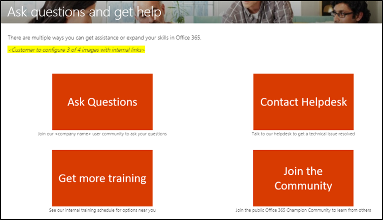
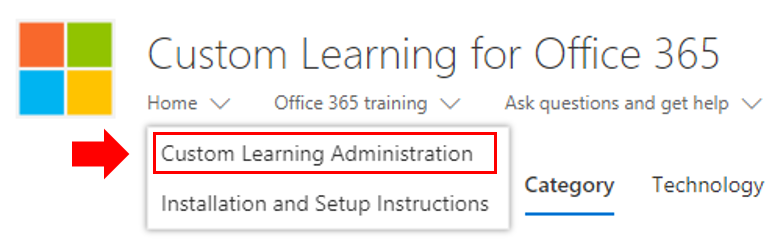

# トレーニング エクスペリエンスのカスタマイズCustomize the training experience

これはテスト 4 です。This is a test four. 既定では、サイト エクスペリエンスと Web パーツの両方に、365 サービスと Windows 10 サービスOfficeコンテンツが含まれます。By default both the site experience and the webpart include content for all Office 365 and Windows 10 services.  これらのサービスのすべてまたは一部のみを会社で利用できる場合は、ユーザーが利用できるコンテンツを調整できます。If only all or some of these services are available in your company you can adjust what content is available to your users.  

このサイトの所有者が使用できるカスタマイズには、いくつかの種類があります。There are several kinds of customizations that are available to the owners of this site. 

- [Web ページのカスタマイズCustomize web pages](#customizing-web-pages)
- [利用可能なサービスをカスタマイズするCustomize available services](#customize-available-services)
- [プレイリストのカスタマイズと共有Customize and share playlists](customplaylist.md)

これらのカスタマイズの一部またはすべては、ユーザー コミュニティにサイトを起動する前に完了できます。Some or all of these customizations can be completed before you launch the site to your user community.  

> [!TIP]
> 従業員からのフィードバックを収集し、定期的に追加のカスタマイズを完了します。Gather feedback from your employees and periodically complete additional customizations.  プレイリストの追加、特定の役割への Web ページのターゲット設定、または新しいサービスの起動時に新しいトレーニング コンテンツを有効にする。Add playlists, target webpages to specific roles or turn on new training content when launching new services. 

## Web ページのカスタマイズCustomizing web pages

カスタム学習 Web サイトを完全にカスタマイズできます。You can fully customize the Custom Learning web site. 最新の SharePoint Online サイト内でページを作成する方法について理解していない場合は [、「SharePoint](https://support.office.com/article/customize-your-sharepoint-site-320b43e5-b047-4fda-8381-f61e8ac7f59b) サイトのカスタマイズ」の記事を参照 support.office.com。If you are not familiar with creating pages within modern SharePoint Online sites we suggest you review [Customize your SharePoint site](https://support.office.com/article/customize-your-sharepoint-site-320b43e5-b047-4fda-8381-f61e8ac7f59b) article on support.office.com. 

### [質問を **する] ページと [ヘルプの取得] ページをカスタマイズ** するCustomize the **Ask Questions and Get Help** page

サイトをカスタマイズするための開始点として、[質問をする] を選択し、メニュー バーからヘルプを取得し、[SharePoint 編集] ボタンをクリックして、画像とリンクを変更します。As a starting point for customizing the site, select Ask questions and get help from the menu bar, then click the SharePoint Edit button and change the images and the links. 

## 利用可能なサービスをカスタマイズするCustomize available services

1.  Web サイト内の [カスタム学習管理] ページに移動 Navigate to the Custom Learning Administration page within the website 
1. ソリューション **に含** まれるサービスの完全な一覧を表示するには、[テクノロジ] を選択します。Select **Technology** to see the full list of services that are included in the solution
1. テクノロジを選択し、 **目の記号をクリックして** 、このコンテンツを非表示にしてください。Select a technology and **click the eye symbol** to hide this content.  目の記号を再度クリックして、エクスペリエンス内のコンテンツを表示します。Click the eye symbol again to show the content within the experience. 

同じプロセスを、エクスペリエンス内のプレイリストのカテゴリに対して繰り返し実行できます。The same process can be repeated for categories of playlists within the experience.  [カテゴリ] オプションを選択するだけで、プレイリストを表示/非表示にできます。Simply select the Category option to show/hide playlists. 

![[カテゴリの選択]](media/custom_cat.png)

### 次のステップNext steps

- [プレイリストのカスタマイズと共有Customize and Share Playlists](customplaylist.md)
- [導入を促進するDrive Adoption](driveadoption.md) 
