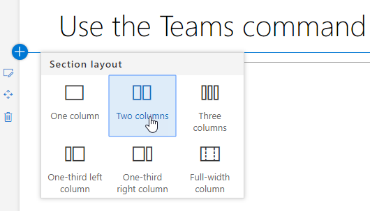
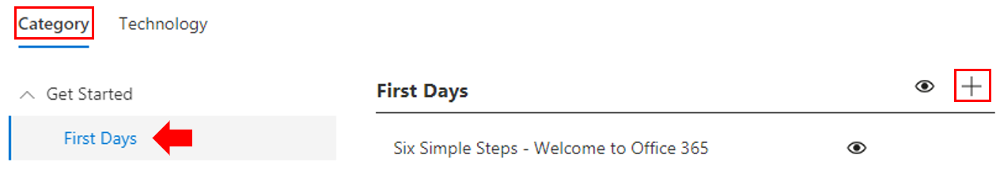
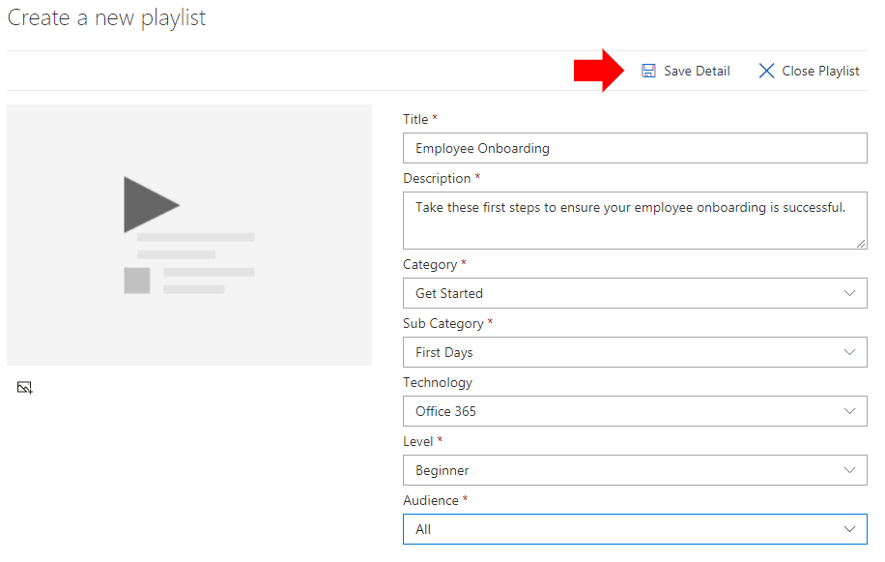
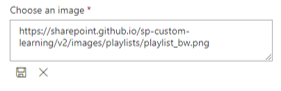
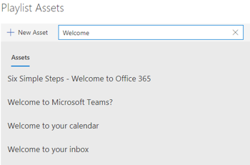
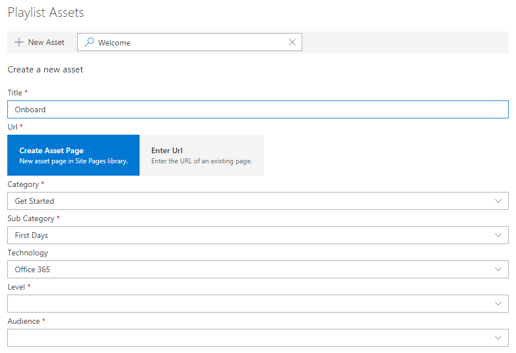

# プレイリストのカスタマイズと共有

## プレイリストの作成

プレイリストは"アセット" の賛辞です。 "アセット" は、SharePoint ページまたは Microsoft トレーニング コンテンツの既存のアイテムです。 プレイリストを作成するときに、一緒に移動するアセットを選択して、ユーザーの学習パスを作成します。  

SharePoint ページを追加する利点は、組織内でホストされている YouTube ビデオまたはビデオを使用して SharePoint ページを作成できる点です。 Forms または他の 365 コンテンツを使用してOffice作成することもできます。  

#### 手順 1: プレイリストの SharePoint ページを作成する
この例では、まずプレイリストに追加する SharePoint ページを作成します。 YouTube ビデオ Web パーツとテキスト Web パーツを含むページを作成します。  これらの手順では、SharePoint Online サービスを使用している必要があります。 

#### 新しいページを作成する
1.  [サイト ページ] の [>] >[サイト ページ>] >を選択します。
2.  タイトル領域で、「Teams コマンド ボックスを使用する」と入力します。
3.  [新しい追加] セクションを選択し、[2 つの列] を選択します。

4.  左側のボックスで、[新しい Web パーツの追加] を選択し、[埋め込み] を選択します。 
5.  Web ブラウザーで、この URL に移動 https://youtu.be/wYrRCRphrp0 し、ビデオの埋め込みコードを取得します。 
6.  SharePoint Web パーツで、[埋め込みコードの追加] を選択し、[埋め込み] ボックスに貼り付けます。 
7.  右側のボックスで、[新しい Web パーツの追加] を選択し、[テキスト] を選択します。 
8.  Web ブラウザーで、次の URL に移動し https://support.office.com/article/13c4e429-7324-4886-b377-5dbed539193b 、[試す] をコピーします。 ページの手順とテキスト Web パーツに貼り付けます。 ページは次のようになります。 
![[埋め込み] ページ](media/clo365teamscommandbox.png)
9.  [ **発行]** をクリックし、ページの URL をコピーしてメモ帳に貼り付けます。

#### 手順 2: プレイリストを作成する

1. サイト エクスペリエンスの **[カスタム学習管理** ] ページに移動します。
![[カスタム学習管理] を選択する画面。](media/custom_admin.png)
1. [カテゴリ **] が選択** されているのを確認する 
1. 新しいプレイリストを表示するカテゴリをクリックします
1. カテゴリ名の横にあるプラス記号ウィンドウをクリックし、[カテゴリ] オプションを選択し、 

1. 下の例に示すように値を入力し、[作成] を **選択します**。 

- **タイトル** - プレイリストの表示名
- **説明** - 学習内容に関する情報
- **カテゴリ** - 最初の選択に基づいて事前に選択されます
- **Sub Category** - intial 選択範囲に基づいて事前に選択されている
- **テクノロジ** - 該当する場合に選択する
- **レベル** - ビギナー、インターミダテ、または Advanced
- **対象** ユーザー - Microsoft が提供する定義済みの役割の一覧に基づいてコンテンツをターゲットに設定できます。

6. [詳細 **の保存] をクリックします。**

> [!TIP]
> プレイリストのアイコンイメージをカスタマイズできます。  画像アイコンをクリックし、以前にアップロードした画像の URL を挿入します。  イメージがカスタム ラーニング サイト コレクション内にあるか、すべてのユーザーがファイルにアクセスできる別の場所に保存されている必要があります。  

#### 手順 3: プレイリストにアセットを追加する
この手順では、Microsoft の既存のアセットと、作成した SharePoint ページをプレイリストに追加します。 

1. プレイリストの詳細を保存したら、既存のアセットの検索を使用できます。
1. **任意の検索用語を入力** して、他のプレイリストから使用できる定義済みのアセットの一覧を表示します。 **アセットの名前をクリック** して、新しいプレイリストに含める。 

以前に作成した SharePoint ページを追加したり、エクスペリエンスで最初から作成することもできます。

1. [プレイリストアセット] **ダイアログの** [新しいアセット] オプションをクリックします。
1. アセットに Title を **指定します**。 入力すると、追加のオプションが表示されます。

1. SharePoint Online で新しいアセット ページを作成するか、既存のページの URL を入力してカスタム プレイリストに追加できます。 
1. **[カテゴリ****] 、[サブ カテゴリ****]** フィールド、および [テクノロジ] フィールドは、このプレイリストの以前の選択内容に基づいて事前に入力されます。
1. この個々のアセットのレベルと対象ユーザーに対して適切な選択を行います。  
1. [ **アセットの保存]** をクリックしてカスタム プレイリストに追加する
1. プレイリストが完了するまで、個々のページを検索または追加する手順を繰り返します。 
1. [プレイリスト **を閉じる] を** クリックして保存する

このコンテンツを含むプレイリストは、Custom Learning webpart をインストール/埋め込み済みの場所で利用できます。 

> [!NOTE]
> プレイリストを閉じた後に間違いを犯した場合は、プレイリスト名の横にある [X] をクリックして、カテゴリから削除できます。  

#### 考え方

カスタムプレイリストは、さまざまなタスクでエンド ユーザーを支援するために使用できます。  時間外の要求フォームはありますか?  ハードウェア機器を要求するフォーム  既存のトレーニングアセットは、エクスペリエンスにプログラムできます。  

## プレイリストを共有する

1. Web パーツまたはサイト エクスペリエンス内の任意のプレイリストに移動する
1. 左上隅に 3 つのアイコンが表示されます
1. リンクを表すアイコンをクリックする
1. URL をプレイリストにコピー ![ する 画面 URL の横にある [コピー] をクリックします。](media/share.png)
この URL は、サイト ナビゲーションに挿入したり、他のコミュニケーションで利用したりして、従業員をそのプレイリストに直接移動できます。 

### 次の手順 - [導入の促進](driveadoption.md)
