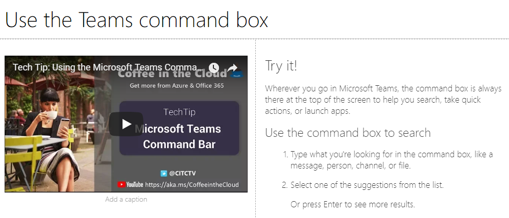

# プレイリストをカスタマイズして共有するCustomize and Share Playlists

## 再生リストを作成するCreate a Playlist

再生リストは、"assets" の compliation です。A playlist is a compliation of "assets". "アセット" は、SharePoint ページまたは Microsoft トレーニングコンテンツの既存のアイテムです。An "asset" is a SharePoint page or existing item of Microsoft training content. 再生リストを作成するときに、ユーザーに対して学習パスを作成するために一緒に使用するアセットを選択します。When you create a playlist you select assets that go together to create a learning path for your user.  

sharepoint ページを追加する利点は、自分の組織でホストされている YouTube ビデオまたはビデオを使用して sharepoint ページを作成できることです。The benefit of adding SharePoint pages is that you can create SharePoint pages with a YouTube videos or videos hosted in your organization. フォームまたはその他の Office 365 コンテンツを含むページを作成することもできます。You can also create pages with Forms or other Office 365 content.  

#### 手順 1: プレイリストの SharePoint ページを作成するStep 1: Create a SharePoint page for your playlist
この例では、まず、プレイリストに追加する SharePoint ページを作成します。In this example, we’ll first create a SharePoint page to add to the playlist. YouTube のビデオ web パーツとテキスト web パーツを使用してページを作成します。We’ll create a page with a YouTube video web part and Text web part.  これらの手順では、SharePoint Online サービスを使用していることを前提としています。These instructions assume you are using the SharePoint Online service. 

#### 新しいページを作成するCreate a new page
1.  [設定] メニューの [> site Contents > site Pages > New > site page] を選択します。Select the Settings menu > Site Contents > Site Pages > New > Site Page.
2.  タイトル領域で、「Teams コマンドボックスを使用する」と入力します。In the title area, type Use the Teams command box
3.  [新しい項目の追加] を選択し、[2 列] を選択します。Select the Add a new section, and then select Two Columns.

4.  左側のボックスで、[新しい web パーツの追加] を選択し、[埋め込み] を選択します。In the left-hand box, select Add a new web part, and then select Embed. 
5.  Web ブラウザーでこの URL https://youtu.be/wYrRCRphrp0に移動し、ビデオの埋め込みコードを取得します。In a Web browser, go to this URL https://youtu.be/wYrRCRphrp0 and get the embed code for the video. 
6.  SharePoint Web パーツで、[埋め込みコードの追加] を選択し、[埋め込み] ボックスに貼り付けます。In the SharePoint Web part, select Add Embed code and then paste it into the Embed box. 
7.  右側のボックスで、[新しい web パーツの追加] を選択し、[テキスト] を選択します。In the right-hand box, select Add a new web part, and then select Text. 
8.  Web ブラウザーで、次の URL に移動しhttps://support.office.com/en-us/article/13c4e429-7324-4886-b377-5dbed539193bて、Try! をコピーします。In a Web browser, go to this URL: https://support.office.com/en-us/article/13c4e429-7324-4886-b377-5dbed539193b and copy the Try it! ページの指示に従って、テキスト Web パーツに貼り付けます。Instructions from the page and paste them into the Text Web part. ページは次のようになります。Your page should look like the following. 

9.  [**発行**] をクリックし、ページの URL をコピーしてメモ帳に貼り付けます。Click **Publish**, and then copy the URL of the page and paste it in Notepad

#### 手順 2: 再生リストを作成するStep 2: Create the Playlist

1. サイトの操作でカスタムの [**ラーニング管理**] ページに移動します。Navigate to the **Custom Learning Administration** page in your site experience.

1. **カテゴリ**が選択されていることを確認するMake sure **Category** is selected 
1. 新しいプレイリストが表示されるようにするカテゴリをクリックします。Click on the category where you'd like your new playlist to appear
1. カテゴリ名の横にあるプラス記号Next to the category name, click on the plus symbol 

1. 次の例のように値を入力し、[**作成**] を選択します。Fill in the values as shown in the example below and select **Create**. 

- **タイトル**-再生リストの名前を表示します。**Title** - Display name of the playlist
- **説明**-学習される内容に関する情報**Description** - Information about what will be learned
- **カテゴリ**-最初の選択範囲に基づいて事前設定**Category** - Preselected based on your initial selection
- **サブカテゴリ**-初期の選択に基づいて事前設定**Sub Category** - Preselected based on your intial selection
- **テクノロジ**-該当する場合に選択します。**Technology** - Select as applicable
- **レベル**-初級、intermidate または Advanced**Level** - Beginner, Intermidate or Advanced
- **対象ユーザー** -これにより、Microsoft によって提供される定義済みのロールのリストに基づいてコンテンツを対象とすることができます。**Audience** - This allows you to target content based on a pre-defined list of roles provided by Microsoft.

6. [**詳細の保存**] をクリックします。Click **Save Detail**

> [!TIP]
> 再生リストのアイコンイメージをカスタマイズできます。You can customize the icon image for your playlist.  イメージアイコンをクリックして、以前にアップロードしたイメージの URL を挿入します。Click the image icon and insert an URL of a previously uploaded image.  画像が、カスタム学習サイトコレクション内にあるか、またはすべてのユーザーがファイルにアクセスできる別の場所に配置されているかを確認します。Make sure the image is located within the Custom Learning site collection or in another location that all users will have access to the file.  

#### 手順 3: 再生リストにアセットを追加するStep 3: Add assets to the playlist
この手順では、Microsoft の既存のアセットと、プレイリストに作成した SharePoint ページを追加します。In this step, you’ll add existing assets from Microsoft and the SharePoint page you created to the playlist. 

1. 再生リストの詳細を保存すると、既存のアセットの検索を使用できるようになります。Once you have saved the details for your Playlist you can use the Search for Existing Assets.
1. **任意の検索用語を入力**して、他の再生リストから利用できる定義済みのアセットの一覧を表示します。**Enter in any search term** to see a list of predefined assets that are available from other playlists. アセットの**名前をクリックし**て、新しい再生リストに追加します。**Click on the name** of an asset to include it in your new playlist.

また、前の手順で作成した SharePoint ページを追加したり、表示で最初から作成したりすることもできます。You can also add the SharePoint page you created earlier or create one from scratch in the experience.

1. [再生リストアセット] ダイアログボックスの [**新しいアセット**] オプションをクリックします。Click on the **New Asset** option in the Playlist Assets dialog
1. アセットに**タイトル**を付けます。Give your asset a **Title**. 入力すると、追加のオプションOnce entered, additional options will display 
1. これで、SharePoint Online に新しいアセットページを作成したり、既存のページの URL を入力してカスタムプレイリストに追加したりできます。You can now create a new asset page in SharePoint Online or enter in the URL of an existing page to add it to your custom playlist. 
1. **Category**、 **Sub category** 、および**ts**の各フィールドは、このプレイリストの以前の選択に基づいて事前に入力されます。**Category**, **Sub Category** and **Technology** fields will be pre-populated based on your previous selections for this playlist.
1. この各資産のレベルと対象ユーザーを適切に選択してください。Make the appropriate selections for Level and Audience for this individual asset.  
1. [**アセットの保存**] をクリックして、カスタムプレイリストに追加します。Click **Save Asset** to add it to the custom playlist
1. 再生リストが完成するまで、個々のページを検索または追加するには、これらの手順を繰り返します。Repeat these steps, either searching or adding individual pages, until your playlist is complete. 
1. [**再生リストを閉じる**] をクリックして保存するClick **Close Playlist** to save

これで、このコンテンツを含むプレイリストは、カスタム学習 web パーツをインストールまたは埋め込まれた任意の場所で利用できるようになります。Your playlist with this content will now be available anywhere you have installed / embedded the Custom Learning webpart. 

> [!NOTE]
> 再生リストを閉じた後で間違いを犯した場合は、再生リスト名の横にある X をクリックしてそのカテゴリから削除できます。If you make a mistake once you have closed the playlist, you can delete it from the category by clicking the X next to the playlist name.  

#### 検討事項Things to Think About

カスタム再生リストを使用すると、エンドユーザーにさまざまなタスクをサポートできます。Custom playlists can be used to assist your end users in a variety of tasks.  休暇を申請するフォームがあるかどうかDo you have a time off request form?  ハードウェア機器を要求するフォームA form to request hardware equipment?  既存のトレーニング資産はすべて、そのままの方法で作業できます。Any existing training assets can be programmed into the experience.  

## 共有のプレイリストShare Playlists

1. webpart 内の任意のプレイリストまたはサイトの操作に移動するNavigate to any playlist within the webpart or site experience
1. 左上隅に3つのアイコンが表示されます。In the upper left hand corner you will see three icons
1. リンクを表すアイコンをクリックします。Click on the icon representing a link
1. URL を再生リストにコピーします。Copy the URL to the playlist

 ] この URL は、サイトのナビゲーションに挿入したり、他の通信で使用したりして、従業員をその再生リストに直接移動することができるようになります。 This URL can now be inserted in your site navigation or utilized in other communications to take your employees directly to that playlist. 

### 次の手順-[ドライブの採用](driveadoption.md)Next Steps - [Drive Adoption](driveadoption.md)
