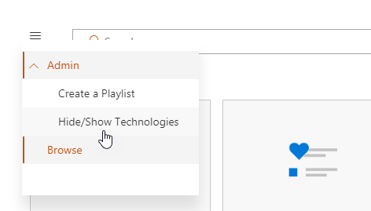
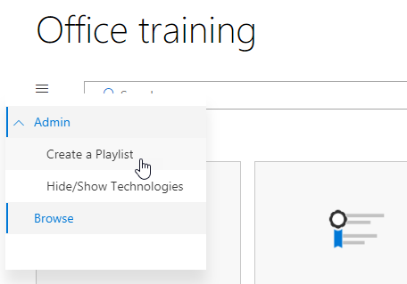
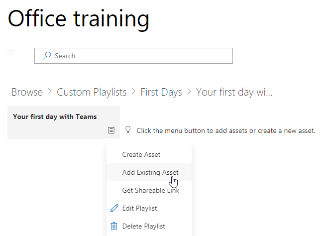
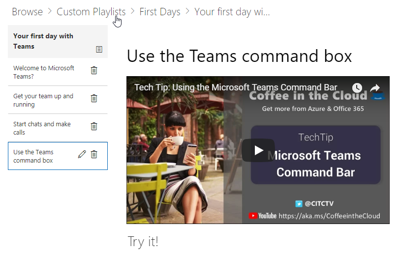

# サービスおよび再生リストをカスタマイズします。

既定でサイトの操作性と web パーツの両方に、すべての Office 365 サービスのコンテンツが含まれます。 だけこれらのサービスの全部または一部が、会社で使用可能な場合は、どのようなコンテンツは、ユーザーに利用可能なを調整できます。 この資料では、web パーツのコンテンツをカスタマイズします。  

## Web パーツのコンテンツをカスタマイズします。

学習のカスタム web パーツには、2 つの主要機能が用意されています。
- テクノロジを表示/非表示
- 再生リストを作成します。

### テクノロジのカテゴリを表示または表示しません。

非表示にし、Web パーツにコンテンツを表示します。 
1.  、Web パーツのドロップダウン ・ メニューをクリックし、表示/非表示テクノロジをクリックしてください

2. 非表示にする技術および**適用**」を選択するのチェック ボックスをオンにします。

### 再生リストを作成します。

再生リストは、「資産」の compliation です。「資産」は、SharePoint ページまたはマイクロソフトのトレーニング コンテンツの既存の項目です。一緒に移動する資産を選択した再生リストを作成するとき、ユーザーの学習パスを作成します。  

SharePoint ページの追加の利点は、YouTube で SharePoint ページを作成することができます、ビデオ、またはビデオを組織でホストされています。フォームやその他の Office 365 のコンテンツにページを作成することもできます。  

#### 手順 1: 再生リストの SharePoint ページを作成します。
この例では、まず、再生リストに追加するのには SharePoint のページを作成します。YouTube のビデオの web パーツと web パーツのテキストを使用してページを作成します。 次の手順では、SharePoint Online のサービスを使用するいると仮定します。 

#### 新しいページを作成します。
1.  [設定] メニューの [_gt サイト コンテンツ _gt サイト ページ _gt 新しい _gt サイトのページを選択します。
2.  [タイトル] 領域で、[チーム] ボックスを使用する種類
3.  新しいセクションの追加] を選択し、2 つの列を選択します。

4.  左側のボックスで、新しい web パーツの追加を選択し、埋め込みします。 
5.  Web ブラウザーでこの URL に移動するhttps://youtu.be/wYrRCRphrp0し、ビデオの埋め込みコードを取得します。 
6.  SharePoint の Web パーツでは、コードの埋め込みを追加を選択し、[埋め込み] ボックスに貼り付けます。 
7.  右側のボックスに、新しい web パーツの追加を選択し、テキストを選択し、します。 
8.  Web ブラウザーでこの URL に移動する: https://support.office.com/en-us/article/13c4e429-7324-4886-b377-5dbed539193b 、Try をコピーし、!ページからの指示テキストの Web パーツに貼り付けることとします。ページは、次のようになります。 

9.  発行] をクリックし、ページの URL をコピーし、メモ帳に貼り付けます

#### 手順 2: 再生リストを作成します。
1.  学習のカスタム web パーツをインストールした場所に移動します。完全なサイトの経験では Office 365 のトレーニングのページでホストされています。 
2.  ドロップダウン ・ メニューから、新しい再生リストの作成を選択します。 

3.  次の例に示すように値を入力し、**作成**を選択します。 

#### 手順 3: 再生リストにアセットを追加します。
ここでは、再生リストに、マイクロソフトおよび作成した SharePoint ページから既存の資産を追加します。 

1.  メニュー ボタンをクリックし、既存資産の追加] をクリックします。

2.  Office 365 アプリケーション _gt マイクロソフト チームのトレーニングにフィルターを適用します。
3.  マイクロソフトのチームにようこそを追加するチームを取得し、チャットを開始、呼び出しを行います。
4.  メニュー ボタン _gt を作成する資産を選択します。
5.  型では、資産のタイトル] ボックスで [チーム] ボックスを使用します。 
6.  SharePoint 使用チーム コマンド ボックス ページのコンテンツ資産] フィールドにコピーした URL を貼り付けます。 
7.  移動ホーム ページ _gt のカスタム再生リスト _gt に最初のチーム _gt の日が [チーム] ボックスを使用します。ページは、次のようになります。 

再生リストをこのコンテンツでできるようがインストールされているし、学習のカスタム web パーツが埋め込まれているが任意の場所です。 

#### 考慮事項

カスタム再生リストは、タスクの vareity で、エンド ・ ユーザーを支援するために使用できます。 要求フォームをオフにしていますか。 ハードウェア機器を要求するためのフォームですか。 作業環境には、既存のトレーニング資料をプログラムできます。  
