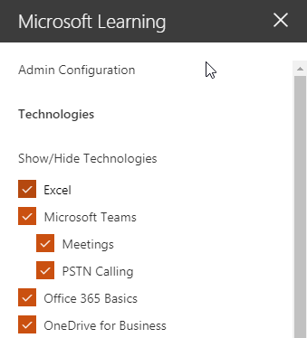

# サービスおよび再生リストをカスタマイズします。Customize the Services and Playlists

既定でサイトの操作性と web パーツの両方に、すべての Office 365 サービスのコンテンツが含まれます。 だけこれらのサービスの全部または一部が、会社で使用可能な場合は、どのようなコンテンツは、ユーザーに利用可能なを調整できます。 この資料では、web パーツのコンテンツをカスタマイズします。By default both the site experience and the webpart include content for all Office 365 services.  If only all or some of these services are available in your company you can adjust what content is available to your users.  In this article we will customize the webpart content.  

## Web パーツのコンテンツをカスタマイズします。Customizing the webpart content

学習のカスタム web パーツには、2 つの主要機能が用意されています。The Custom Learning webpart provides two key features:
- テクノロジを表示/非表示Hide/Show Technologies
- 再生リストを作成します。Create a Playlist

### テクノロジのカテゴリを表示または表示しません。Hide or Show Technology Categories

非表示にし、Web パーツにコンテンツを表示します。To hide and show content in the Web part: 
1.  、Web パーツのドロップダウン ・ メニューをクリックし、表示/非表示テクノロジをクリックしてくださいClick the dropdown menu on the webpart, then click Hide/Show Technologies

2. 非表示にする技術および**適用**」を選択するのチェック ボックスをオンにします。Select a checkox to hide or show a technology and select **Apply**.

### 再生リストを作成します。Create a Playlist

再生リストは、「資産」の compliation です。「資産」は、SharePoint ページまたはマイクロソフトのトレーニング コンテンツの既存の項目です。一緒に移動する資産を選択した再生リストを作成するとき、ユーザーの学習パスを作成します。A playlist is a compliation of "assets". An "asset" is a SharePoint page or existing item of Microsoft training content. When you create a playlist you select assets that go together to create a learning path for your user.  

SharePoint ページの追加の利点は、YouTube で SharePoint ページを作成することができます、ビデオ、またはビデオを組織でホストされています。フォームやその他の Office 365 のコンテンツにページを作成することもできます。The benefit of adding SharePoint pages is that you can create SharePoint pages with a YouTube videos or videos hosted in your organization. You can also create pages with Forms or other Office 365 content.  

#### 手順 1: 再生リストの SharePoint ページを作成します。Step 1: Create a SharePoint page for your playlist
この例では、まず、再生リストに追加するのには SharePoint のページを作成します。YouTube のビデオの web パーツと web パーツのテキストを使用してページを作成します。 次の手順では、SharePoint Online のサービスを使用するいると仮定します。In this example, we’ll first create a SharePoint page to add to the playlist. We’ll create a page with a YouTube video web part and Text web part.  These instructions assume you are using the SharePoint Online service. 

#### 新しいページを作成します。Create a new page
1.  [設定] メニューの [_gt サイト コンテンツ _gt サイト ページ _gt 新しい _gt サイトのページを選択します。Select the Settings menu > Site Contents > Site Pages > New > Site Page.
2.  [タイトル] 領域で、[チーム] ボックスを使用する種類In the title area, type Use the Teams command box
3.  新しいセクションの追加] を選択し、2 つの列を選択します。Select the Add a new section, and then select Two Columns.

4.  左側のボックスで、新しい web パーツの追加を選択し、埋め込みします。In the left-hand box, select Add a new web part, and then select Embed. 
5.  Web ブラウザーでこの URL に移動するhttps://youtu.be/wYrRCRphrp0し、ビデオの埋め込みコードを取得します。In a Web browser, go to this URL https://youtu.be/wYrRCRphrp0 and get the embed code for the video. 
6.  SharePoint の Web パーツでは、コードの埋め込みを追加を選択し、[埋め込み] ボックスに貼り付けます。In the SharePoint Web part, select Add Embed code and then paste it into the Embed box. 
7.  右側のボックスに、新しい web パーツの追加を選択し、テキストを選択し、します。In the right-hand box, select Add a new web part, and then select Text. 
8.  Web ブラウザーでこの URL に移動する: https://support.office.com/en-us/article/13c4e429-7324-4886-b377-5dbed539193b 、Try をコピーし、!ページからの指示テキストの Web パーツに貼り付けることとします。ページは、次のようになります。In a Web browser, go to this URL: https://support.office.com/en-us/article/13c4e429-7324-4886-b377-5dbed539193b and copy the Try it! Instructions from the page and paste them into the Text Web part. Your page should look like the following. 

9.  発行] をクリックし、ページの URL をコピーし、メモ帳に貼り付けますClick Publish, and then copy the URL of the page and paste it in Notepad

#### 手順 2: 再生リストを作成します。Step 2: Create the Playlist
1.  学習のカスタム web パーツをインストールした場所に移動します。完全なサイトの経験では Office 365 のトレーニングのページでホストされています。Navigate to where you have installed the Custom Learning webpart. In the full site experience it is hosted on the Office 365 training page. 
2.  ドロップダウン ・ メニューから、新しい再生リストの作成を選択します。From the dropdown menu select Create New Playlist. 

3.  次の例に示すように値を入力し、**作成**を選択します。Fill in the values as shown in the example below and select **Create**. 

#### 手順 3: 再生リストにアセットを追加します。Step 3: Add assets to the playlist
ここでは、再生リストに、マイクロソフトおよび作成した SharePoint ページから既存の資産を追加します。In this step, you’ll add existing assets from Microsoft and the SharePoint page you created to the playlist. 

1.  メニュー ボタンをクリックし、既存資産の追加] をクリックします。Click the menu button, then click Add Existing Asset.

2.  Office 365 アプリケーション _gt マイクロソフト チームのトレーニングにフィルターを適用します。Filter on Office 365 Apps > Microsoft Teams Training
3.  マイクロソフトのチームにようこそを追加するチームを取得し、チャットを開始、呼び出しを行います。Add Welcome to Microsoft Teams, Get your team up and running, and Start chats and make calls.
4.  メニュー ボタン _gt を作成する資産を選択します。Select the menu button > Create Asset.
5.  型では、資産のタイトル] ボックスで [チーム] ボックスを使用します。Type Use the Teams command box in the Asset title box. 
6.  SharePoint 使用チーム コマンド ボックス ページのコンテンツ資産] フィールドにコピーした URL を貼り付けます。Paste the SharePoint Use the Teams command box page URL you copied in the Asset content field. 
7.  移動ホーム ページ _gt のカスタム再生リスト _gt に最初のチーム _gt の日が [チーム] ボックスを使用します。ページは、次のようになります。Now navigate back to the Home Page > Custom Playlists > Your first days with Teams > Use the Teams command box. Your page should look like the following. 

再生リストをこのコンテンツでできるようがインストールされているし、学習のカスタム web パーツが埋め込まれているが任意の場所です。Your playlist with this content will now be available anywhere you have installed / embedded the Custom Learning webpart. 

#### 考慮事項Things to Think About

カスタム再生リストは、タスクの vareity で、エンド ・ ユーザーを支援するために使用できます。 要求フォームをオフにしていますか。 ハードウェア機器を要求するためのフォームですか。 作業環境には、既存のトレーニング資料をプログラムできます。Custom playlists can be used to assist your end users in a vareity of tasks.  Do you have a time off request form?  A form to request hardware equipment?  Any existing training assets can be programmed into the experience.  
