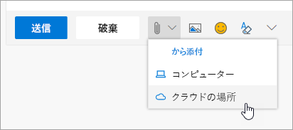

# 同僚と共同作業Collaborating with Colleagues

2時 00分 PM と同僚と共同作業する時間をお勧めします。Office 365 は、チームがさまざまな方法で共同作業を有効にすると、共同作業のためのクラス最高の機会を提供します。It's 2:00 PM and time to collaborate with colleagues. Office 365 provides best-in-class opportunities for collaboration, enabling teams to work together in a number of ways. 

## ツールTools
- Microsoft TeamsMicrosoft Teams
- Office OnlineOffice Online
- OneNoteOneNote
- SharePoint & OneDriveSharePoint & OneDrive
- 
## 同僚と共同作業を行うためのチェックリストChecklist for collaborating with colleagues
- 作成または Microsoft チームの共同作業に参加Create or join a Microsoft Team to collaborate
- 作成し、OneDrive からファイルを共有します。Create and share files from OneDrive 
- Office 365 で共同作成します。Co-create in Office 365 
- クラウドの添付ファイルを使用します。Use cloud attachments

## 作成や共同作業のためのマイクロソフトのチームに参加Create or join a Microsoft Team for collaboration

マイクロソフトのチームとチャネルは、場所の人がファイルを共有することによって共同作業が可能、チームの活動項目などの作業を追跡します。マイクロソフトのすべてのチームは、SharePoint サイト、OneNote のノートブック、およびその他の資産を統合します。Office 365 のこのサービスは、共有プロジェクトまたは結果の頻繁に共同作業するユーザーに適しています。Microsoft Teams and channels are places where people can collaborate by sharing files, tracking team action items and much more. Every Microsoft Teams has an integration into a SharePoint site, a OneNote notebook and other assets. This service of Office 365 is best used for people who work together frequently on shared projects or outcomes. 

## OneDrive からファイルを共有します。Share Files from your OneDrive
ビジネスの OneDrive に保存されているファイルは、ブラウザーまたは Word または Excel のようなデスクトップ アプリケーションを Office 365 から他のユーザーと共有できます。名前、エイリアス、または会社の電子メール アドレスを使用するユーザーと共有することができます。Files that have been saved on OneDrive for Business can be shared with anyone either from the browser or Office 365 desktop applications like Word or Excel. It is possible to share with individuals using their name, alias, or company email address. 

## Office 365 で共同作成します。Co-create in Office 365
共同作成すると、同時に同僚と同じファイルです。コアの Office 365 アプリケーションの web ベースのバージョンではこれらのアプリケーションの Office 2016 以降のデスクトップのバージョンでは可能です。 保存時と同じドキュメントと Office の共同作業はその変更を同期をするのいずれかがオフラインであって。Co-creation is when we work simultaneously with colleagues on the same file. This is possible in the web-based versions of the core Office 365 apps and in the desktop versions of those applications from Office 2016 onward.  Save time and work together on the same document and Office will synchronize those changes for you, even if one of you is offline. 

## クラウドの添付ファイルを使用して -、そのスプレッドシートを電子メールで送信を停止します。Use Cloud Attachments - Stop Emailing that Spreadsheet!
それを電子メールに添付されたときに、ドキュメントの適切なバージョンのハントをしたことがありますが何回かこれで Office 365 のすべてのユーザーが同じバージョンを編集するために、クラウドの添付ファイルと呼ばれる、ファイルへのリンクを共有できます。 人の表示またはファイルを編集できるかどうかのリンクを送信するを選択することができます。How many times have you had to hunt for the right version of a document when it was attached to an email? Now in Office 365 you can share a link to the file, called a cloud attachment, so that everyone is editing the same version.  You can chose to either send a link and whether or not people can view or edit the file. 

