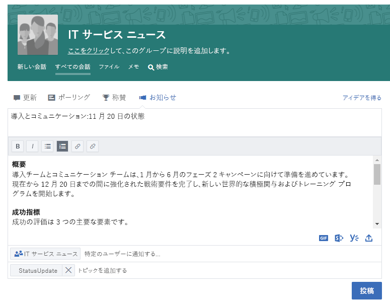
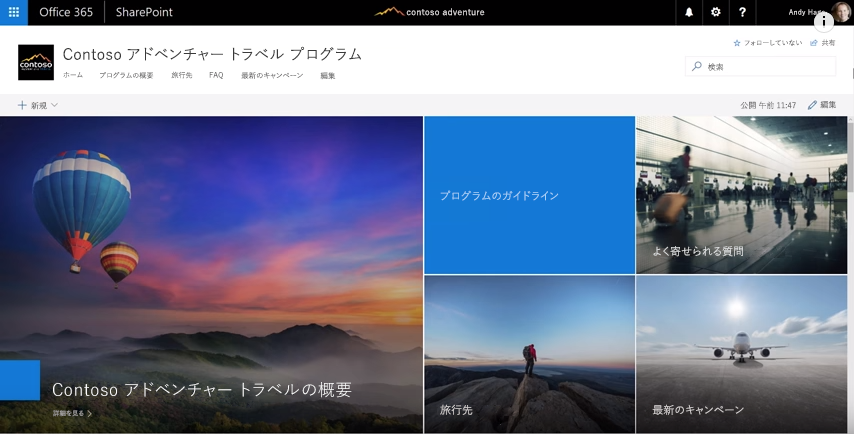
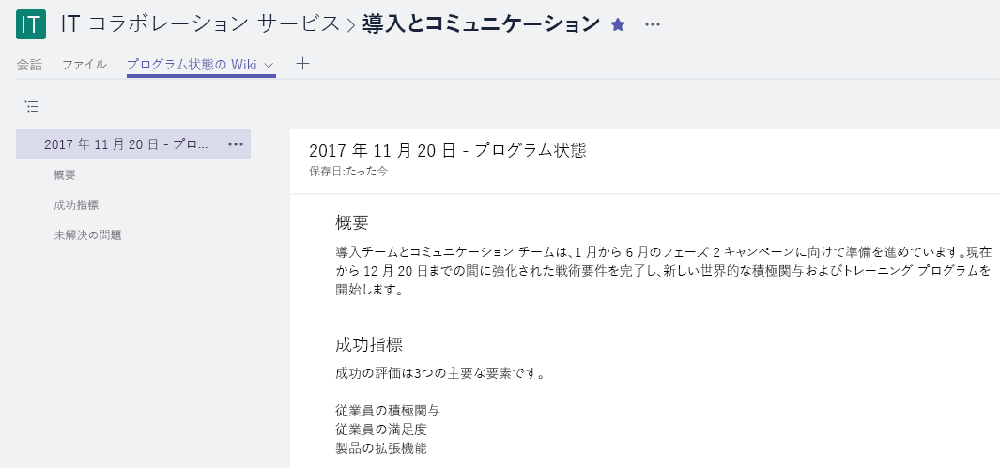

# 会社全体をつなぐ

忙しい 1 日でした。でも、オフィスを出る前に、作業の関係者全員が現在の状況を確実に把握できるようにしたいと考えています。 チームの内部と外部のすべての関係者が、目標、進捗状況、結果を理解することが重要な部分です。  

## ツール
- SharePoint
- Yammer
- Outlook
- Microsoft Teams 

## 会社全体でコミュニケーションをとるためのチェックリスト
- コミュニケーションを取る相手と、彼らが使用している既存のコミュニケーション方法を理解する
- キー メッセージを、プロジェクト関係者、チーム メンバー、従業員などのペルソナ別に作成する
- Yammer コミュニティへの投稿作成やメールでの通知送信など、互いに補完する通信ツールを選択する 
- チームの他のユーザーと情報を共同編集する
- 情報を公開して、関係者全員に通知を送信する 
 
## コミュニケーション方法を選択する
以下の情報を基に、チームとコミュニケーションをとる最適な方法を決定します。 ユーザーが新しいコミュニケーション方法に移行している最中は、新しいテクノロジの使用と従来のメールによる通知とのバランスを取ります。 一貫性のあるコミュニケーション アプローチは、意識を高め、組織の変化を推し進めるのに効果的です。 

**Yammer**: Yammer を使用して更新プログラムを共有することにより、幅広いユーザー間の会話を促進できます。 標準的な更新プログラムを投稿するか、アナウンスメント機能を使用して、更新プログラムのコピーが各メンバーのメールボックスに送信されるようにします。 

**SharePoint**: 作業グループ外のユーザーに連絡する場合は、憲章や進捗状況に関する簡潔なニュース記事を書いて、SharePoint Online でプロジェクトを実行する期間ずっといつでも読めるようにしておくことを検討できます。 SharePoint チーム サイトのモダン ページを使用するか、大規模なプログラムの場合は、SharePoint コミュニケーション サイトの作成を検討してください。 

SharePoint コミュニケーション サイトでは、画像、ダッシュボード、テキストも一緒に埋め込むことができる視覚的で柔軟なニュース記事を作成できます。 これを使用すると、任意のブラウザーや SharePoint モバイル アプリを利用して情報にアクセスできます。 このビデオでは、このような強力なサイトの概要について説明します。 最善の可視性を実現するため、コミュニケーション サイトを Microsoft Teams の作業グループ用のタブとしてピン留めします。

**Microsoft Teams**: 幅広いユーザーが Microsoft Teams の作業グループの一部になっている場合は、長期間の更新で必要となる重要な情報や Wiki ページへのリンクを含むメモを、全般チャネルに投稿することができます。  Wiki ページは複数のユーザーによって共同編集され、そのチームの存続を維持できます。 

## コミュニケーションをモダン化するためのヒント

**電子メール中心の同僚** の場合: 自分のグループまたは SharePoint ニュース フィードYammer通知にサブスクライブします。  こうすることで、これらのユーザーは新しい情報が公開されたことを示す通知をメールで受け取り、クリックするだけでソース情報にアクセスできます。管理者が別個のメールを作成する必要はありません。  さらに体裁をよくしたい場合  Microsoft Flow や PowerApps を使用して通知をカスタマイズできます。 これらのユーザーがモバイル デバイスで Microsoft Teams、SharePoint、または Yammerを使用する方法を示すブラウンバッグを持つことを検討してください。 

**ユーザーどうしの会話を促す。** SharePoint コミュニケーション サイト ページのコメント機能を有効にすることにより、エンゲージメントを高めましょう。  Yammer を使用している場合は、回答できる質問が無いか定期的に監視することにより、ユーザーのコミュニティ参加を促すことができます。 

**外部との共有**: Microsoft Teams、SharePoint、Yammer は、管理者が Office 365 のインスタンスで許可している場合は、いずれも外部共有をサポートします。  外部共有を使用することにより、パートナー側のユーザー、業者、顧客と更新を共有できます。
